# Octos 源码分析：Kubernetes 无状态改造与插件工厂方案

分析日期：2026-09-14。源码基线：`main @ 6cfc689e`，workspace 版本 `2.0.3-rc.11`。

本文是源码分析与待实施设计，不代表代码已经具备本文提出的集群能力。工作区已有的 MiniMax 注册与模型目录修改保留原样；结论主要来自当前运行时、存储、插件和协议代码。没有运行集群、构建或性能测试，文中的容量和恢复指标是验收目标，不是实测结果。

## 1. 结论与设计边界

Octos 可以改造成适合 Kubernetes 的多租户 Agent 平台，但改造核心是把“业务状态的唯一真相”从本机文件、进程内注册表移到持久化服务，并把执行过程改造成可恢复的任务。仅把 `octos serve` 放进 Deployment、挂共享卷并增加 replicas，会遇到 redb 打开冲突、会话并发写入、审批无法跨 Pod 恢复和后台任务失联等问题。

建议的基础组合是：**无状态 API/WS 接入层 + 可恢复 Agent Worker + PostgreSQL + S3 兼容对象存储 + 插件控制面 + 隔离执行环境**。第一阶段采用 PostgreSQL 持久化任务队列及事件 outbox，减少跨系统一致性问题；Redis 仅用于限流/短期缓存，消息中间件在规模需要时再加入。

这里的“无状态”指：API/Worker Pod 的销毁不会丢失已经确认的业务状态，也不要求请求继续回到原 Pod。Worker 可以有内存、网络连接、本地缓存和当前执行上下文，但它们必须可重建。PostgreSQL、对象存储以及部分旧 MCP/设备连接仍然有状态，必须有明确的持久化和恢复边界。

插件工厂负责“定义、验证、构建、发布、绑定、运行治理、升级、退役”。它统一管理三个不同对象：Skills 是知识/流程包，Tools 是可调用能力，业务 Agent 是绑定版本、权限和运行策略的执行定义。不要把三者都实现为一类长期运行的插件进程。

本方案默认：一个 Kubernetes 集群、多租户与多 profile、允许引入托管 PostgreSQL/对象存储、主要运行 Linux 工作负载。涉及桌面应用、机器人、用户本机文件和硬件的能力保留为受控边缘执行器；跨地域多主不在第一阶段范围内。

## 2. 源码事实与改造依据

### 2.1 当前实际架构

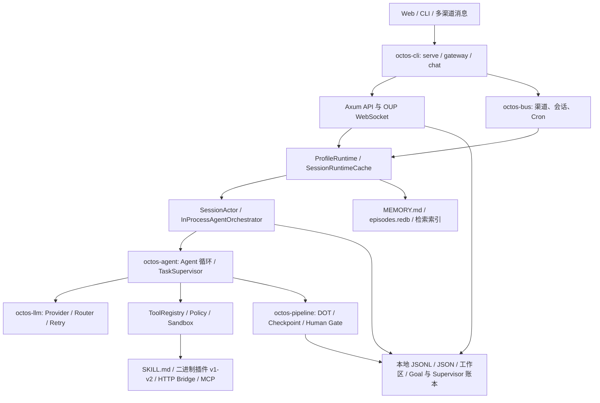

| 源码证据 | 已有能力 | 对集群改造的含义 |
|---|---|---|
| [AppState](../../crates/octos-cli/src/api/mod.rs)、[SessionRuntimeCache](../../crates/octos-cli/src/runtime/cache.rs) | API 持有 profile 映射、会话缓存、鉴权、任务查询等资源 | API 与执行/本地资源尚未完全分离 |
| [octos-server](../../crates/octos-server/src/lib.rs) | 文件明确写明 Stage 1 scaffold only | 不能把它当作已经抽取完毕的独立服务；生产 API 仍主要在 octos-cli |
| [SessionManager](../../crates/octos-bus/src/session.rs) | 本地会话 JSONL、LRU、canonical 持久化路径、消息序号 | 保留现有消息与线程语义，替换存储实现，不另造第二套 transcript |
| [UiProtocolLedger](../../crates/octos-cli/src/api/ui_protocol_ledger.rs) | 本地事件账本、snapshot、进程内广播与序号 | 跨 Pod 需要共享事件序号/回放；进程内 broadcast 只能做本地加速 |
| [ContextManager](../../crates/octos-cli/src/api/context_manager.rs)、[SessionActor](../../crates/octos-cli/src/session_actor.rs) | 上下文 snapshot、compaction、retry state、后台任务关联 | 是持久化检查点的复用基础；不能只保存聊天消息 |
| [EpisodeStore](../../crates/octos-memory/src/store.rs) | redb；代码明确指出单进程占有数据库 | 共享 RWX 卷不能让多个 serve 安全共享同一个 episodes.redb |
| [SupervisorStore](../../crates/octos-cli/src/autonomy/supervisor_store.rs) | JSONL + snapshot，已有跨进程文件锁和恢复逻辑 | 并非完全没有恢复能力，但文件锁不等于分布式执行所有权 |
| [TaskSupervisor](../../crates/octos-agent/src/task_supervisor.rs)、[Orchestrator](../../crates/octos-cli/src/autonomy/agent_orchestrator.rs) | 内存任务表、取消令牌、持久化副本、进程级 orchestrator | 任务状态可存储；Rust Future、oneshot、子进程句柄不可跨 Pod 迁移 |
| [审批](../../crates/octos-cli/src/contracts/approvals.rs)、[用户问题](../../crates/octos-cli/src/contracts/questions.rs) | Pending map + oneshot 等待/响应 | 人工等待需转成持久化状态与续执行命令 |
| [OTP](../../crates/octos-cli/src/otp.rs)、[stores](../../crates/octos-store/src/lib.rs)、[profiles](../../crates/octos-cli/src/profiles.rs) | 内存 OTP、登录会话与本地用户/配置存储 | 跨 Pod 鉴权、撤销、OTP 消费与配额必须统一 |
| [CronService](../../crates/octos-bus/src/cron_service.rs)、[ProcessManager](../../crates/octos-cli/src/process_manager.rs) | 本地 cron.json 与 tokio 调度，按 profile 拉起 gateway/bridge 子进程 | 集群独立调度与渠道租约，替换本机 PID/端口管理 |
| [Pipeline checkpoint](../../crates/octos-pipeline/src/checkpoint.rs) | 已有 `CheckpointStore` trait 与文件实现 | 复用抽象，但当前同步接口需要异步适配，避免阻塞 Tokio 工作线程 |
| [Plugin SDK manifest](../../crates/octos-plugin/src/manifest.rs)、[运行时 manifest](../../crates/octos-agent/src/plugins/manifest.rs) | 两套相关 manifest 模型，后者承载更丰富扩展 | 工厂需做兼容映射与规范化，不能只改其中一处 |
| [插件发现](../../crates/octos-plugin/src/discovery.rs)、[loader](../../crates/octos-agent/src/plugins/loader.rs) | profile/user/bundled/legacy 优先级、schema 校验、工具装载、摘要校验 | 可以复用，但本地目录发现升级为精确版本的解析结果 |
| [插件协议 v2](../../crates/octos-plugin/src/protocol_v2.rs)、[协议文档](../../crates/octos-plugin/docs/protocol-v2.md) | stdout 最终结果，stderr 结构化进度、费用、文件事件 | 可通过 runner adapter 映射到统一任务事件，无需重写全部插件 |
| [MCP](../../crates/octos-agent/src/mcp.rs)、[MCP OAuth](../../crates/octos-agent/src/mcp_auth.rs) | rmcp、stdio、Streamable HTTP、OAuth；凭据保存在 OS keyring | HTTP 已存在；需要集群身份、凭据托管、版本兼容、连接恢复 |
| [Dockerfile](../../Dockerfile)、[compose.yml](../../compose.yml) | 根目录 `.octos` 卷、本地配置、默认 gateway | 是本地容器化基础，不是多副本集群方案；构建缓存阶段的成员清单也需对齐当前 workspace |

补充三个容易漏掉的源码约束：

1. `UiProtocolLedger.scopes` 的注释明确记录：同一个 wire session key 并发用于不同 cwd 时，当前作用域映射仍有 last-writer-wins 残留。集群版必须把完整作用域贯穿请求、存储与广播，不能直接复用纯 session 字符串作全局键。
2. `mcp.rs` 的 DNS/URL 校验拒绝私网、回环和 link-local 地址；普通 `*.svc.cluster.local` 最终解析为集群私网地址，不能直接按现有外部 MCP 路径接入。
3. `plugins.require_signed` 当前主要校验 executable SHA-256；loader 明确说明该摘要不覆盖 SKILL.md、MCP、hooks 等 extras，严格模式会跳过这些扩展。它不是完整的发布者数字签名信任链。

### 2.2 当前可复用的设计

保留 `octos-core` 的消息/任务/OUP 类型、`octos-llm` 的模型抽象、Agent 主循环、Tool/ToolPolicy、DOT pipeline、profile/session 两级 runtime、现有 compaction 与 checkpoint 语义，以及插件 v1/v2 适配能力。新增的是状态存储边界、集群执行控制和扩展治理，不必把项目整体换成另一套 Agent 框架。

现有 `serve` 已处理 SIGTERM 和 graceful shutdown；集群改造需要在此基础上增加停止领取任务、检查点提交、租约处理和事件排空，而不是从零添加信号处理。

## 3. 无状态改造目标架构

### 3.1 Kubernetes 架构图

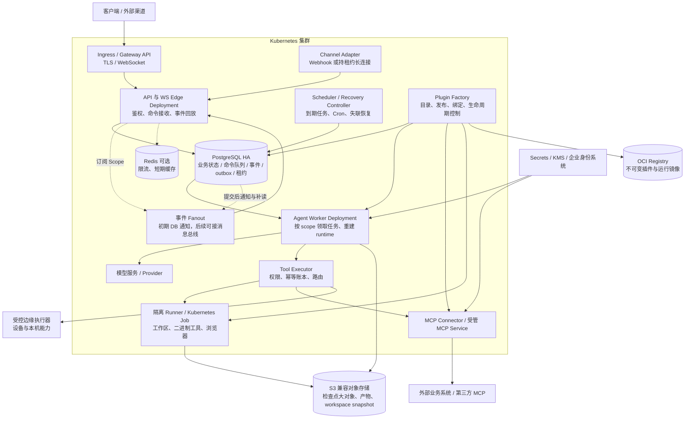

图中 PostgreSQL、对象存储、Registry 可由集群外托管服务提供；部署在集群内时也必须单独做高可用与备份。它们不会因为应用改用 Deployment 就自动无状态。Deployment 适合不依赖稳定 Pod 身份的副本；数据库等持久化工作负载有不同部署需求。[Kubernetes Deployment](https://kubernetes.io/docs/concepts/workloads/controllers/deployment/)、[StatefulSet](https://kubernetes.io/docs/concepts/workloads/controllers/statefulset/)。

### 3.2 服务职责与部署单位

| 部署单位 | 职责 | 本地状态允许范围 | 扩缩容依据 |
|---|---|---|---|
| API/WS Edge | OUP 与管理 API、身份校验、命令落库、回放与推送 | 连接、游标缓存；不持有唯一任务状态 | 活跃连接、入站请求、发送积压 |
| Agent Worker | 运行现有 Agent 循环、checkpoint、子任务派发 | 可重建 runtime、LLM 连接、持租约执行实例 | 待领取任务、最老任务等待、活跃 run；不只看 CPU |
| Scheduler/Recovery | 持久 Cron、重试、租约超时、父子 join | 可丢失的扫描游标 | 初期两个副本，DB claim 去重 |
| Factory API/Controller | 包版本、Agent 定义、Binding、部署协调 | 可重建索引/协调缓存 | 控制面请求与 reconcile 积压 |
| Tool/MCP Executor | 幂等执行、协议适配、凭据隔离、结果归一 | 连接与进程句柄；持久状态在账本/外部服务 | 调用积压、并发、资源类别 |
| Channel Adapter | webhook 去重、持久收发与长连接管理 | 单 owner 的长连接，可重连 | 账号/渠道分片；长连接按账号租约 |
| Sandbox Runner | 文件/代码/浏览器/二进制工具 | 专属 scratch workspace，可由 snapshot 恢复 | Job 队列、CPU/内存/GPU；按信任域隔离 |

第一阶段这些是逻辑边界，不强制拆成七个独立仓库。可用同一个 Rust workspace 构建 API、Worker、Controller 三类镜像，Controller 合并 scheduler/factory 协调；Tools 的隔离运行镜像独立。`octos-server` 可作为抽取落点，但要先完成其空壳到实际运行时的迁移。

### 3.3 状态外置清单

| 状态 | 目标真相源 | 迁移/一致性规则 |
|---|---|---|
| 用户、租户、profile、Agent 定义与绑定 | PostgreSQL | 明确 tenant/profile/workspace 归属，配置用不可变 revision |
| 登录会话、撤销、OTP、OAuth state/PKCE | PostgreSQL 或企业 IdP；OTP 可用受控 Redis TTL | OTP 校验/次数/消费原子化；撤销跨 Pod 生效；secret 加密 |
| Canonical 消息、线程、控制记录 | PostgreSQL | 保留 message/thread/turn ID、顺序、fork/rollback、原时间戳 |
| OUP 事件、snapshot、cursor | PostgreSQL + 老事件归档到对象存储 | 按完整 scope 分配单调序号；持久化后推送 |
| ContextManager、compaction、retry/loop state | PG 元数据 + 必要的大对象 | checkpoint 带 schema/runtime revision，不能只导入纯文本聊天 |
| Task、Goal、Supervisor、续执行、预算 | PostgreSQL | 状态迁移与对应事件在同一事务；保留去重与证据摘要 |
| 审批、提问、人工 gate | PostgreSQL | 存 pending/决策/超时/续执行，不存 oneshot 作为唯一事实 |
| Cron、渠道 cursor、入站/出站去重 | PostgreSQL | `(schedule_id, scheduled_at)`、渠道 message ID 唯一约束 |
| 长期记忆与 Episode | PostgreSQL；向量检索可用 pgvector | 先保证 episode 全量迁移；向量索引可异步重建，带模型/维度/version |
| 文档、媒体、工具结果大对象 | S3 兼容存储 + PG artifact 引用 | 先上传并校验，再提交可见引用；孤儿对象异步 GC |
| 可变工作区与 peer 隔离目录 | run/workspace 专属 runner + 版本化 snapshot | 外部持久化是恢复依据；本地路径不进入跨节点身份 |
| Skills 与 Tools 安装目录 | OCI 内容摘要包 + 本地只读缓存 | 安装和调用都固定 digest；本地缓存可删除重建 |
| Provider 凭据、MCP refresh token | KMS 加密的凭据服务/Secret 引用 | 授权主体绑定；分布式 refresh CAS；不写模型上下文 |
| 运行指标、日志、链路 | 集中日志/Prometheus/Tracing 后端 | 业务状态不能依赖日志检索恢复 |

`MemoryStore` 文件语义要显式适配：保留 `MEMORY.md` 作为逻辑文档，读写变成版本化文档操作；需要文件的插件由 workspace 服务物化，再以 CAS 提交变更。`HybridSearch` 既有 BM25/向量评分需用固定样本对照，不能未经评估直接宣称 SQL 全文检索与原算法等价。

### 3.4 统一身份与授权

定义不可歧义的内部作用域：

```text
Scope = tenant_id + profile_id + workspace_id + session_id
Execution = Scope + thread_id + run_id + attempt_id
```

`workspace_id` 是服务端分配的逻辑身份，不是客户端提交的任意 cwd 字符串。cwd 只是 runner 内映射位置。认证身份推导 tenant/profile 权限；wire session ID 进入服务端后绑定到 Scope，在查询、缓存、广播、审批、工具、对象存储路径和审计全过程携带。

默认一个 Scope 只有一个主执行 owner，保持现有 SessionActor 串行输入语义；并行 thread/peer 使用独立 run/子作用域，合并通过持久化 join。控制命令如 interrupt、approval、steer 有独立可消费通道，不能排在一个长 LLM 调用之后永远无法送达。

所有租户业务表含 tenant_id，关键外键采用含 tenant_id 的复合约束；对象 key 也包含 tenant。数据库可开启 Row Level Security，应用连接角色不使用 superuser/BYPASSRLS，表 owner 的绕过行为也要处理；连接池每事务设置 tenant 上下文并自动复位。RLS 是应用授权的补充。[PostgreSQL RLS](https://www.postgresql.org/docs/current/ddl-rowsecurity.html)。

### 3.5 PostgreSQL 逻辑模型

下列是待新增的核心表及约束，不是现有数据库 schema：

| 表/聚合 | 核心字段和约束 |
|---|---|
| `sessions` | 完整 Scope；`version`、`next_event_seq`、主运行引用 |
| `messages` / `session_control_records` | Scope、message_id、thread_id、turn_id、canonical 顺序、kind；保留历史控制语义 |
| `commands` | Scope、command_id、request_id、payload_hash、kind、state、not_before；请求幂等唯一约束 |
| `agent_runs` | run_id、parent_run、definition/binding revision、runtime/schema version、state、attempt、cancel_requested |
| `run_leases` | 执行作用域、owner_id、epoch、expires_at；占有与递增在数据库事务完成 |
| `run_checkpoints` | run_id、step、transcript_highwater、context、workspace_revision、pending invocation、artifact refs、digest |
| `tool_invocations` | logical invocation ID、tool revision、args_hash、state、external idempotency key、result ref；唯一约束 |
| `approvals` / `questions` | originating run/step、args_hash、binding revision、state、decision、expires_at、resume command |
| `session_events` | Scope、seq、event_id、causation_id、attempt、event schema；`UNIQUE(Scope, seq)` 与 event_id 去重 |
| `outbox` | 同事务生成的事件/投递项、聚合键、投递状态、重试时间 |
| `goals` / `budget_reservations` / `usage_entries` | goal 与 scope、reserve/settle 状态、调用级计费 ID、token/cost、证据版本 |
| `schedules` / `schedule_firings` | cron/timezone、misfire policy、next_fire、`UNIQUE(schedule_id, scheduled_at)` |
| `workspaces` / `artifacts` | workspace revision/写租约、object key、digest、完整性状态、权限与保留期 |
| `plugin_versions` / `bindings` / `agent_definitions` | 不可变 digest、依赖 lock、权限、状态、发布与绑定 revision |

不要仅给每个旧模块加一个 `save_to_postgres()`：一次业务转换涉及消息、运行状态、事件和 outbox 时，必须由共享的 Unit of Work 提交同一个事务。缓存提交后更新；事务失败不可把内存结果当作已经成功。

## 4. 请求执行、恢复与一致性

### 4.1 一次请求的系统处理流程图

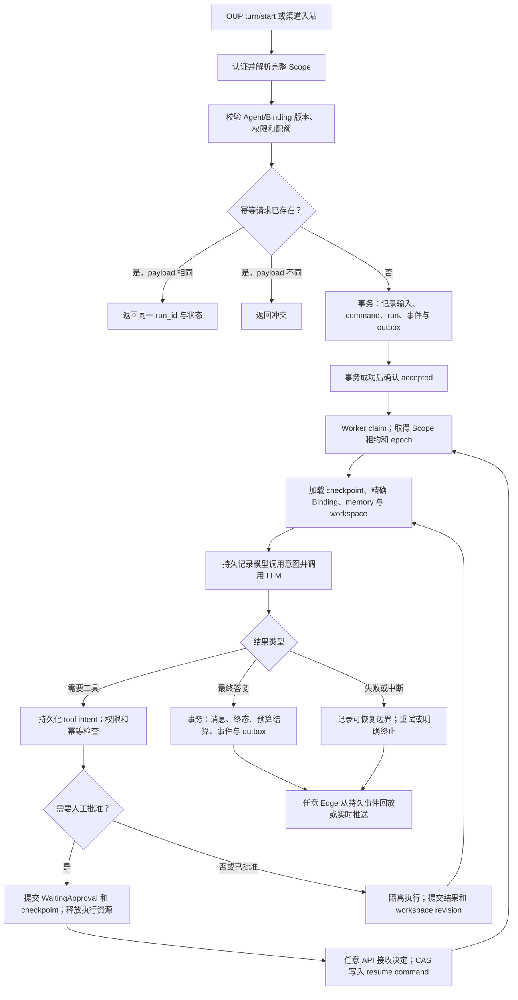

OUP 是 WebSocket JSON-RPC，保留其既有 method/notification 语义；accepted/run_id 的新增字段需走协议变更与兼容测试。REST 新增异步执行接口时可以采用 202。浏览器断开只结束连接，是否取消 run 必须由产品协议明确，不能再隐式依赖连接析构。

### 4.2 正常执行与跨 Pod 事件交付时序图

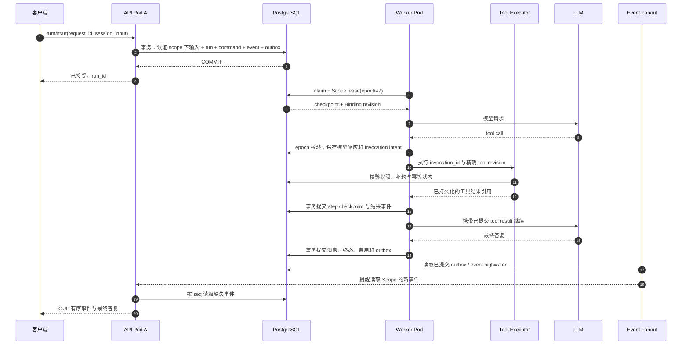

### 4.3 领取、租约和 fencing

Worker 通过短事务 `FOR UPDATE SKIP LOCKED` 领取可运行项，在同一事务里取得/检查 Scope 运行租约，设置 owner、epoch 和有效期。该语法适合多个消费者跳过已锁队列项，不适合作为业务查询的一致性捷径。[PostgreSQL SELECT](https://www.postgresql.org/docs/current/sql-select.html)。

建议起始参数：租约 30 秒、每 10 秒续约；参数需根据数据库尾延迟、工作负载与故障演练调整。以数据库时钟判断超时。SQL 锁仅维持毫秒级事务，不在 LLM/网络/人工等待期间持有。

每次 claim 的 epoch 单调递增。所有权验证必须在每个业务写事务内锁定租约行、确认 owner/epoch/expiry，再提交状态；不能先查租约，随后在另一个事务裸写。旧 owner 的结果即使迟到，也必须被拒绝覆盖。心跳失败达到失权条件后 Worker 停止提交及派发新副作用，并取消可取消的调用。

租约解决同一执行作用域的 owner，workspace 独占写还需单独的资源租约。Session A/B 即使不同 session，也可能编辑同一个 workspace；安全默认是为每个 run/peer 创建隔离分支目录，在发布变更时校验 workspace revision，冲突显式返回。不要把“不同 session”误当成“不会写同一文件”。

Kubernetes Lease 可以用于少量控制器 leader election；高频 run 所有权放在同一个 PostgreSQL 事务域，不把每个 turn 建成 Kubernetes Lease。[Kubernetes Leases](https://kubernetes.io/docs/concepts/architecture/leases/)。

### 4.4 Pod 故障接管时序图

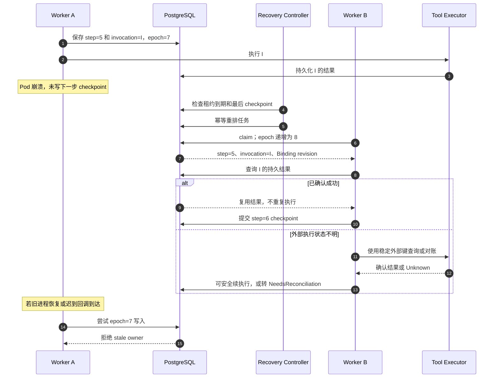

数据库 fencing 只能保证业务状态提交不被旧 owner 覆盖，不能撤回已经发送的邮件、支付请求、机器人指令。必须结合下面的工具幂等协议；仅加 Redis/DB 锁不能承诺外部副作用 exactly-once。

### 4.5 执行检查点与副作用

一个 `RunCheckpoint` 至少包含：完整 Scope、run/attempt、Agent/Binding/runtime/schema revision、canonical transcript highwater、ContextManager snapshot、compaction 边界、pending tool calls 与已提交结果、loop/retry 状态、预算 reservation、审批/问题、父子任务关系、工作区版本和产物引用。

安全提交边界包括：输入接受后、LLM 完整响应被接受后、工具调用前 intent、工具结果确认后、人工等待前、并行分支/join、最终输出前。LLM 半截响应不能当成完整 assistant/tool-call 消息；恢复时标记旧 attempt 中断并从前一安全边界重新请求，不承诺继续原服务端 token 流或原 KV cache。

| 调用类别 | 恢复策略 |
|---|---|
| 纯读取、幂等查询 | 有界重试；记录重试开销与 attempt |
| 支持幂等键的业务写入 | `invocation_id` 派生稳定外部 idempotency key；重试沿用同一个 key |
| 可查询执行状态的异步操作 | 提交后保存 external operation ID；重启先查询，不能重新创建 |
| 不支持幂等或查询的不可逆副作用 | 超时/断连进入 `Unknown/NeedsReconciliation`，人工或专用对账后继续 |
| 纯本地文件修改 | runner 隔离目录中执行，结果与内容 snapshot 上传后发布 revision；失败可回到上个快照 |
| 可变外部文件系统、任意 shell 网络副作用 | 按真实能力声明；无法证明可恢复时不得自动重跑 |

逻辑 invocation ID 在接受完整 LLM tool call 时生成并持久化，绑定 `run + logical step + call index + tool revision + args hash`。epoch/attempt 是执行所有权元数据，**不能并入跨重试的外部幂等键**。LLM 提供的 tool_call_id 单独使用不足以代表跨故障的稳定业务操作。

工具执行器独立记录 `Prepared → Dispatching → Succeeded/Failed/Unknown`。成功后直接复用结果；同一 invocation 不同 args_hash 是错误；未知结果默认阻断自动重试。对不可信任的工具声明，由平台审核决定 replay policy，不能照信 MCP 的 hint 或插件的自称“只读”。

### 4.6 审批、取消、子 Agent、Cron

- 审批/提问：pending request、参数摘要、请求人权限、Agent/Binding revision、到期时间与 run checkpoint 在同一事务提交，run 进入等待后释放 owner。任意 API 的回复通过 CAS 决策一次，并产生唯一 resume command。恢复前重新核对权限和参数；过期、已取消、绑定到其他租户的回复不能执行工具。
- 取消：API 先持久化 `cancel_requested`，通知 owner；Worker/Executor 在每个安全点及长调用控制通道消费取消。收到取消请求不等于副作用已撤销；只有实际停止或确认剩余动作后才发布 Cancelled 终态。
- 子 Agent：替换只有 `tokio::spawn` 意义的派发为持久 child run；父子 ID、依赖、预算分配、结果引用、join epoch 持久化。`UNIQUE(parent_run, child_run, terminal_revision)` 防重复 join，CAS 保证父任务续执行只入队一次。
- Cron：迁移时保留表达式、时区、next_fire、misfire 策略；Controller 事务生成 firing 和 command。唯一约束负责去重，多个扫描副本也不会重复派发。大量用户 Cron 不逐个创建 Kubernetes CronJob。
- 渠道：webhook 按 provider/event_id 去重并在落库后 ACK；长连接/轮询渠道按账号租约占有，cursor 与入站同事务提交。出站消息走 delivery outbox；第三方不支持幂等时保留重复投递可能并提供对账。
- 预算：模型/工具调用前原子预留，完成后按调用 ID 结算；取消或确认未执行才退款，Unknown 保持预留并对账，防止子 Agent 并发突破 goal/tenant 预算。

### 4.7 WebSocket 回放与背压

采用数据库权威事件序号；`event_id` 去重，Scope 内有序，不要求整个集群所有会话全局有序。Transcript 序号与 UI event 序号是不同概念，明确映射，不能把两者混为一个计数器。

重连到任意 Edge：校验 cursor 与 Scope/权限，先建立通知订阅，再读取事件 highwater H、回放 `(last_seq, H]`，随后补读新增事件。通知只是“去数据库补读”的提示，定期补读修复通知丢失；不依赖 LISTEN/NOTIFY 或 Redis Pub/Sub 保存历史。

事件 cursor 超出保留期：返回 snapshot + 新 cursor + 明确 resync 标志，不能悄悄截断。慢客户端使用有界发送缓冲；超限主动断开并让它重连补读。可合并进度事件；工具结果、审批和终态不能丢弃。批量写入 token delta 后再推送，可在延迟和写入量之间调节；如选择未持久化的实时预览，协议必须标记为 ephemeral，RPO 承诺不包含它。

### 4.8 工作区和产物恢复

API 不再直接读取 Worker 本机路径。所有文件入口变为 `workspace_id + relative_path` 或 artifact ID，服务端授权后解析，防越界、符号链接逃逸与 tenant 混用。下载通过短期签名 URL 或授权代理。

代码型 Agent 需要真正可写文件系统，不能直接把 S3 当 POSIX 使用。建议每个 run/隔离 peer 使用 runner 的 emptyDir，从 Git revision + 已确认 workspace snapshot 恢复；也可为大工作区使用专属 PVC，但该 runner 明确是有状态执行资源，其可迁移性依赖卷可用域与 snapshot。

每次对用户确认可见的文件变更，需完成内容上传/持久卷写入与完整性校验，然后以 workspace revision CAS 发布引用，最后提交工具完成事件。对象已上传但事务失败时只产生不可见孤儿对象；GC 根据引用和保留期清理。若只在 turn 末快照，必须接受中途已报告文件操作的丢失窗口，不能称为零丢失恢复。

共享编译缓存按 tenant、repo、toolchain、target、依赖锁和权限域分区；不可信构建不能写可被其他租户执行的共享缓存。设备工具通过注册的边缘 worker 执行，保留硬件安全 lifecycle，不迁移到任意普通 Pod。

## 5. 插件工厂：统一管理 Skills、Tools/MCP 和业务 Agent

### 5.1 工厂架构图

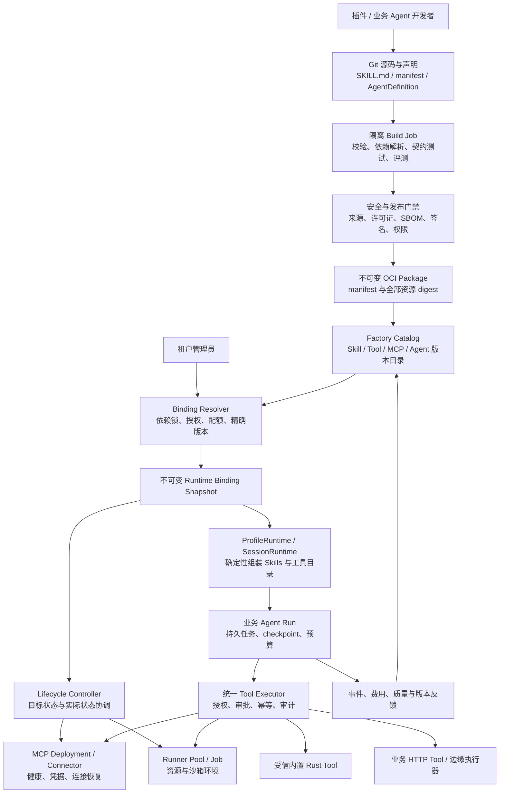

### 5.2 领域模型与职责

| 对象 | 主要内容 | 生命周期与运行方式 |
|---|---|---|
| `PluginPackage` | 包 ID、版本、OCI digest、签名、资源清单、schema/host compatibility | 构建、验证、发布、弃用、撤销；一个包可导出多个对象 |
| `SkillDefinition` | SKILL.md、参考文件、提示片段、使用条件、依赖 capability | 知识/流程版本；本身通常不需要 Pod |
| `ToolDefinition` | schema、实际执行方式、并发资源、timeout、replay policy、权限 | 内置函数、binary v1/v2、HTTP、MCP 等统一适配 |
| `McpServiceDefinition` | 受管 image 或外部 endpointRef、协议版本、authRef、隔离和健康策略 | 服务/connector 的运行生命周期，与 tools/list 导出的工具区分 |
| `AgentDefinition` | 指令、Skill/Tool 依赖、模型策略、预算、sandbox、memory、workflow、评测集 | 可版本化业务模板；不等于一个永久进程 |
| `AgentDeployment` | AgentDefinition 的租户发布实例、入口、路由、并发与伸缩策略 | 发布、灰度、暂停接新任务、排空、回滚、退役 |
| `AgentRun` | 一次执行及父子关系、输入、checkpoint、结果和费用 | Created/Queued/Running/Waiting/Terminal，可跨 Pod 接管 |
| `RuntimeBinding` | 租户/profile 对精确 Agent、Skills、Tools/MCP 版本的授权组合 | 按 revision 不可变；新 run 绑定新版本，旧 run 固定原版本 |

Agent 的声明式 workflow 直接复用现有 DOT pipeline；需要自定义 Rust agent loop 的扩展属于新运行镜像/host revision，走更高等级审核，不允许上传动态库后直接注入多租户主进程。

### 5.3 与现有 Octos 扩展的对应关系

| 现有入口 | 工厂接入方式 | 必须补齐的能力 |
|---|---|---|
| 纯 `SKILL.md` 目录 | 转为包内 Skill export，按需物化只读目录 | 包版本、内容签名、准入、依赖与提示权限边界 |
| `manifest.json + binary` | `BinaryV1Adapter / BinaryV2Adapter` 运行旧协议 | 执行隔离、幂等账本、产物上传、统一取消与资源限制 |
| manifest 的 `spawn_only` | 对外仍显示工具；调用时创建持久任务并返回 task_id | 将单机 tokio 后台任务升级为可恢复 run；保留关联 tool_call_id |
| `tool_discovery: http` | 保留 HTTP Bridge adapter | 它是 GET /tools、POST /tools/name 的桥接协议，不是 MCP |
| profile/配置中的 MCP | 转为版本化 McpService + tenant/user credential binding | 协议版本适配、私网准入、OAuth 托管、会话隔离 |
| hooks / prompts / hardware lifecycle | 作为包中独立声明资源，进入签名覆盖和授权范围 | 禁止未审核的安装/启动脚本在 API 主进程运行 |
| `UserProfile` / `ProfileRuntime` | Profile 继续表示身份/配置作用域；AgentDefinition 作为其上层业务部署定义 | 避免把一个 profile 或一份 system prompt 等同完整业务 Agent |
| PluginLoader 的本地优先级 | 本地模式继续保留；集群模式只加载 Binding 指定 digest | 防止节点目录差异导致同一 Agent 在不同 Pod 使用不同工具 |

### 5.4 包和 Agent 声明示例

以下 YAML 是**拟新增的工厂 API 数据模型示例**，不是当前 Octos 支持的配置，也不是已安装的 Kubernetes CRD。字段由工厂解析，转换成现有 manifest/runtime 输入。示例所有 digest 和资源引用均须在实现时解析为实际值。

```yaml
apiVersion: factory.octos.io/v1alpha1
kind: PluginPackage
metadata:
  name: acme-order-assistant
spec:
  version: 1.0.0
  artifactRef: "oci://registry.example.com/acme/order-assistant@sha256:<package-digest>"
  compatibility:
    hostApi: "octos-factory-runtime/v1"
    pluginProtocols: [binary-v1, binary-v2]
  exports:
    skills:
      - id: order-policy
        entry: skills/order-policy/SKILL.md
    tools:
      - id: order-status
        transport: mcp
        serviceRef: order-mcp
        remoteName: order_status
        schemaRef: schemas/order-status.json
        effect: read
        replayPolicy: retry-safe
      - id: refund-order
        transport: mcp
        serviceRef: order-mcp
        remoteName: refund_order
        schemaRef: schemas/refund-order.json
        effect: write
        replayPolicy: external-idempotency-key
        approvalPolicyRef: refund-approval-v1
    mcpServices:
      - id: order-mcp
        mode: managed
        image: "registry.example.com/acme/order-mcp@sha256:<image-digest>"
        transport: streamable-http
        protocolVersion: "2025-11-25"
        authBindingRef: tenant-order-service
        networkPolicyRef: approved-order-backend
        isolation: tenant
  requestedPermissions:
    workspace: read-only
    egressPolicyRef: approved-order-backend
    secretBindings: [tenant-order-service]
```

```yaml
apiVersion: factory.octos.io/v1alpha1
kind: AgentDefinition
metadata:
  name: order-support
spec:
  version: 1.0.0
  instructionsRef: prompts/order-support.md
  dependencies:
    - package: acme-order-assistant
      version: "=1.0.0"
      digest: "sha256:<package-digest>"
  skills: [acme-order-assistant/order-policy]
  tools:
    - acme-order-assistant/order-status
    - acme-order-assistant/refund-order
  modelPolicyRef: support-model-policy-v1
  memoryPolicyRef: tenant-support-memory-v1
  execution:
    mode: agent-loop
    timeoutSeconds: 600
    maxConcurrentRuns: 20
    maxInputTokens: 32000
    maxOutputTokens: 8000
    checkpointPolicy: every-durable-step
    sandboxPolicyRef: restricted-network-tool-agent
  evaluationSuiteRef: order-support-regressions-v1
```

SemVer 仅用于作者表达兼容范围；Binding Resolver 最终生成含 digest 的 lockfile，禁止运行时使用 floating `latest`。`hostApi` 是新增适配契约版本，不应直接用 crate 版本猜测兼容性。工具名称映射为模型支持的稳定、无冲突别名，并保留 canonical ID；与内置工具冲突时显式拒绝，不能静默覆盖。

绑定还必须锁定：依赖 DAG、工具 schema digest、提示顺序、MCP 协议版本/能力、权限、模型策略 revision、credential binding identity 与 runtime image digest。Secret 值可以受控轮换，但身份/作用域不能随意变更。所有工具 schema 排序和序列化确定化，避免重建 runtime 破坏 prompt cache 稳定性。

### 5.5 插件制造与发布流程图

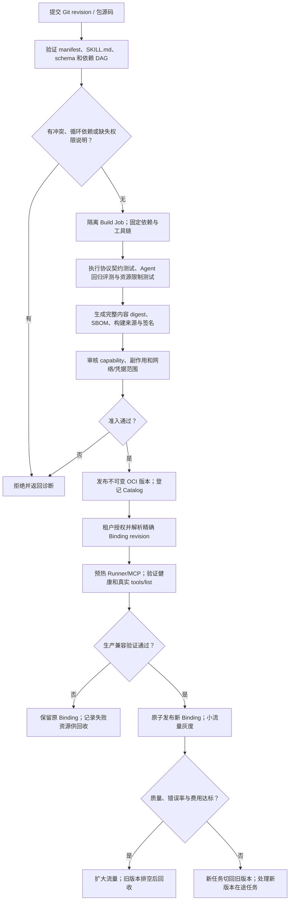

一个包即使只含 SKILL.md，也需做来源、内容、权限和评测门禁，但不必构建可执行镜像。Skill 文本不能绕过运行时 ToolPolicy，不能通过提示声称自己拥有额外权限。源码内的安装脚本在隔离构建阶段执行，线上只拉取验证后的产物。

### 5.6 发布/灰度/回滚时序图

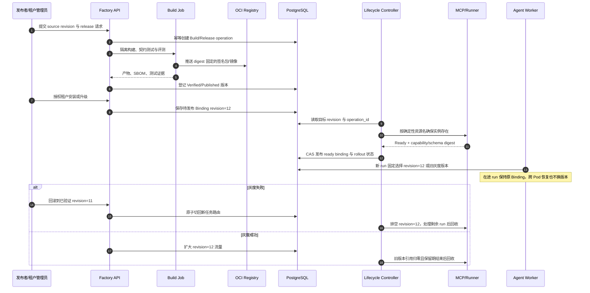

数据库和 Kubernetes 不存在统一事务。Controller 用 `operation_id + tenant + resource + revision` 生成确定性资源名/标签，采用幂等 reconcile；Pod 已创建但回写失败时，下次扫描认领同一个资源，不重复创建。超过保留期的孤儿资源依据 operation 状态清理。

**配置真相源选择**：第一版 Factory API + PostgreSQL 为期望状态唯一来源，Kubernetes Deployment/Job 是执行投影。不同时允许用户独立编辑 CRD spec 和数据库中的同一配置。若后期采用 GitOps/CRD，则指定该资源的期望状态由 Git/CRD 独占管理，数据库仅做索引和运行账本，并限制 Factory 对对应字段的写入。

不为每个工具调用、会话或 token 创建 Kubernetes CR；这些高频对象在数据库。Kubernetes 资源主要对应长期 MCP 服务、runner 池及需要独立隔离的长任务。

### 5.7 统一工具调用时序图

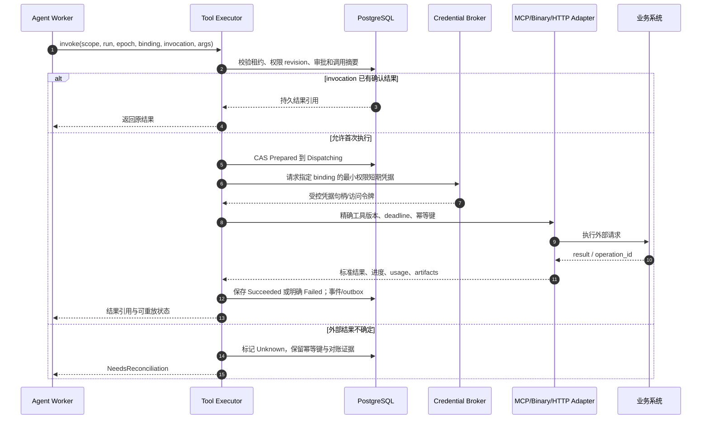

Executor 接口应包含 `ExecutionContext`：可信 tenant/profile/workspace、principal、run/attempt、lease epoch、binding revision、policy revision、deadline、trace ID。当前 `Tool::execute(&Value)` 不携带这些信息，需要新增上下文接口或包装器，并为旧工具提供兼容适配；不能把安全上下文塞进模型可改写的 arguments 来信任。

并发控制使用资源键，例如 `tenant/order-service/account-id` 或 workspace ID；现有 `concurrency_class=exclusive` 主要作用于本机执行批次，不能直接充当跨 Pod 的业务资源互斥。允许并行的工具也要做配额与幂等检查。

### 5.8 MCP 服务专项设计

**A. 连接方式分层**

| 类型 | 部署方式 | 恢复与隔离 |
|---|---|---|
| 新建受管 HTTP MCP | 独立 Deployment + Service，按 tenant/trust domain 设隔离级别 | 可水平扩展的业务状态外置；通过 Factory 托管健康与版本 |
| 旧 HTTP MCP，带协议会话 | connector 维持 backend/session 绑定 | sticky routing 只是兼容机制；实例丢失需重建会话并对账在途调用 |
| 第三方远程 MCP | 外部 endpointRef + 专属 credential binding | 工厂不负责部署第三方，只负责授权、能力目录、调用与失效治理 |
| stdio MCP | runner 内的子进程，或带 HTTP 适配器的专属 Pod | 不能把 stdio 直接连接 Kubernetes Service；子进程崩溃需重启/重新协商 |
| 依赖设备/桌面的 MCP | 注册边缘 worker，带心跳与能力清单 | 指令去重、设备占有与安全停机；不宣称可任意节点迁移 |

同一 MCP 连接池的 key 至少包含 tenant、principal/credential binding、service version 与协议版本，禁止跨租户共用带授权状态的连接。HTTP 传输不意味着业务状态天然无状态；旧协议中的 transport session 也不能当成身份凭证。

**B. 协议版本兼容，区分现有代码与新规范**

当前 `Cargo.lock` 锁定 `rmcp 1.8.0`；本地代码显式执行 `initialize/initialized` 并持有 `RunningService`，属于已观察到的有握手/会话运行方式。本文没有验证该 SDK 能否支持所有新协议分支，不能按依赖名称推断已经兼容。

2025-11-25 规范允许服务端发放 `Mcp-Session-Id`。官方 2026-07-28 版本已改为无握手、无协议会话的请求模型，并增加相应路由元数据。因此工厂必须固定每个 service 的协议版本，保留旧连接适配器，同时把新版本适配列为独立兼容项目；升级 SDK 和协议需要真实服务契约测试，不能只替换 URL 或删 initialize。[旧版传输规范](https://modelcontextprotocol.io/specification/2025-11-25/basic/transports)、[2026-07-28 官方发布说明](https://blog.modelcontextprotocol.io/posts/2026-07-28/)、[新版 Streamable HTTP](https://modelcontextprotocol.io/specification/2026-07-28/basic/transports/streamable-http)。

新受管 MCP 优先采用经验证的无状态协议适配；已有服务在旧版兼容路径运行。迁移不以 Rust SDK 新版未验证能力作为前置假设。MCP 的异步 Tasks 能力也必须在实际协商/配置支持后启用；普通 tools/call 不自动等价为可断线恢复的业务任务。

**C. 集群内网络准入**

新增由平台管理的 `EndpointPolicy`，区分 `PublicExternal` 与 `ManagedCluster`。前者保留当前 SSRF 防护；后者只允许注册 Service UID/namespace/name/port 对应的 endpoint，并验证 TLS/工作负载身份与 NetworkPolicy。不能简单设置 `allow_private=true` 或仅放行 `.svc.cluster.local` 字符串后缀。

对 ExternalName、重定向、DNS 重绑定、解析出的地址与 Service 身份变化做校验；始终阻断云 metadata 等非授权 link-local 目标。OAuth discovery/token/refresh endpoint 使用自己单独批准的策略，不能因为 MCP endpoint 受管就自动信任它声明的任意内部 URL。

现有 HTTP Bridge 的 localhost 约束也要单独处理：可以保留 runner 内 loopback 适配，或走受管 Service adapter，不能为方便接入而全局关闭原有地址限制。

**D. OAuth 与 Secrets**

集群版不使用交互式本机 keyring 作为凭据真相源。Factory/Credential Broker 提供浏览器授权入口与固定回调，state/PKCE/issuer/client/scope 绑定到 tenant + principal + service；token 加密存储，访问审计，默认仅 Executor 获得实际 secret。

对 refresh token 旋转使用数据库版本 CAS 和短租约，只允许一个刷新者提交新 token；其他 Pod 等待读取新版本。refresh 返回不确定时禁止无限重复消耗旧 token，进入重新授权/对账路径。服务账号可用业务系统支持的 workload identity/client credentials，但不能把用户授权流程擅自替换成服务账号。

**E. 工具目录与长调用**

`tools/list` 的分页、重复名称、schema 大小/深度、超时及兼容性都进入验证；目录规范化后保存 schema digest。运行时发现上游 schema 改变，需要新 Binding 验证，不能静默更新活跃 Agent 的 schema。业务长任务设计为“提交 operation → 持久 operation ID → 查询/取消”，否则保持固定 timeout 并按 Unknown 处理断连。当前 MCP tools/call 的 60 秒常量需要改成受管、有限上界的工具级策略。

### 5.9 Agent 与服务生命周期

业务 Agent Run 状态机如下；恢复沿用同一 run_id，生成新的 attempt/lease epoch，不能伪造一次全新的用户请求。

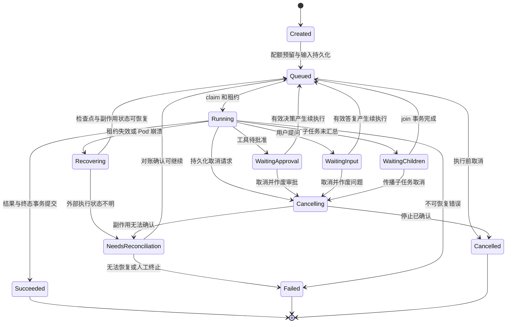

`Waiting*` 必须有 timeout/deadline，超时可 Failed/Cancelled；执行重试有 max_attempts 和 backoff，不能无限 Recovering。业务 pause 与基础设施 Recovering 区分：pause 保存 checkpoint 后停止新步骤，resume 才重新排队。紧急撤销时，即使在等待或排队中，也要阻止下一次工具执行。

MCP/Runner 服务生命周期与 run 分开：

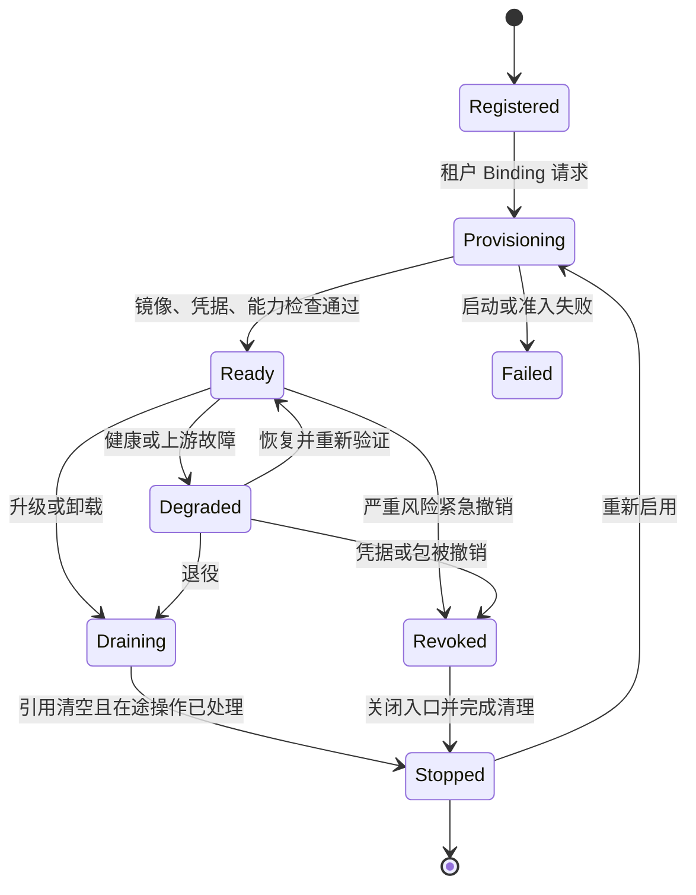

“删除”分为卸载 Binding、停止实例、删除版本/数据三个操作。先停止新 run，再等待/取消活跃 run，确认无 checkpoint/审计保留引用后才能物理 GC。紧急 revoke 立即阻止新调用，即使 run 固定旧 Binding 也必须执行这条全局禁用策略。

### 5.10 安全、签名与供应链

完整签名覆盖 package manifest、SKILL.md、references、scripts、工具 schema、MCP/hook 声明和镜像 digest；构建来源与 SBOM 作为验证材料。SHA-256 证明内容一致，发布者数字签名与信任策略才用于确认来源；不能把用户上传的 hash 自身当作授权。

在新增完整包验证器之前，集群版继续遵守现有 require_signed 的限制：不将未经完整验证的 extras 重新打开。过渡期可把受控 MCP/hooks 放在平台审核的 host/profile 配置中；最终由 `VerifiedPackage` 输入路径接入 loader，并保持旧格式兼容。

运行时使用 deny-wins ToolPolicy，并加 tenant entitlement、Agent capability、资源 scope、审批与费用上限。`SKILL.md`、工具输出、MCP 返回内容作为可能不可信的数据进入上下文，不能提升执行权限。对内置敏感能力、任意 shell、网络、凭据和安装权限分别控制。

多租户不可信代码不与 API 共享进程或 ServiceAccount，不挂宿主 Docker socket，不继承数据库管理员凭据。默认非 root、只读 rootfs、drop capabilities、seccomp、限制 CPU/内存/PID/临时盘和 egress；高风险代码可采用专属节点池/沙箱 RuntimeClass。Kubernetes Restricted 标准为 Pod 安全配置提供基础，不等于完整的恶意代码沙箱。[Pod Security Standards](https://kubernetes.io/docs/concepts/security/pod-security-standards/)。

### 5.11 工厂管理接口与幂等

以下为新增管理 API 示例；认证和审计沿用统一 Scope，不由客户端随意声明 tenant。

| 接口 | 语义 |
|---|---|
| `POST /factory/builds` | 固定 Git revision 开始构建，返回 operation_id |
| `GET /factory/operations/{id}` | 查询验证、构建、发布、安装进度与失败原因 |
| `POST /factory/packages/{id}/versions` | 登记已验证 digest 与发布证据；版本不可覆盖 |
| `POST /factory/bindings` | 解析依赖与授权，准备不可变 Binding revision |
| `POST /factory/bindings/{id}/activate` | CAS 激活已就绪 revision，并设置灰度路由 |
| `POST /factory/agents/{id}/runs` | 创建一次持久执行；返回 run_id |
| `POST /factory/runs/{id}/cancel` | 持久化取消意图；查询实际终态 |
| `POST /factory/deployments/{id}/rollback` | 新任务路由切到指定已验证 revision |
| `POST /factory/packages/{id}/revoke` | 撤销包版本/来源信任，阻断后续执行 |
| `DELETE /factory/bindings/{id}` | 进入排空；有引用时不直接删包与数据 |

写接口要求 request/idempotency key；同一键不同 payload 返回冲突。更新使用 revision/If-Match，防止两个管理员覆盖操作。角色区分作者、审核者、租户管理员、运行主体和审计员；所有高权限变更产生审计事件。数据库 RBAC 与 Kubernetes RBAC 是不同层，Worker 默认不具有创建任意 Deployment/Secret 的权限。

## 6. Kubernetes 落地与运行保障

### 6.1 第一阶段部署规格

下面是规划起点，不是已完成的 Helm chart，也不是现有 `octos` 已支持的命令参数。

| 组件 | 建议初始配置 | 关键约束 |
|---|---|---|
| API Deployment | 至少 2 副本，跨节点/可用区；从 2 个扩展 | 无持久本地业务卷；WebSocket 重连/回放；连接负载纳入伸缩 |
| Worker Deployment | 至少 2 副本，按实际并发设上限 | 每 Pod 限 active runs；从 DB claim；模型配额也限制扩容 |
| Controller Deployment | 2 副本，幂等 reconcile/claim | DB 去重为最终防线；必要时 K8s Lease 选主 |
| Tool/MCP 工作负载 | 可信域分池；重要 HTTP 服务至少 2 副本 | 旧协议会话服务按其状态语义部署；不能一律多副本轮询 |
| Runner Job/Pool | run 专属或可信租户专属 | requests/limits、deadline、scratch/PVC、限制挂载、回收 TTL |
| PostgreSQL | HA 主库 + 故障切换 + PITR 备份 | 权威事务写主库；不能对一致性关键读使用滞后副本 |
| Object Storage / Registry | 高可用、加密、version/retention、访问审计 | 与数据库引用一起演练恢复；不可仅备份 PG |

新增 `/livez`、`/readyz` 和 startup probe：livez 只检测进程是否活着及事件循环健康，不因 LLM/DB 短暂故障重启全体 Pod；readyz 检查此角色是否能安全接收请求/领取任务、schema 是否兼容以及必要连接是否可用。现有 `/health` 不自动等价于这些角色化探针。

滚动升级使用 `maxUnavailable: 0` 与适当 surge，PDB 保留可用副本，topology spread 避免集中同节点。API 处理 SIGTERM 后停止接新连接，发重连提示并排空有界发送缓冲；Worker 停止领取、保存安全 checkpoint、处理进行中的 tool operation、释放已安全结束的租约。不能先释放租约，再继续执行写操作。

建议 termination grace 起点为 120 秒，真正值根据最长安全检查点时间决定。Kubernetes 会在优雅终止期限结束后强制终止容器，因此断电/强杀恢复不能依赖 preStop 一定执行。[Pod 生命周期与终止](https://kubernetes.io/docs/concepts/workloads/pods/pod-lifecycle/)。

云端执行策略默认 fail-closed；确认容器内选用的 sandbox 后端可用。现有 Auto 模式可能退化为 NoSandbox 的路径不能作为多租户默认。API 镜像移除浏览器/编译器等不需要的工具链，Office/Chromium/Node 放入明确版本的 runner 镜像；构建阶段不静默忽略最终构建错误。

### 6.2 网络、配置和配置发布

- 入口：TLS、可信 proxy header 配置、OUP WebSocket Origin 校验、连接/消息大小限制与空闲超时，多个 Edge 使用一致认证配置。
- 网络：API 只能访问 DB/身份/对象服务；Worker 只访问批准的模型和 Executor；Runner/MCP 默认 egress deny，通过受管策略放行业务目标与 DNS。NetworkPolicy 需要实际支持它的 CNI。
- 身份：不同角色不同 ServiceAccount；普通 Worker 不自动挂 Kubernetes API token；Controller 只能管理指定 namespace 和带所有权标签的资源。
- 配置：启动配置经 ConfigMap/Secret 引用注入；profile/Agent/Binding 放版本化存储。环境变量和 ConfigMap 文件变化不等于所有实例 runtime 已更新，由 Controller 发布 revision、Worker 明确读取。
- 凭据：short-lived token 优先；Secret 配置静态注入不用于高频动态用户 OAuth。日志、工具输出与错误诊断脱敏。
- 指标：API/Worker/Executor 暴露角色化 metrics，run_id/tenant_id 不作为无界 Prometheus label；详细维度进入 traces/logs。

### 6.3 容量测算方法

先用代表性 workload 分别测短问答、带工具任务、代码任务、长 workflow；不能用 CPU 利用率推算模型等待型吞吐。

```text
需要的并发执行槽 ≈ 每秒到达任务数 × 平均占槽秒数
Worker 副本数 ≈ 向上取整(并发执行槽 / 每 Pod 槽数 / 目标利用率)
事件写入速率 ≈ 活跃运行数 × 持久事件批次频率 + 业务状态事件
连接池预算 = API + Worker + Controller + Executor 的连接上限总和
```

例如压测若得到 2 run/s、平均占槽 30s、8 槽/Pod、目标利用率 70%，则约需 11 个 Worker Pod；这只是公式示例，**不是 Octos 实测容量**。还要受模型并发/token 限制、数据库写入、对象存储和 runner CPU/内存限制。

事件表按时间/租户策略分区、Scope + seq 建索引；delta 按小批次持久化并压缩，结果大对象放对象存储。初期 PostgreSQL 队列先压测；若 claim/outbox/回放成为瓶颈，再引入 NATS JetStream/Kafka 等消息总线。此时 outbox 继续提供 DB→消息系统的一致发布，消费者按 event_id 去重，业务状态和恢复账本仍以 DB 为准。

### 6.4 建议验收指标与故障语义

以下是上线门槛建议，具体负载、数据量、机型需在测试计划锁定。

| 项目 | 目标及限定 |
|---|---|
| 已接受输入 | 单 Pod/节点故障不丢失已 COMMIT 且确认 accepted 的输入；灾难恢复 RPO 取决于 PG 复制/备份配置 |
| 跨 Pod 重连 | cursor 在保留期内能重放全部已提交事件，无 scope 混流；示例目标 5 秒内恢复首条事件 |
| Worker 故障接管 | 30 秒租约配置下，示例目标 60 秒内开始可恢复任务的接管；不包括模型完成时间 |
| 外部副作用 | 对支持稳定幂等键的测试系统不重复生效；不支持的结果不明调用必须进入对账 |
| 请求重复 | 相同幂等键相同 payload 始终映射到同一逻辑 run；不同 payload 明确拒绝 |
| 灰度/回滚 | 新任务版本路由可回滚，旧任务引用的包与 runtime 在保留期内可重新拉取 |
| 租户隔离 | 同名 session/workspace/tool 在两个租户并发时，消息、审批、secret、缓存与产物均不串用 |
| 费用 | 单次调用最多结算一次；不确定调用保留待对账记录；LLM retry 的真实费用可追踪 |

故障处理要预先写成运行手册：

| 故障 | 系统行为 |
|---|---|
| PostgreSQL 不可用 | 不确认新 durable accepted；Worker 无法确认 owner 时停止新副作用；恢复后续租/接管 |
| 对象存储不可用 | 不把未成功持久化的产物标记完成；有界重试，保留调用/上传状态 |
| Redis/通知丢失 | 限流依预定策略降级或拒绝；事件靠 DB 补读恢复；不丢任务 |
| Worker 强杀 | 从 checkpoint + invocation 账本恢复，未知外部结果先对账 |
| 工厂暂时不可用 | 已有不可变 Binding 的 run 可继续，但调用权限与紧急撤销仍须可验证；停止新发布 |
| 包/镜像 Registry 不可用 | 已校验本地 digest 缓存可用；冷启动阻塞，不能偷偷换其他版本 |
| MCP 不可用 | 限时重连/熔断；只读可重试，写入按幂等能力处理 |
| 部分可用区故障 | 依赖存储/runner 的可用区约束接管；专属 PVC 无法挂载时明确等待或恢复 snapshot |

## 7. 代码改造清单与实施顺序

### 7.1 源码模块级改造

以下新增名称仅表达建议职责，可以在实现时合并为较少 crate。

| 改造点 | 文件/模块落点 | 实施内容 |
|---|---|---|
| 统一 Scope 与运行版本 | `octos-core`、OUP transport/scope、runtime cache | 新增可信 ExecutionContext、作用域键和版本化 run 类型；沿全部事件路径传递 |
| 存储抽象与事务 | `octos-store` + 建议 `octos-store-postgres` | 定义 async repositories + UnitOfWork；保存 local adapter 供本地 chat/gateway |
| 会话与上下文 | `octos-bus/session.rs`、`context_manager.rs`、`session_actor.rs` | canonical 持久化走 repository；snapshot 与 transcript highwater 一起提交 |
| 事件账本 | `ui_protocol_ledger.rs`、`events.rs`、`ui_protocol_transport.rs` | PG seq/outbox/replay；本地 broadcast 为加速层；补跨节点 cursor 语义 |
| 任务 owner 与调度 | `task_supervisor.rs`、`agent_orchestrator.rs`、`supervisor_store.rs` | 分离业务状态机与进程执行 handle；持久队列、epoch、recovery/join |
| 审批/提问 | `contracts/approvals.rs`、`contracts/questions.rs`、pipeline human gate | durable waiting + reply CAS + resume command；兼容本地 oneshot adapter |
| Episode/记忆 | `octos-memory`、profile bootstrap | Memory/Episode repository；PG 后端、向量索引重建、逻辑文档版本 |
| 鉴权/配置 | `otp.rs`、`profiles.rs`、`auth/`、`octos-store` | 集群登录会话、OTP、撤销和 Secret 引用；配置不可变 revision |
| Cron/渠道 | `cron_service.rs`、gateway adapters、`process_manager.rs` | durable firing；账号租约；把进程管理抽象成 K8s/edge controller |
| Pipeline | `checkpoint.rs`、`executor.rs`、`manager.rs` | async checkpoint store、节点运行状态和 artifact 引用；子节点幂等 |
| 工具执行 | `tools/mod.rs`、`plugins/tool.rs`、`mcp.rs` | ExecutionContext、Tool Executor、invocation ledger、取消与结果恢复 |
| 工厂目录与解析 | `octos-plugin` + 建议 `octos-factory` | 包 schema、版本 DAG/lock、完整签名信任、Binding 编译 |
| MCP 与 Secret | `mcp.rs`、`mcp_auth.rs`、plugins extras | 受管 endpoint policy、OAuth broker、旧/新协议适配与 schema pinning |
| 工作区/产物 | `peers/`、file mutations、preview、pipeline artifact | 逻辑 workspace、版本快照、隔离 runner、授权下载 |
| 服务部署 | `octos-server`、`commands/serve.rs`、Dockerfile | 完成 server 提取、角色化启动、探针、drain、Helm/部署清单 |

不要直接把所有原有同步方法内部换成网络 IO。以 async 适配为目标；过渡期确需保留同步接口时，使用受控阻塞线程桥接并限制并发，不能在 Tokio 主执行线程里阻塞等待数据库。

### 7.2 分阶段计划与退出条件

工期仅用于规划量级：在 3–5 名熟悉 Rust/平台工程成员、已有数据库/对象存储/K8s 基础设施的假设下，核心可用版约 10–16 周；完整第三方 MCP 兼容、复杂 workspace 与安全评测可能更长。以下阶段可部分并行，估计不是项目承诺。

| 阶段 | 交付 | 退出条件 |
|---|---|---|
| P0：基线与契约，1–2 周 | 状态/调用路径清单、Scope、SLO、数据映射、ADR 与回归样本 | 关键状态均有 owner、存储、恢复和授权定义；样本可重放 |
| P1：持久化边界，2–3 周 | async repository/事务、PG schema、迁移工具、local adapter | 单副本 PG 模式功能对照通过；重启后消息/上下文/审批一致 |
| P2：API 多副本，1–2 周 | 共享鉴权、OUP event replay、无状态文件 API、Edge 部署 | 任意 API 交替处理请求与回放，scope/权限无串用 |
| P3：可恢复执行，3–4 周 | queue/lease/fencing、tool intent、checkpoint、取消/join、workspace 恢复 | 强杀和网络分区演练通过；副作用 Unknown 不误重试 |
| P4：插件工厂，3–4 周 | Build/Registry/Catalog、Binding、AgentDefinition、binary/MCP adapters、发布回滚 | 一个现有 skill、一个新 HTTP MCP、一个业务 Agent 完整上架运行 |
| P5：生产演练，1–2 周 | 灰度迁移、容量/恢复压测、备份演练、安全隔离与运行手册 | 满足 SLO/验收清单；完成一次故障接管和一次完整回滚演练 |

P4 的包模型、校验与构建可与 P1/P2 并行设计，但“可恢复 Agent 工厂”依赖 P3；否则只是一个包管理页面，不能完成业务 Agent 生命周期管理。

### 7.3 数据迁移与回滚流程图

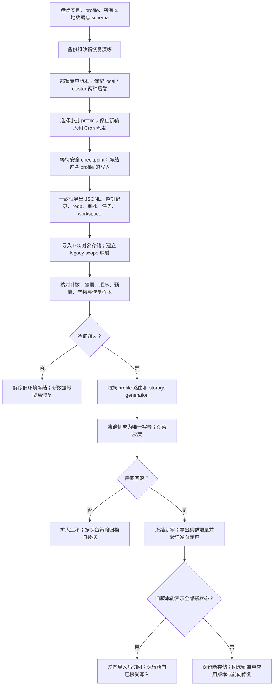

第一轮推荐按 profile 的短暂停写迁移。禁止复制正在运行的 redb 文件充当一致备份；读取支持的一致导出或停写关闭后复制。JSONL 导入必须包含 meta、thread、控制记录、fork、rollback、去重标记，不可按每行都是 Message 简化。

保留旧 wire session ID，建立 `(旧实例、profile、规范化存储作用域) → 新 Scope` 映射；session ID 不一定全局唯一。未完成任务、待审批与无法迁移的旧进程需逐个归类：可从检查点恢复、等待旧环境排空、或标记需人工处理。

不要做本地文件与 PG 无事务的长期双写。若后续必须不停机迁移，需要额外的单写者变更日志、递增 LSN/版本、幂等应用与切换屏障，这是独立复杂度。新集群已经接受写入后，不能直接把流量切回旧文件副本；回滚应用应优先使用仍能读取新 PG schema 的兼容版本，数据库采用 expand/contract 迁移。

### 7.4 必须通过的测试与验收

| 编号 | 场景 | 必须观察到的结果 |
|---|---|---|
| K01 | 同一 request 经两个 API 同时提交 | 一个逻辑 run，一份用户输入；不同 payload 的重用键报冲突 |
| K02 | 多 Worker 同时领取同一 Scope | 一个有效 owner；不同 scope 仍可并行 |
| K03 | Worker 与 DB 网络分区，另一个接管 | 旧 epoch 不可写业务状态/派发新操作；晚结果受控处理 |
| K04 | 工具外部成功后立即杀 Worker/Executor | 有幂等键的副作用只生效一次；无幂等的 Unknown 不自动重发 |
| K05 | 审批请求后杀原 Pod，再从另一个 API 批准 | 同一审批恢复执行一次；重复/跨租户/参数变化被拒绝 |
| K06 | WS 断线/切 API/通知丢失/回放并发新事件 | seq 无缺口或显式 resync；不丢终态；慢客户端不拖垮 Worker |
| K07 | 两租户使用相同 wire session 和相同相对 cwd | 存储、广播、artifact、OAuth、缓存和审批均隔离 |
| K08 | 两个 run 修改同一 workspace revision | 一个成功发布或分支隔离；冲突不会悄悄覆盖 |
| K09 | 并行子任务终态重复投递 | 父任务只 join/续执行一次；费用不重复结算 |
| K10 | 两个 Cron Controller 同时扫到同一个时间点 | 一个 firing 和一个 run；按既定 misfire 策略补跑 |
| K11 | 更新 Binding 后旧 run 崩溃并接管 | 旧 run 继续使用旧 digest/权限快照，撤销策略仍优先 |
| K12 | 插件篡改 SKILL.md/manifest/script 或工具 schema 漂移 | 完整签名或 schema pin 校验拒绝；现有 runtime 不部分替换 |
| K13 | MCP Service 假冒、DNS 改指 metadata、跨租户连接池复用 | endpoint/身份/隔离校验阻断；正常受管 Service 可达 |
| K14 | 多 Pod 同时 refresh OAuth token | 一个合法更新者；其他读取新版本，无凭据串用 |
| K15 | 升级期间数据库或对象存储失败 | 不发布未落盘的成功；恢复后可续执行，不产生 phantom completion |
| K16 | 从备份恢复 PG + 对象存储 + Registry 引用 | 可打开历史会话、恢复样本 run、下载产物和拉取旧 Binding |
| K17 | 任意 Pod 强杀、SIGTERM 超时、节点删除 | 满足对应恢复边界；不依赖 preStop 才能保数据 |
| K18 | 内置 Rust / binary v1-v2 / HTTP Bridge / MCP 多适配器 | 相同授权、取消、费用与产物契约；旧插件行为回归通过 |
| K19 | 恶意 plugin 无限输出、超量 CPU/内存/子进程 | 限额触发隔离终止；其他租户与 API 仍可服务 |
| K20 | 包撤销或版本卸载时存在运行和待审批任务 | 阻断后续调用，按策略取消/对账/保留引用，不直接删证据 |

验证分为原有 Rust 单元/集成测试、adapter 契约测试、容器内隔离测试、真实多 Pod 故障注入与回滚演练。不能仅凭 mock SQL 的单元测试宣称已验证分布式恢复，也不需要每次文档调整运行整个 workspace。

### 7.5 插件工厂的仓库组织建议

第一阶段建议采用“同一仓库、独立 crate、独立服务部署”。继续使用当前 Cargo workspace：`octos-plugin` 保持轻量 SDK/manifest/协议职责，新增 `octos-factory` 承载目录、依赖解析、发布与 Binding 控制面；集群运行时通过窄接口消费版本化 Binding。Factory 不依赖 `octos-cli` 的内部模块，不反向让 Agent 主循环依赖工厂的部署管理代码。

可以在一个 `octos-factory` crate 中先分 domain、application、api、controller、adapters 模块，并产出独立 binary/镜像；不要一开始拆出大量空 crate。插件构建任务、MCP 服务和业务 Agent runner 依然可独立部署。共享仓库不意味着在同一个进程或同一个 Pod 中运行。

原因是本次改造会同时改变 Tool 上下文、MCP 凭据接口、完整包验证、ProfileRuntime 和持久运行状态。同仓库可以让接口、实现、spec 和测试在一个 PR 原子演进；过早独立仓库会增加 SDK 发版、版本矩阵和跨仓库变更协调。在当前 `octos-server` 仍处于提取 scaffold 阶段时，先明确依赖边界更有价值。

实际业务 Skills/MCP/Agent 包可以从第一天放在单独的插件或业务仓库，通过 Git revision + OCI digest 进入工厂；它们与工厂平台代码的归属不同。若以后工厂需要适配多个 Agent 引擎、有独立维护团队/权限与发布周期，且 runtime adapter 协议已稳定并有兼容测试，再拆工厂仓库。若当前已经决定做独立商业产品或组织权限隔离，则独立仓库应提前，但必须先冻结 SDK/API 边界。

## 8. 这个项目实际用什么 specs 维护？

### 8.1 能从仓库确认的结论

**后续核查补正：项目已有任务明确采用 `agent-spec` 管理/验证任务契约，配合 TDD、独立审查和集成验证。此前仅根据目录和通用搜索将其描述为文档约定，证据搜集不完整；工具名称现在可以确认是 `agent-spec`，不能继续表述为“没有找到对应执行器”。**

直接证据有三处：[evo-goal-verifier 实施计划](../superpowers/plans/2026-09-09-evo-goal-verifier.md) 明写 `agent-spec lint 100%`，并记录先合约、设计审查、RED、GREEN、实现审查和外层集成验证；[merged-review 记录](../superpowers/plans/2026-09-10-merged-verifier-review.md) 明写 `agent-spec parse` 与 `lint --min-score 0.7`；[OLP spec](../../specs/task-olp-obs-p2-producers.spec.md) 为 agent-spec 测试选择器不能携带 cargo feature 的限制设计了专门的集成门测试。

本机实际安装 `agent-spec 1.4.0`，CLI 提供 parse、lint、verify、matrix、lifecycle、contract、guard 等命令；已用它 lint 一份现有 spec，成功返回结构化质量报告。安装版本是当前环境事实，不表示仓库已统一锁定该版本。对 OpenSpec/Spec Kit 仍未发现对应工作流证据；Superpowers 目录存在实施记录，但不能据此把整个开发流程称为 Superpowers。已观察到的实际组合应表述为“agent-spec 契约验证 + BDD 场景 + TDD + 独立审查/集成验证”；独立双模型审查在部分任务有记录，不能推断所有 PR 都强制执行。

### 8.2 四层维护材料

| 层级 | 实际文件 | 用途与证据 |
|---|---|---|
| 任务规格 | [specs/task-issue-2236-fenced-peer-build-cache.spec.md](../../specs/task-issue-2236-fenced-peer-build-cache.spec.md)、[审批续执行 spec](../../specs/task-approval-post-tool-continuation.spec.md) | `spec: task`、name/tags/estimate，Intent、Decisions、Allowed Changes、Forbidden、Acceptance Criteria |
| 行为验收 | 同上；[evo-goal-verifier spec](../../specs/task-evo-goal-verifier.spec.md) | `Scenario / Given / When / Then`，并用 `Test` 或 `Test.Package / Filter` 指向具体 Rust 测试 |
| 协议/架构契约 | [OUP v1 spec](../../api/OCTOS_UI_PROTOCOL_V1_SPEC_2026-04-24.md)、[Harness ABI](../OCTOS_HARNESS_ABI_VERSIONING.md)、[UPCR-2026-029](../OCTOS_UI_PROTOCOL_CHANGE_REQUEST_UPCR_2026_029_SEMANTIC_CONTEXT_CACHE_DIAGNOSTICS.md)、[Context ADR](../adr/oup-semantic-boundary-context-cache.md) | 维护客户端/runtime 协议、兼容性、版本字段与架构决策；需要结合已接受 UPCR 和现有实现解读旧基础文档 |
| 实施与验证记录 | [merged-verifier plan](../superpowers/plans/2026-09-10-merged-verifier-review.md)、[CI](../../.github/workflows/ci.yml) | 计划/修复/RED→GREEN 记录；CI 运行 Cargo 测试及显式 OUP spec/实现一致性检查 |

`.spec` 与 `.spec.md` 都存在，例如 [ephemeral profile context](../../specs/task-ephemeral-shared-profile-context.spec)。这些使用 agent-spec 支持的“元数据 + Markdown + 场景”格式；Given/When/Then 是 BDD 风格，不代表使用 Cucumber。`e2e/tests/*.spec.ts` 则是测试文件命名，需要与需求规格区分。

实际示例的缩写形式：

```text
spec: task
name: "某项行为改造"
tags: [runtime, persistence]
---
## Intent
## Decisions
## Boundaries
### Allowed Changes
### Forbidden
## Acceptance Criteria
Scenario: 崩溃后恢复
  Test:
    Package: octos-cli
    Filter: should_resume_from_committed_checkpoint
  Given 存在已持久化检查点
  When 原 Worker 终止且另一 Worker 取得新 epoch
  Then 已确认工具结果被复用
```

CI 中可见 `spec_section6_catalog_lists_every_advertised_method` 等专门的协议同步测试，插件 manifest 也有验证脚本；当前检查的工作流没有看到对全部 spec 统一执行 `agent-spec lifecycle/guard` 的入口。应区分“开发中确实使用 agent-spec”与“全库每份 spec 已被 CI 强制验证”，后者尚无证据。lint 评分不是代码正确性证明，verify 报告也需要核对实际命中测试数、未能判定的场景和 cargo feature。

### 8.3 后续改造采用的开发工作流

沿用已观察到的做法：Issue/改造切片 → ADR（跨层设计）→ `spec: task`（Intent、Decisions、Boundaries、验收与真实测试绑定）→ agent-spec parse/lint → 设计审查 → RED/GREEN/REFACTOR → verify 与实际 Cargo 测试 → 实现审查 → 集成 CI → 更新 spec 状态与合并证据。发布关键任务还应遵循 `.octos/AGENTS.md` 的基线、范围与 canary 要求。

建议在新改造的开发说明/CI 中明确锁定 agent-spec 版本和 lint 门槛，再把未判定场景、边界违规与未命中测试纳入验收。现有记录曾用 0.7 门槛，这不等于全仓库已有统一最低分要求。修改 OUP 协议时遵循现有 [UPCR 检查脚本](../../scripts/check-ui-protocol-upcr.sh) 的覆盖规则，补 UPCR 文档与兼容测试；不用新建另一套 specs 框架替换既有流程。

### 8.4 本次改造如何沿用该方式

建议新增两份 ADR 与五份任务 specs，保持现有风格：

```text
docs/adr/cluster-state-and-execution.md
docs/adr/plugin-factory-and-versioned-binding.md
specs/task-cluster-scope-and-storage.spec.md
specs/task-cluster-durable-execution.spec.md
specs/task-cluster-oup-replay-and-approvals.spec.md
specs/task-plugin-factory-and-mcp-lifecycle.spec.md
specs/task-cluster-migration-and-failover.spec.md
```

每份包含不变量、权限边界、状态机、Allowed/Forbidden、升级/回滚、Given/When/Then 与真实测试映射，使用 K01–K20 等验收编号建立可追踪矩阵。OUP 新增字段/状态单独走 UPCR，不能只修改服务端而让客户端自行猜测。

还需要明确文档入库政策：当前 [.gitignore](../../.gitignore) 忽略大部分新 `.md` 与 `docs/superpowers/`，只对白名单文档例外。已有 tracked spec 不受忽略规则影响，但新 ADR/spec/本文若需要随 PR 维护，必须按项目约定加入精确白名单并正常提交；本文没有修改这些规则，也没有自动提交。

## 9. 决策摘要与图索引

推荐优先顺序：先统一 Scope 与持久化事务，再完成租约/检查点/工具幂等，随后开放 API/Worker 多副本，最后以精确 Binding 将插件和业务 Agent 纳入工厂生命周期。插件 Catalog/构建可以提前做，但其运行恢复必须建立在持久执行层之上。

需要评审的关键决策：PG 为业务真相源；PG 队列起步；完整 Scope 隔离；基于检查点的恢复而非内存迁移；外部副作用 Unknown 明确对账；工厂 DB 为期望状态唯一来源；版本固定到 run；MCP 旧/新协议分层兼容；代码工作区使用独立 runner 与可恢复 snapshot。

本文共提供 **12 张 Mermaid 图**：当前源码架构、K8s 目标架构、请求处理流程、正常执行时序、故障接管时序、插件工厂架构、插件制造发布流程、发布回滚时序、工具调用时序、AgentRun 状态机、服务生命周期状态机、数据迁移回滚流程。可在支持 Mermaid 的 Markdown 阅读器中直接渲染，图源保存在本文中便于后续维护。
