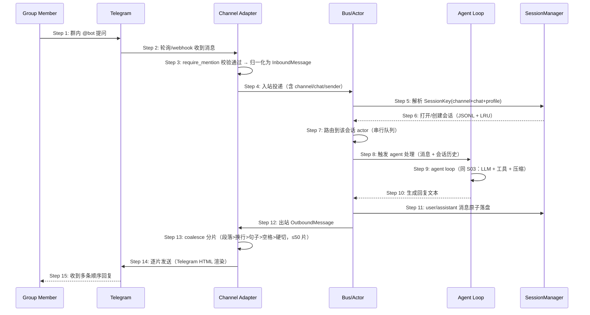

# Delta: prd/3-technical-plan/2-scenario-implementation — core-S04-gateway-channel.md

> target: logos/resources/prd/3-technical-plan/2-scenario-implementation/core-S04-gateway-channel.md(全新文档)

## ADDED — S04: 团队 IM 通道接入与消息网关 — 时序图

# S04: 团队 IM 通道接入与消息网关 — 时序图

> 场景来源：core-01-requirements.md §四 S04（P0）；交互设计：core-03-gateway-channels-design.md §一
> 参与方与架构概要 §四.3 一致：Member（IM 用户）、IM（平台，以 Telegram 为例）、CH（通道适配器）、BUS（消息总线/会话 actor）、AG（Agent loop）、SM（SessionManager）

## 时序图

## 步骤说明

1. **群成员** 在 Telegram 群中 @bot 发送问题。
2. **通道适配器** 通过轮询（或 webhook，视通道配置）收到平台消息。
3. **通道适配器** 做通道级过滤（群聊 `require_mention=true` 时忽略未 @ 消息）并归一化为统一 InboundMessage。→ 见 EX-3.1（通道凭据失效）
4. **通道适配器** 将消息投入总线入站侧。
5. **总线** 依据通道标识 + chat 标识 + profile 解析 SessionKey。

> SessionKey 同时携带 profile，使多租户 gateway 下不同租户的同名 chat 也互不串话。

6. **SessionManager** 打开会话（JSONL 持久化 + LRU 内存缓存；单文件 10MB 上限）。→ 见 EX-6.1（会话文件超限）
7. **总线** 将消息路由到该会话的 actor——每会话串行处理保证一致性，跨会话并发。
8. **actor** 调用 agent loop 处理。
9. **Agent** 执行与 S03 完全相同的核心循环（LLM + 工具 + 沙箱 + 压缩）；无人值守会话受 UNATTENDED_MAX_ITERATIONS_FALLBACK=50 兜底。→ 见 EX-9.1（处理失败）
10. **Agent** 返回回复文本。
11. **actor** 将 user/assistant 消息原子写入会话（tmp+rename）；同时支持 `/new` fork（parent_key 链接）等会话命令——会话命令在 Step 7 前被拦截处理，不进入 agent。
12. **actor** 将回复投到出站侧。
13. **通道适配器** 调用 coalesce 分片：按段落 > 换行 > 句子 > 空格 > 硬切的降级顺序贴近通道上限（Telegram 4000），UTF-8 安全边界，上限 50 片。→ 见 EX-13.1（超长截断）
14. **通道适配器** 按通道格式渲染（Telegram Markdown→HTML）逐片发送。
15. **群成员** 按序收到多条回复。

## 异常用例

### EX-3.1: 通道凭据失效
- **触发条件**：某通道 token 失效（平台返回 401）
- **期望响应**：该通道适配器报错并退避重试；其余通道不受影响；进程不退出
- **副作用**：失效期间该通道消息丢失（平台侧不重推），日志留痕

### EX-6.1: 会话文件达到 10MB 上限
- **触发条件**：会话 JSONL 追加后将达到单文件上限
- **期望响应**：追加被拒绝并告警；已有历史保持可读（原子写无半行）；用户可 `/new` fork 新会话继续
- **副作用**：新会话 parent_key 指向旧会话，历史链可查

### EX-9.1: agent 处理失败
- **触发条件**：LLM 链全部不可用或迭代耗尽
- **期望响应**：actor 捕获错误并向用户发送一条可理解的失败提示（含重试建议），不静默吞掉；错误入日志
- **副作用**：会话中保留失败轮次的记录

### EX-13.1: 回复超过分片上限
- **触发条件**：回复经 50 片仍无法装下
- **期望响应**：按 50 片截断发送，末片标注截断；不产生无限分片（DoS 上限）
- **副作用**：用户可通过追问让 agent 继续输出剩余部分
