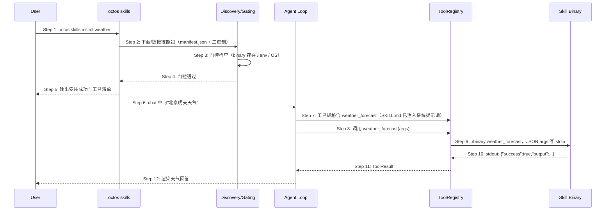

# Delta: prd/3-technical-plan/2-scenario-implementation — core-S09-skills.md

> target: logos/resources/prd/3-technical-plan/2-scenario-implementation/core-S09-skills.md(全新文档)

## ADDED — S09: 技能插件安装与使用 — 时序图

# S09: 技能插件安装与使用 — 时序图

> 场景来源：core-01-requirements.md §四 S09（P1）；交互设计：core-06-capability-design.md §二
> 参与方与架构概要 §四.6 一致：User、CLI（octos skills）、DISC（discovery/gating）、AG（Agent loop）、TR（ToolRegistry）、BIN（技能二进制）

## 时序图

## 步骤说明

1. **用户** 运行 `octos skills install weather`。
2. **CLI** 获取技能包（含 manifest.json 与平台二进制）。
3. **discovery/gating** 执行门控：二进制存在且可执行、manifest `requires.env` 全部就绪、`requires.os` 匹配。→ 见 EX-3.1（门控不满足）
4. **门控** 通过。

> 发现优先级 profile > user > bundled > legacy——同名技能就近覆盖，便于项目级定制。

5. **CLI** 输出安装成功与该技能注册的工具清单。
6. **用户** 在 chat 中自然语言提问。
7. **Agent** 的注册表已含该技能工具（经 PluginTool 适配为 Tool trait）；技能的 SKILL.md 片段已注入系统提示词，agent 因此"知道"何时/如何调用。
8. **Agent** 发起工具调用。→ 见 EX-8.1（spawn_only 工具）
9. **ToolRegistry** 以二进制协议执行：`./binary weather_forecast`，参数 JSON 写 stdin。
10. **技能二进制** 在 stdout 返回 `{success, output, files_to_send}` JSON。→ 见 EX-10.1（进程崩溃/非法输出）
11. **ToolRegistry** 解析为 ToolResult 回注。
12. **Agent** 渲染回答。

## 异常用例

### EX-3.1: 门控不满足
- **触发条件**：manifest 声明的 env 缺失或 OS 不匹配
- **期望响应**：install/list 中标记不可用及缺失项；agent 调用被拒并提示配置方法；其余技能不受影响
- **副作用**：工具不注册（LLM 看不到不可用的工具规格）

### EX-8.1: spawn_only 工具自动后台化
- **触发条件**：工具在 manifest 标记 `spawn_only: true`
- **期望响应**：agent 循环自动拦截——包装 tokio::spawn 立即返回任务句柄占位回执；任务完成后结果异步回注会话；无需 LLM 特殊配合
- **副作用**：SKILL.md 必须已注入（否则 agent 不知道该工具是长任务）

### EX-10.1: 技能进程失败
- **触发条件**：二进制崩溃、超时或输出非法 JSON
- **期望响应**：包装为工具级错误返回 agent（含 stderr 摘要），agent 可向用户说明；主进程不崩溃
- **副作用**：失败计入工具调用记录

### EX-2.1: 安装来源不可达
- **触发条件**：技能源网络不可达或包不存在
- **期望响应**：install 报错（源地址与原因），退出码非 0；不写半成品到技能目录
- **副作用**：无
