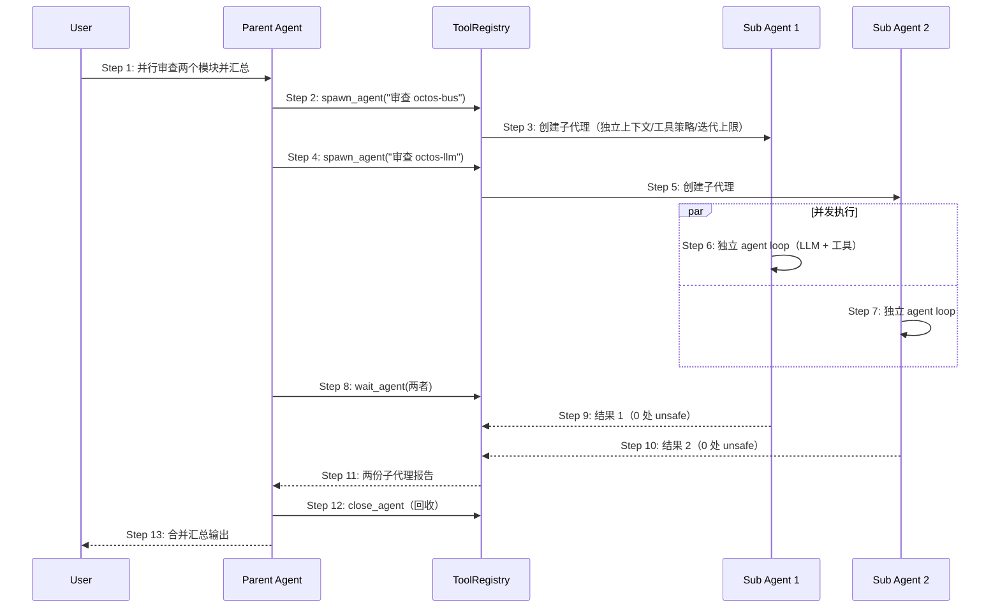

# Delta: prd/3-technical-plan/2-scenario-implementation — core-S11-sub-agent.md

> target: logos/resources/prd/3-technical-plan/2-scenario-implementation/core-S11-sub-agent.md(全新文档)

## ADDED — S11: 子代理派生与并行协作 — 时序图（主路径）

# S11: 子代理派生与并行协作 — 时序图（主路径）

> 场景来源：core-01-requirements.md §四 S11（P2）；交互设计：core-05-orchestration-design.md §二
> 参与方与架构概要 §四.1/§四.2 一致：User、PA（父 agent）、SA×2（子代理）、TR（ToolRegistry）
> P2 场景：本文档覆盖主路径；细化异常在设计评审后按需补充。

## 时序图

## 步骤说明

1. **用户** 提出可并行的任务（多模块审查/多主题调研）。
2. **父 agent** 调用 spawn/spawn_agent（delegate 为 Codex 兼容包装，同一路径）派生第一个子代理。
3. **子代理 1** 创建：独立消息上下文、独立工具策略子集、独立迭代上限（spawn 默认值以注册配置为准）；支持 send_input 追加输入、resume_agent 恢复。
4-5. **父 agent** 派生第二个子代理。
6-7. **两个子代理** 并发运行各自的 agent loop（独立 LLM 调用与工具执行，互不共享上下文）。
8. **父 agent** 用 wait_agent 阻塞收集结果（带工具超时，不挂死）。
9-10. **子代理** 完成后结果回注。
11. **父 agent** 收到两份报告；任一失败时失败状态与原因一并回注（在汇总中显式标注，不静默遗漏）。
12. **父 agent** close_agent 回收资源。
13. **父 agent** 向用户输出合并汇总。

## 异常用例（主路径级别）

### EX-8.1: wait 超时
- **触发条件**：子代理超过等待时限未完成
- **期望响应**：wait_agent 返回超时状态；父 agent 可选 send_input 催办 / resume_agent 恢复 / close_agent 放弃，并向用户说明处置
- **副作用**：子代理状态可查，不泄漏资源

### EX-9.1: 子代理失败
- **触发条件**：子代理因提供商错误或迭代耗尽失败
- **期望响应**：失败状态回注父会话；父 agent 在汇总中明确该子任务未完成及原因，不伪造结论
- **副作用**：其余子代理结果正常保留
