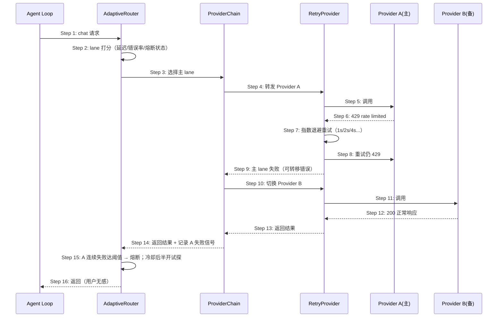

# Delta: prd/3-technical-plan/2-scenario-implementation — core-S12-llm-failover.md

> target: logos/resources/prd/3-technical-plan/2-scenario-implementation/core-S12-llm-failover.md(全新文档)

## ADDED — S12: LLM 故障转移与自适应路由 — 时序图

# S12: LLM 故障转移与自适应路由 — 时序图

> 场景来源：core-01-requirements.md §四 S12（P1）；交互设计：core-06-capability-design.md §四
> 参与方与架构概要 §四.4 一致：AG（Agent loop）、AR（AdaptiveRouter）、PC（ProviderChain）、RP（RetryProvider）、PA（主提供商）、PB（备提供商）

## 时序图

## 步骤说明

1. **Agent** 发起 chat 请求（包装链最外层是 AdaptiveRouter；未启用 adaptive 时最外层为 ProviderChain）。

> 实际包装顺序：每个基础提供商先包 RetryProvider，多提供商再由 ProviderChain/AdaptiveRouter 编排——重试在单提供商内，转移在提供商间，分层职责清晰。

2. **AdaptiveRouter** 基于 lane 打分（延迟、错误率、成本、熔断状态）选择 lane；熔断中的 lane 直接跳过。→ 见 EX-2.1（全部熔断）
3. **Router** 选择主 lane。
4. **ProviderChain** 转发给主提供商（外层已包 RetryProvider）。
5. **RetryProvider** 发起实际调用。
6. **主提供商** 返回 429。
7. **RetryProvider** 按指数退避重试（仅对 429/5xx 等可重试错误；4xx 业务错误不重试）。
8. **重试** 仍失败。
9. **RetryProvider** 向 Chain 上报可转移失败。
10. **Chain** 切换到下一个提供商（熔断计数随之更新）。
11. **RetryProvider（备）** 调用备提供商。
12. **备提供商** 返回正常响应。→ 见 EX-12.1（备也失败）
13. **结果** 逐层返回。
14. **Router** 记录主 lane 的失败信号用于打分与熔断。
15. **熔断**：连续失败达阈值后该 lane 进入熔断；冷却期后半开试探，成功则恢复。
16. **Agent** 收到正常结果——用户无感。

## 异常用例

### EX-2.1: 全部 lane 熔断
- **触发条件**：所有 lane 均在熔断期
- **期望响应**：立即返回"全链路不可用"错误（各 lane 最近失败原因），不再空转等待；半开试探到点自动恢复
- **副作用**：错误信息含每跳原因，便于定位

### EX-12.1: 备用提供商也失败
- **触发条件**：备提供商同样 429/5xx 且重试耗尽
- **期望响应**：链条穷尽后返回聚合错误：逐跳列出（A: 429 quota / B: 5xx），附可操作建议；不伪造成功回复
- **副作用**：上层（cron/gateway）按各自语义记录失败（见 S06 EX-8.1）

### EX-7.1: 不可重试错误
- **触发条件**：返回 401（凭证失效）或 400（请求非法）
- **期望响应**：RetryProvider 不重试，直接按可转移性判定：凭证类错误转移无意义时快速失败并提示修复凭证
- **副作用**：避免对必败请求放大调用量

### EX-15.1: 半开试探失败
- **触发条件**：熔断冷却后的试探请求仍失败
- **期望响应**：重新进入熔断（冷却期回退延长），健康 lane 继续承载流量
- **副作用**：无流量冲击恢复中的提供商
