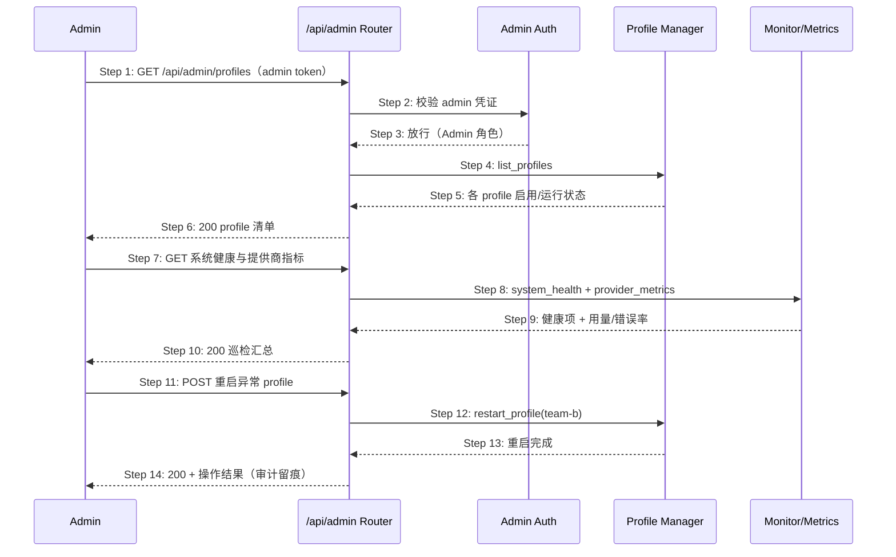

# Delta: prd/3-technical-plan/2-scenario-implementation — core-S14-admin-ops.md

> target: logos/resources/prd/3-technical-plan/2-scenario-implementation/core-S14-admin-ops.md(全新文档)

## ADDED — S14: 多租户运维与管理面 — 时序图（主路径）

# S14: 多租户运维与管理面 — 时序图（主路径）

> 场景来源：core-01-requirements.md §四 S14（P2）；交互设计：core-03-gateway-channels-design.md §三
> 参与方：Admin、API（/api/admin/* 路由组）、AUTH（admin 认证中间件）、PF（Profile 管理）、MON（监控/指标）
> P2 场景：本文档覆盖主路径；细化异常在设计评审后按需补充。

## 时序图

## 步骤说明

1. **管理员** 以 admin token 调用 `/api/admin/*`（也可在管理会话中由 agent 调 admin/* 工具集，语义一致）。
2. **认证中间件** 校验 admin 凭证（仅 Admin 角色放行；用户级 token 访问 → 403）。
3. **中间件** 放行。
4. **Profile 管理** 返回所有 profile（多租户单元：独立配置/数据目录/会话域）。
5. **API** 汇总启用与运行状态。
6. **管理员** 获得清单。
7. **管理员** 请求健康与指标。
8. **监控面** 提供 system_health / system_metrics / provider_metrics（用量、错误率）。
9. **API** 汇总返回。
10. **管理员** 发现 team-b 异常。
11. **管理员** 发起重启。
12. **Profile 管理** 执行 restart_profile（另有 start/stop/enable/update/view_logs 等 20 个 admin 工具同面）。
13. **完成**。
14. **API** 返回结果并留审计记录。

## 异常用例（主路径级别）

### EX-2.1: 非 admin 凭证
- **触发条件**：用户级 token 请求管理面
- **期望响应**：403，不泄露 profile 清单等内部信息；可计入审计
- **副作用**：无

### EX-12.1: 重启失败
- **触发条件**：目标 profile 不存在或重启过程中出错
- **期望响应**：返回明确错误（profile 不存在 → 404 语义；执行失败 → 500 + 原因）；不产生半状态（profile 配置不被破坏）
- **副作用**：失败留审计记录
