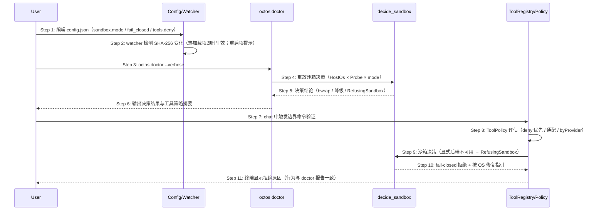

# Delta: prd/3-technical-plan/2-scenario-implementation — core-S15-security-config.md

> target: logos/resources/prd/3-technical-plan/2-scenario-implementation/core-S15-security-config.md(全新文档)

## ADDED — S15: 安全策略与沙箱配置管理 — 时序图（主路径）

# S15: 安全策略与沙箱配置管理 — 时序图（主路径）

> 场景来源：core-01-requirements.md §四 S15（P2）；交互设计：core-02-cli-onboarding-design.md §四
> 参与方与架构概要 §四.2 一致：User、CFG（config.json + config watcher）、DOC（octos doctor）、DEC（decide_sandbox 决策层）、TR（ToolRegistry/ToolPolicy）
> P2 场景：本文档覆盖主路径；细化异常在设计评审后按需补充。

## 时序图

## 步骤说明

1. **用户** 编辑 config.json 的 sandbox 与 tools 段。
2. **config watcher** 以 SHA-256 检测变更：系统提示词类热加载；provider/model/hooks 类提示需重启。

> 安全相关配置以"显式声明优先"为基本原则：`enabled=false`/`mode="none"` 是显式豁免并覆盖 fail_closed；除此之外不可用即拒绝，不允许静默降级。

3. **用户** 运行 `octos doctor --verbose` 验证。
4. **doctor** 重放沙箱决策（同一纯决策层 decide_sandbox， HostOs × HostBackendProbe × mode）。
5. **决策层** 返回结论：可用后端 / 响亮降级 / RefusingSandbox。
6. **doctor** 输出决策结果、候选链与生效的工具策略摘要。→ 见 EX-6.1（配置非法）
7. **用户** 在 chat 中触发一条边界命令做端到端验证。
8. **ToolRegistry** 先过 ToolPolicy（deny 优先于 allow；通配与 group 展开；byProvider 覆盖）。
9. **ToolRegistry** 经决策层解析沙箱；显式后端不可用时返回 RefusingSandbox。
10. **决策层** 拒绝并附按 OS 的修复指引。
11. **终端** 显示拒绝原因——与 doctor 报告完全一致（同一决策源，无双标）。

## 异常用例（主路径级别）

### EX-6.1: 配置非法
- **触发条件**：sandbox.mode 拼写错误或 tools 组名不存在
- **期望响应**：doctor 输出配置错误项与合法取值清单，退出码非 0（--strict 下）；运行期按安全默认处理并告警
- **副作用**：无

### EX-9.1: auto 无后端且 fail_closed=false
- **触发条件**：auto 模式下无任何可用后端
- **期望响应**：响亮降级为 NoSandbox——每进程告警一次、doctor 报告；命令仍执行（用户已默认接受）；fail_closed=true 时转为拒绝
- **副作用**：告警留日志
