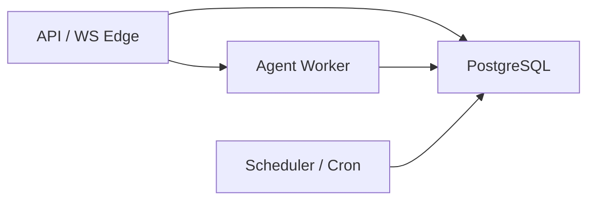

# Delta: prd/3-technical-plan/1-architecture — core-01-architecture-overview.md

> target: logos/resources/prd/3-technical-plan/1-architecture/core-01-architecture-overview.md

## ADDED — 十、集群部署架构视图（S16）

## 十、集群部署架构视图（S16）

> 决策权威：docs/adr/cluster-state-and-execution.md。本节是架构概要的部署侧补充，不替代 ADR 条文。

### 10.1 逻辑部署单位

第一阶段允许同一二进制角色化启动；扩缩容依据与本地状态允许范围按角色分离。

### 10.2 状态边界

| 层 | 允许 | 禁止 |
|----|------|------|
| PG | 会话 canonical、事件 seq、审批、租约、检查点、cron | — |
| Pod 本地 | 连接、缓存、加速层 | 作为跨 Pod 真相源 |
| 工作区 FS | 工具工作区（可 PVC） | 替代 PG 会话账本 |

### 10.3 与单机模式关系

- `octos chat` / `octos gateway` 保留 local adapter（JSONL/redb）
- `octos serve` 在集群配置下切换 PG 后端；对外 UI Protocol / REST 契约保持兼容
