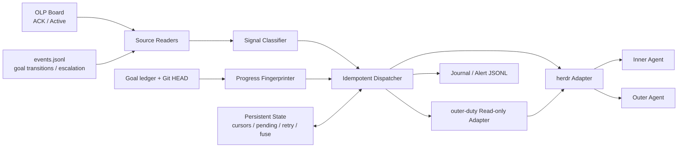

# Delta: prd/3-technical-plan/1-architecture — core-01-architecture-overview.md

> target: logos/resources/prd/3-technical-plan/1-architecture/core-01-architecture-overview.md

## ADDED — 十一、OctoLoop Watchdog 架构视图（S17）

## 十一、OctoLoop Watchdog 架构视图（S17）

### 11.1 组件与依赖方向

依赖只从 Watchdog 指向外部权威面。Watchdog 不提供黑板/goal/Git 的写模型，不持有 outer-duty 锁，也不把 pane id 长期缓存成身份。

### 11.2 模块边界

| 模块 | 输入 | 输出 | 禁止事项 |
|------|------|------|----------|
| Source Readers | board/events/goal/git | 带 file identity 与 highwater 的事实 | 修改源文件、猜测损坏边界 |
| Signal Classifier | 新事实 | typed signal + stable signal_id | 从自由日志猜授权 |
| Progress Fingerprinter | board/ledger/git 权威字段 | task fingerprint | 把 agent 状态抖动当进展 |
| Duty Adapter | project path | HELD/VACANT/ERROR/unsupported | acquire、hold、TTL 接管 |
| Herdr Adapter | 每次实时 agent list | accepted/失败的 prompt receipt | cwd 模糊匹配、多候选择一 |
| State Store | cursor/pending/delivery/retry/fuse | 原子 JSON 状态 | 存储凭据、充当业务真相源 |
| Alert Sink | fault/fuse/pending | journal + JSONL | 吞掉错误或把告警记成成功 |

### 11.3 一致性与投递语义

- 采用 at-least-once 信号处理与稳定 signal id，而非无法跨 CLI 进程保证的 exactly-once。
- 状态转换顺序为“持久化 pending → 调用外部适配器 → 持久化 accepted/delivered”；恢复时 pending 可重试。
- cursor 只在解析成功且信号已进入 pending/delivered/fused 可审计状态后推进。
- 本地 state 写入使用同目录原子 rename；单项目只允许一个 Watchdog writer，以 systemd 单实例和进程锁防并发。
- 事件轮转以 file identity/generation 识别；无法证明连续性时 fail closed 并告警。

### 11.4 安全与授权边界

Watchdog 只提交用户消息级门铃，不执行门铃指向的业务动作。OpenLogos 的 merge、verify、部署、smoke、archive、push 授权仍由既有工作流裁定；通用 Claude/Codex auto mode 不产生授权。`openlogos next --auto` 的 standing 授权不由 Watchdog 创建、延长或伪造，`gate:implement:loop-exhausted` 始终硬阻塞。

### 11.5 可观测性与测试接缝

- `run-once --json` 是无守护环境与 ST 的确定性入口。
- source reader、clock、agent discovery、duty check、prompt sender、state store、alert sink 均以 trait/adapter 注入假实现。
- 每次周期输出 cycle id、source highwater、分类计数、投递结果与 fingerprint change，不记录秘密或完整对话。
- 所有自动测试通过 OpenLogos reporter 追加真实 UT/ST ID 至 `logos/resources/verify/test-results.jsonl`。
