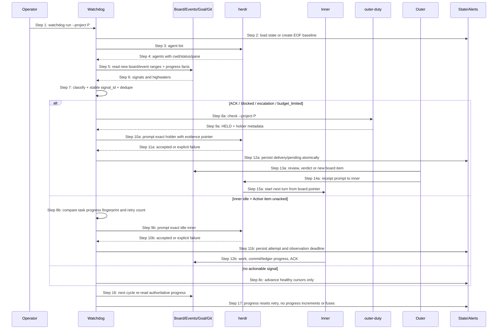

## MODIFIED — 主时序：ACK/负信号唤醒外环，空闲待办续推内环

```mermaid
sequenceDiagram
    participant OP as Operator
    participant WD as Watchdog
    participant SRC as Board/Events/Goal/Git
    participant HD as herdr
    participant IN as Inner
    participant OD as outer-duty
    participant OUT as Outer
    participant ST as State/Alerts

    OP->>WD: Step 1: watchdog run --project P
    WD->>ST: Step 2: load state or create EOF baseline
    WD->>HD: Step 3: agent list
    HD-->>WD: Step 4: agents with cwd/status/pane
    WD->>SRC: Step 5: read new board/event ranges + progress facts
    SRC-->>WD: Step 6: signals and highwaters
    WD->>WD: Step 7: classify + stable signal_id + dedupe
    alt ACK / blocked / escalation / budget_limited
        WD->>OD: Step 8a: check --project P
        OD-->>WD: Step 9a: HELD + holder metadata
        WD->>HD: Step 10a: prompt exact holder with evidence pointer
        HD-->>WD: Step 11a: accepted or explicit failure
        WD->>ST: Step 12a: persist delivery/pending atomically
        OUT->>SRC: Step 13a: review, verdict or new board item
        OUT->>HD: Step 14a: receipt prompt to inner
        HD->>IN: Step 15a: start next turn from board pointer
    else inner idle + Active item unacked
        WD->>WD: Step 8b: compare task progress fingerprint and retry count
        WD->>HD: Step 9b: prompt exact idle inner
        HD-->>WD: Step 10b: accepted or explicit failure
        WD->>ST: Step 11b: persist attempt and observation deadline
        IN->>SRC: Step 12b: work, commit/ledger progress, ACK
    else no actionable signal
        WD->>ST: Step 8c: advance healthy cursors only
    end
    WD->>SRC: Step 16: next cycle re-read authoritative progress
    WD->>ST: Step 17: progress resets retry, no progress increments or fuses
```

> 修复说明：原时序图 Step 17 消息文本中的 ASCII 分号 `;` 被 mermaid 解释为语句分隔符，导致整图解析失败（渲染为语法错误框）；改为逗号后通过 mermaid v10/v11 双版本解析校验（`scripts/check-mermaid.mjs`）。
