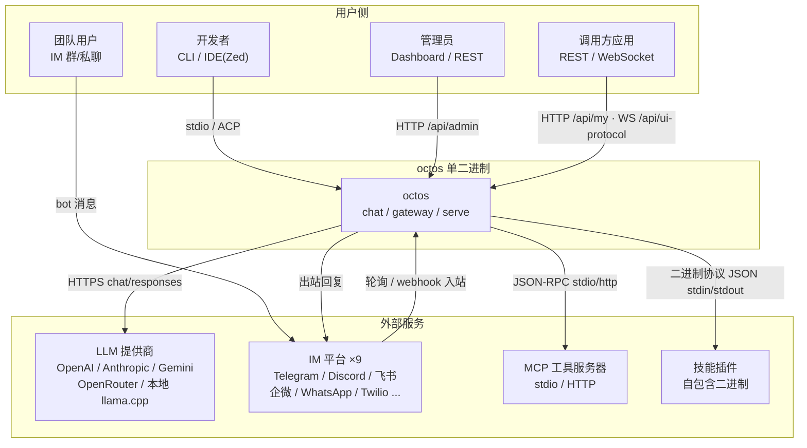
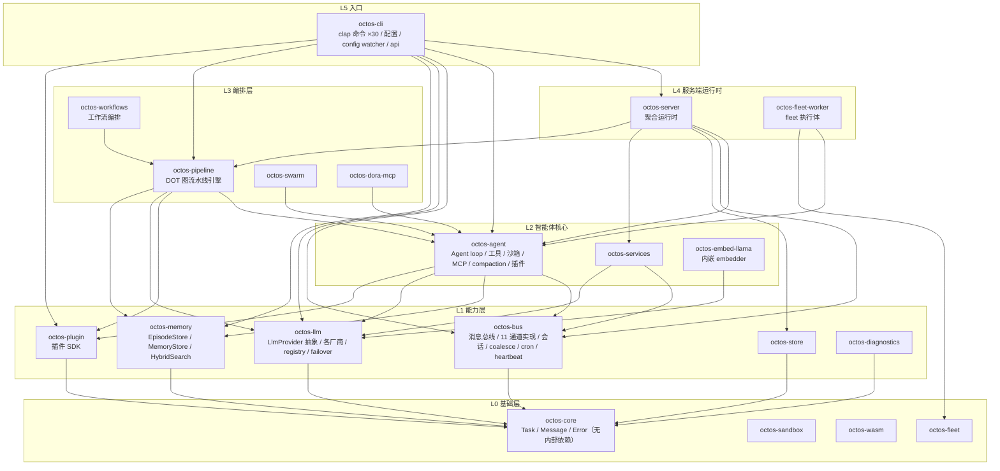
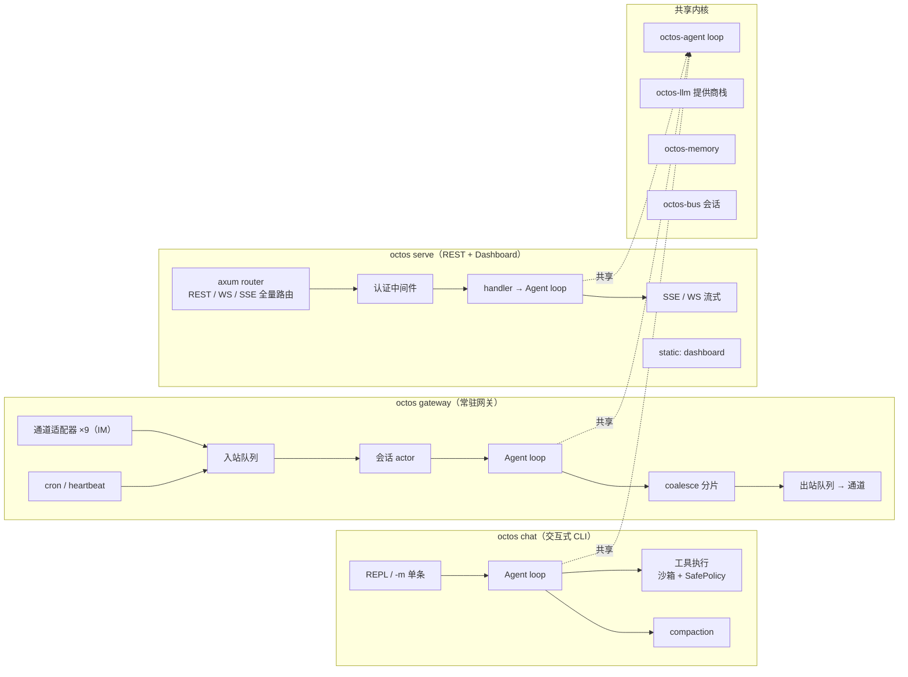
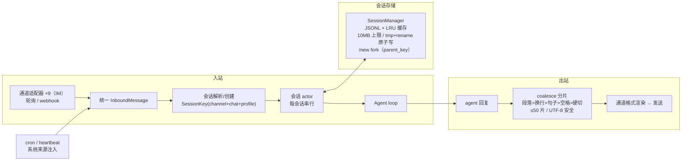

## MODIFIED — 一、系统上下文

octos 是单二进制、自托管的智能体运行平台。对外边界：LLM 提供商 API（OpenAI/Anthropic/Gemini/OpenRouter 及各 OpenAI 兼容家族、本地 llama.cpp/LM Studio）、9 个 IM 平台、MCP 工具生态、IDE（ACP）、调用方应用（REST/WebSocket）。

> 口径说明（2026-09-29，trim-unused-features）：IM 通道 9 个（telegram / discord / whatsapp / feishu / twilio / wecom / wecom-bot / matrix / matrix-user），另有 api/cli 两个本地通道，`*_channel.rs` 合计 11 个；dingtalk / slack / line / email / qq-bot / wechat 已随裁剪移除。

## MODIFIED — 二、分层架构（crate 级）

Rust 工作区（edition 2024，rust 1.85+），20 个平台 crate + 15 个技能 crate（14 app-skills + 1 platform-skill）。依赖方向自上而下，禁止反向依赖。

依赖规则：`octos-core` 无内部依赖；技能 crate（app-skills / platform-skills）不进入平台依赖图，运行期以二进制协议接入。

> 口径说明（2026-09-29，trim-unused-features）：FFI 绑定家族（octos-ffi / octos-uniffi / octos-pyo3）已移除，平台 crate 23 → 20；octos-bus 通道实现 11 个（9 IM + api/cli）；clap 顶层子命令 30 个。

## MODIFIED — 三、三种运行时部署视图

同一内核（agent loop + 工具 + 记忆）支撑三种进程形态：

> 口径说明（2026-09-29）：gateway 通道适配器为 9 个 IM 通道（api/cli 为本地通道，不经 gateway 适配）；路由数不设固定口径（实测 route( 注册点 226 处、唯一路径 76 条，随开发演进）。

## MODIFIED — 4.3 消息总线与通道（gateway 内核）

> 口径说明（2026-09-29）：通道适配器 9 个 IM 通道，同三节口径。

## MODIFIED — 八、外部依赖与测试策略

| 依赖 | 用途 | 测试策略 |
|------|------|---------|
| LLM 提供商 API | 全部对话能力 | mock-service（录制/桩 provider）；真实调用测试 `#[ignore]` 手动触发 |
| IM 平台（9 通道） | 消息收发 | mock-service（通道适配层以假 InboundMessage 单测；端到端手动验证） |
| MCP 服务器 | 工具扩展 | mock-service（内置测试 server fixture） |
| 沙箱后端（bwrap/docker 等） | 命令隔离 | env-disable + 纯决策层矩阵单测（HostOs × Probe 全组合可跨宿主测试） |
| OAuth IdP（OpenAI 等） | 登录 | mock-service + fixed-value（本地 callback 仿真） |
| embedding provider | 记忆向量通道 | env-disable（降级 BM25-only 路径即默认测试路径） |
