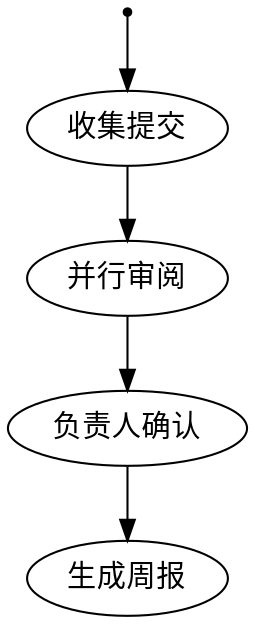

# core-05 编排与自动化 — 功能规格

> 覆盖场景：S07（流水线编排多步工作流）、S11（子代理派生与并行协作）
> 需求来源：core-01-requirements.md（Phase 1）
> 配套原型：`core-05-orchestration-terminal.md`

## 一、S07: 流水线编排多步工作流 — 交互规格

### 1.1 概述

流水线引擎（octos-pipeline）以 **DOT 图**定义多步工作流，通过 agent 工具 `run_pipeline` 在 chat/gateway 会话中触发执行（无独立 CLI 子命令）。核心能力：per-node 模型选择（ModelStylesheet）、并行 fan-out、checkpoint 断点续跑、human gate 人工卡点、产物存储（artifact store）。

### 1.2 DOT 定义（交互输入）

用户在工作区编写 `.dot` 流水线定义，节点带 handler 类型与属性（模型、超时、gate 等）：

**关键节点属性**：

| 属性 | 说明 |
|------|------|
| handler | agent / parallel / dynamic_parallel / human_gate / 条件节点等 |
| model | 节点级模型覆盖（ModelStylesheet 匹配） |
| workers | fan-out 并发 worker 数 |
| timeout_secs | 节点超时（图级可用 default_timeout_secs 兜底） |
| human_gate + resolver | 人工卡点节点必须声明 resolver（校验期强制） |

### 1.3 交互流程

1. 用户在会话中要求"运行 release_notes 流水线"（或直接让 agent 执行指定 .dot）
2. agent 调用 `run_pipeline` 工具：解析 DOT → 校验（图合法性、human_gate 必须带 resolver 等）→ 构建执行计划
3. 执行器按依赖调度节点；parallel 节点在运行时展开 N 个并发 worker；每个节点完成后将状态写入 checkpoint
4. 到达 human_gate：执行暂停，通过配置的 resolver（如消息通道）向负责人请求确认；确认/拒绝后恢复
5. 全部完成：返回 PipelineResult（总输出、token 用量、逐节点摘要、修改文件清单）；产物落 artifact store
6. 中断恢复：进程崩溃/手动中断后重新触发，已完成节点按 checkpoint 跳过

#### 验收条件（交互级）

##### 正常：端到端执行
- **GIVEN** 工作区存在合法的 release_notes.dot（含 parallel 与 human_gate）
- **WHEN** 用户在 chat 中要求运行该流水线
- **THEN** 会话中可见逐节点进度（开始/完成/模型）；fan-out 节点显示 worker 并发数；human_gate 暂停并提示等待确认；确认后执行到底，agent 汇总 PipelineResult（token 用量、逐节点摘要、修改文件）

##### 正常：校验前置拦截
- **GIVEN** DOT 中 human_gate 节点未声明 resolver
- **WHEN** run_pipeline 解析校验
- **THEN** 工具直接返回校验错误（指明节点与缺失属性），不启动任何节点执行、不消耗模型调用

##### 正常：断点续跑
- **GIVEN** 上次执行在 fanout 节点完成后崩溃
- **WHEN** 用户重新触发同一流水线
- **THEN** collect 与 fanout 节点被跳过（标记为 checkpoint 命中），执行从 gate 节点继续；最终 PipelineResult 不含重复节点扣费

##### 异常：human_gate 被拒绝
- **GIVEN** 流水线执行到 human_gate
- **WHEN** 负责人选择"拒绝"
- **THEN** 流水线以"人工拒绝"状态终止，后续节点不执行；结果中记录拒绝人与时间；可修改定义后重新触发（已完成的下游节点无 checkpoint，重新执行）

##### 异常：节点 token 预算耗尽
- **GIVEN** 图配置 max_total_tokens=200000
- **WHEN** 累计用量达到上限
- **THEN** 执行器停止调度新节点，返回预算耗尽状态与已完成节点摘要；checkpoint 已落盘可供续跑

## 二、S11: 子代理派生与并行协作 — 交互规格

### 2.1 概述

agent 可通过一族工具派生并管理子代理：`spawn` / `spawn_agent`（派生）、`send_input`（下发输入）、`resume_agent`（恢复）、`wait_agent`（等待结果）、`close_agent`（回收）；`delegate` 为 Codex 兼容包装，走同一路径。子代理拥有独立上下文与工具策略，默认迭代上限独立（spawn 默认值以注册配置为准）。

### 2.2 交互流程

1. 主 agent 判断任务可拆分（如"同时审三个模块"），调用 spawn 派生 N 个子代理（带独立任务描述与可选角色/工具子集）
2. 子代理在后台独立运行自己的 agent loop（独立 LLM 调用与工具执行）
3. 主 agent 可继续做别的事，或用 wait_agent 阻塞收集结果
4. 子代理完成后结果回注主会话；主 agent 汇总输出
5. close_agent 回收资源；会话内可见子代理状态（运行中/完成/失败）

#### 验收条件（交互级）

##### 正常：并行派生与汇总
- **GIVEN** 用户在 chat 中要求"并行审查 src/ 下三个模块的 unsafe 用法并汇总"
- **WHEN** agent 开始执行
- **THEN** 会话中可见 3 个子代理被派生（各自任务摘要）；全部完成后主 agent 输出合并报告（逐模块发现 + 汇总）；子代理互不影响彼此的上下文

##### 正常：等待与超时
- **GIVEN** 一个子代理长时间未返回
- **WHEN** 主 agent 以 wait_agent 等待并达到工具超时
- **THEN** wait_agent 返回超时状态而非挂死；主 agent 可选择 send_input 催办、resume_agent 恢复或 close_agent 放弃，并在会话中说明处置

##### 异常：子代理失败回注
- **GIVEN** 某子代理因提供商错误失败
- **WHEN** 结果回注主会话
- **THEN** 主 agent 收到该子代理的失败状态与原因，并在最终汇总中明确标注该模块未完成审查（不静默遗漏、不伪造结论）

**原型**：`core-05-orchestration-terminal.md`
