# octos 技术架构概要

> 最后更新：2026-09-20
> 输入：core-01-requirements.md（S01–S15）、core-02~06 产品设计、core-system-map.md（逆向种子，本文以代码核验为准）
> 架构文件全局唯一：后续架构修改始终更新本文档，不新建文件。

## 一、系统上下文

octos 是单二进制、自托管的智能体运行平台。对外边界：LLM 提供商 API（OpenAI/Anthropic/Gemini/OpenRouter 及各 OpenAI 兼容家族、本地 llama.cpp/LM Studio）、17 个 IM 平台、MCP 工具生态、IDE（ACP）、调用方应用（REST/WebSocket）。

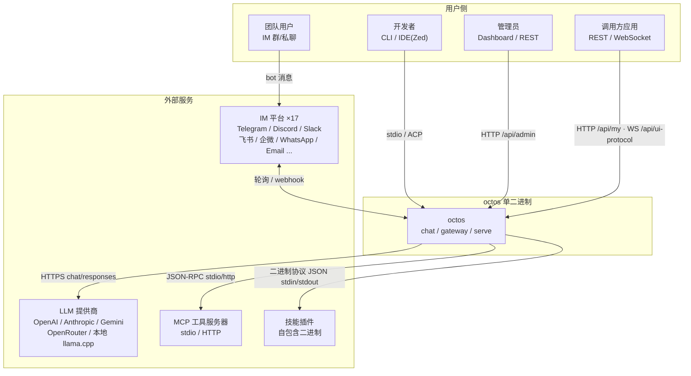

## 二、分层架构（crate 级）

Rust 工作区（edition 2024，rust 1.85+），23 个平台 crate + 15 个技能 crate（14 app-skills + 1 platform-skill）。依赖方向自上而下，禁止反向依赖。

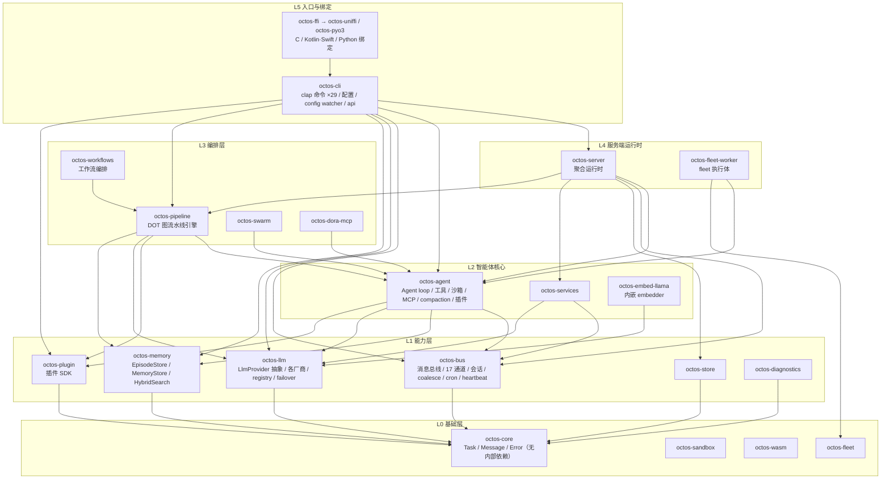

依赖规则：`octos-core` 无内部依赖；技能 crate（app-skills / platform-skills）不进入平台依赖图，运行期以二进制协议接入。

## 三、三种运行时部署视图

同一内核（agent loop + 工具 + 记忆）支撑三种进程形态：

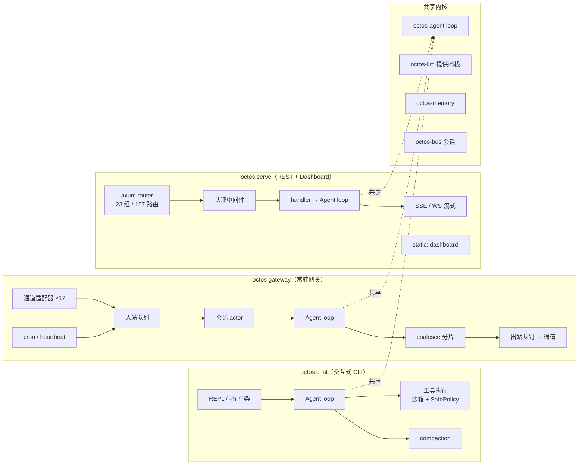

## 四、子系统架构（分层子图）

### 4.1 Agent loop 与上下文压缩

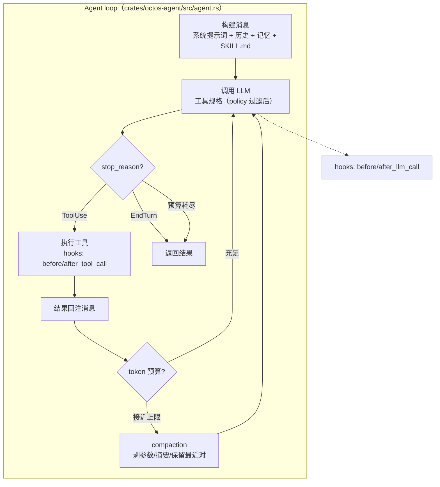

### 4.2 工具系统与沙箱决策

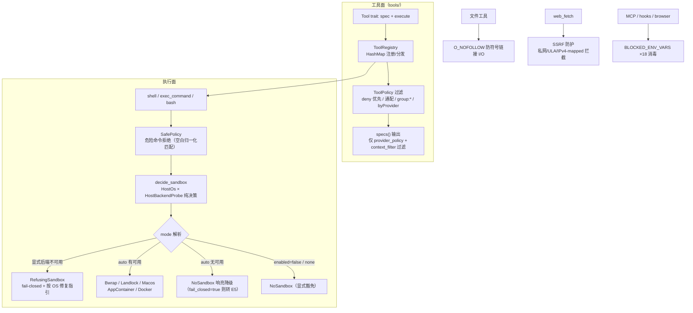

### 4.3 消息总线与通道（gateway 内核）

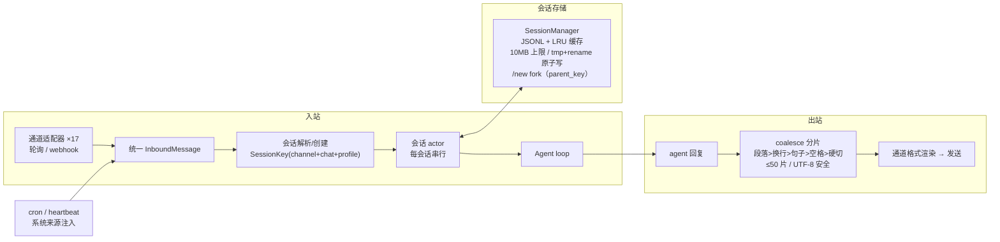

### 4.4 LLM 提供商栈与故障转移

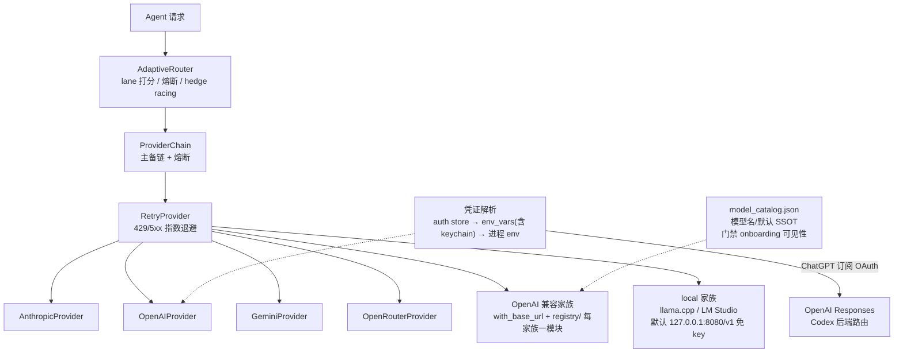

### 4.5 记忆系统

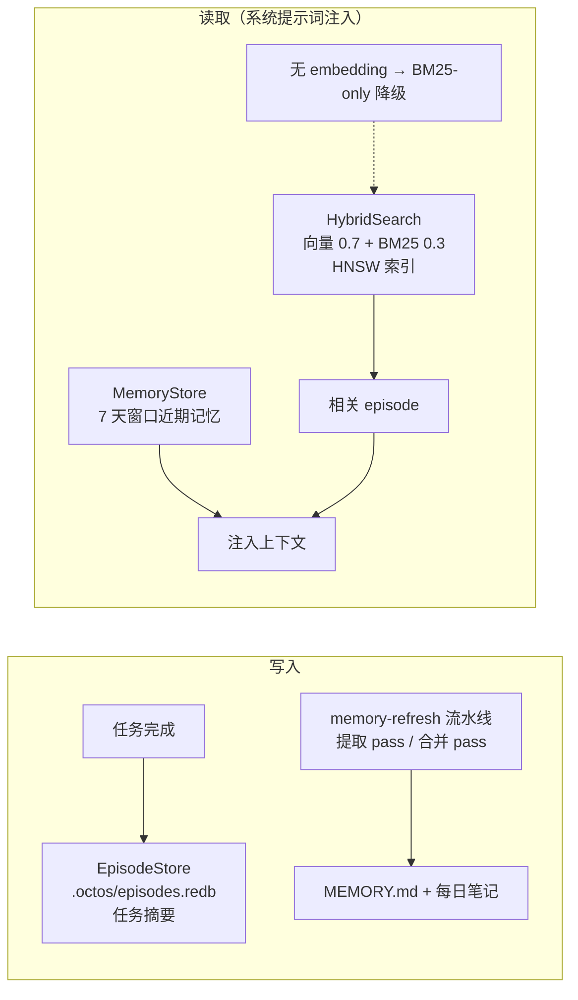

### 4.6 插件与 MCP

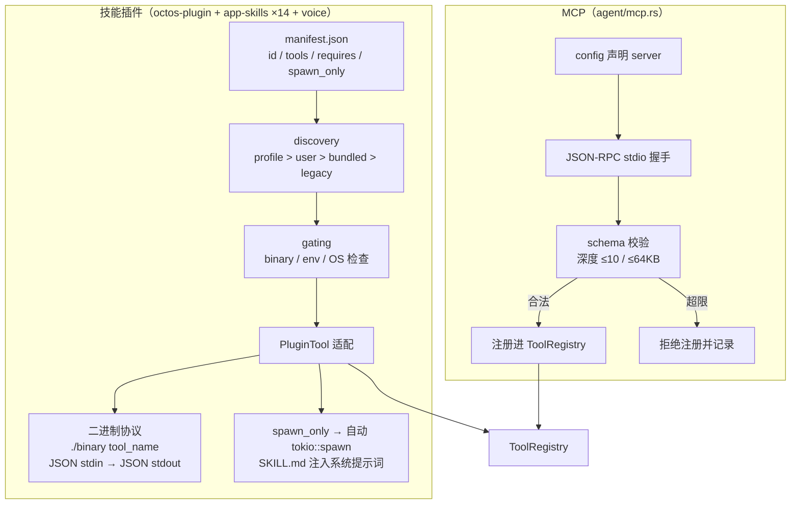

## 五、系统处理流程（端到端）

### 5.1 octos chat 单轮请求流程

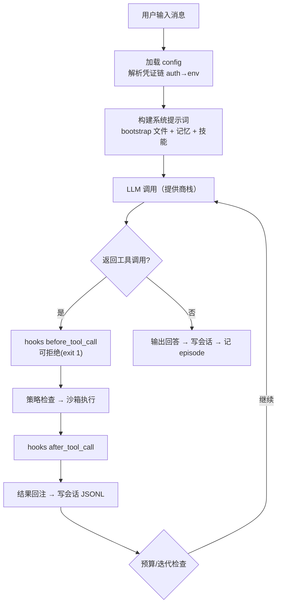

### 5.2 gateway 消息处理流程

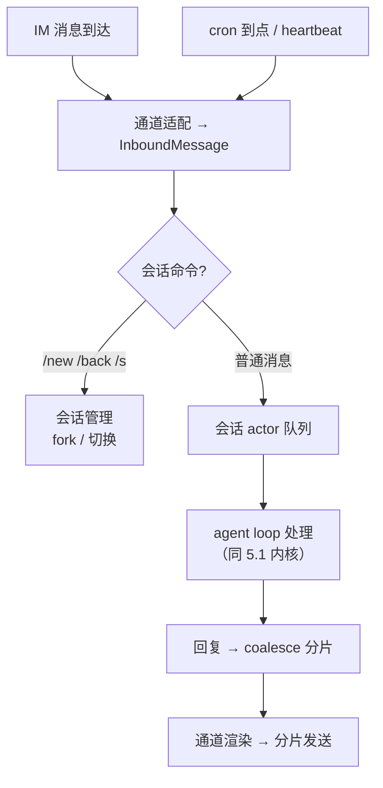

### 5.3 serve 请求处理流程

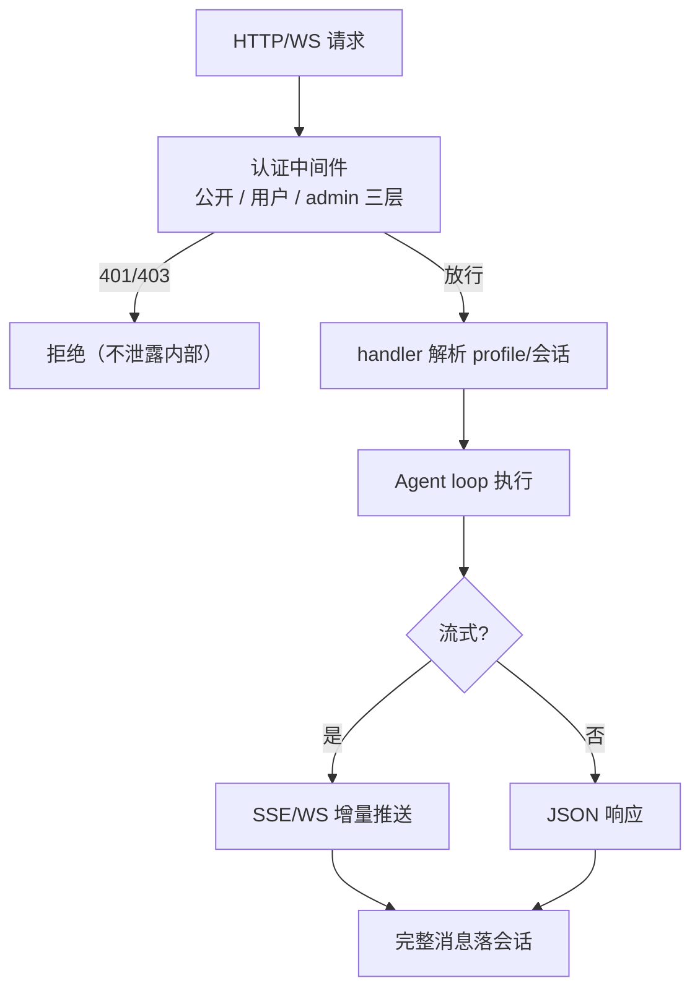

### 5.4 pipeline 执行流程

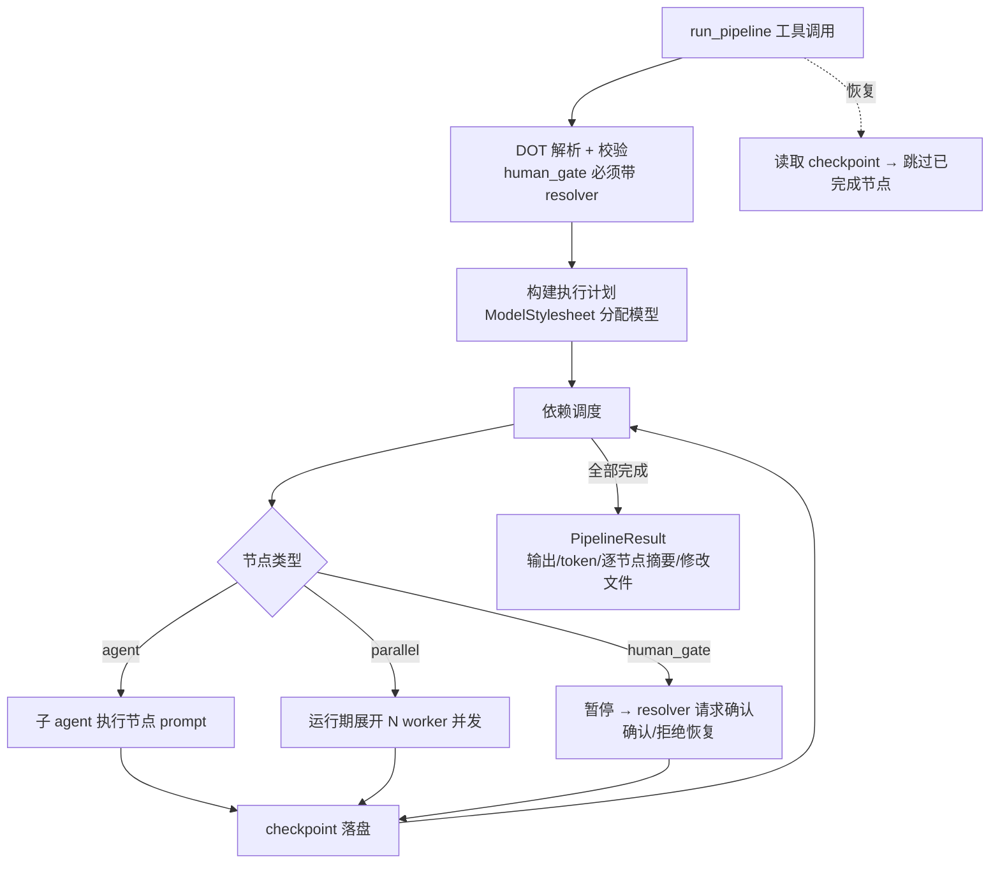

## 六、技术选型

| 维度 | 选型 | 理由 | 备选方案 |
|------|------|------|---------|
| 语言 | Rust（edition 2024，1.85+） | 单二进制分发、内存安全（deny(unsafe_code)）、跨平台抽象 | Go（GC 暂停与二进制体积） |
| 异步运行时 | tokio | agent loop 并发工具执行、通道 IO、fan-out 的事实标准 | async-std（生态较小） |
| TLS | rustls（纯 Rust） | 无 OpenSSL 系统依赖，交叉编译与审计友好 | native-tls（引入系统依赖） |
| HTTP 框架 | axum | tokio 原生、类型安全路由、中间件生态 | actix-web（学习曲线） |
| 嵌入式存储 | redb | 纯 Rust 嵌入式 KV，episode 存储零运维 | sled（维护停滞）、sqlite（C 依赖） |
| 向量检索 | hnsw_rs | 纯 Rust HNSW，内存索引无外部服务 | qdrant（外部服务，违背单二进制） |
| LLM 抽象 | 自研 LlmProvider trait + registry | 4 原生 + N 兼容家族统一；3 层 failover 自研可控 | langchain-rust（不成熟） |
| 沙箱 | bwrap/Landlock/sandbox-exec/AppContainer/Docker 五后端 | 按平台用足 OS 原生隔离；纯决策层可单测 | 仅 Docker（Linux 开发机过重） |
| 通道框架 | 各平台 SDK/HTTP（teloxide 等） | 每通道最薄适配层，行为一致性由 bus 保证 | 桥接服务（引入外部依赖） |
| 流水线 | 自研 DOT 图引擎 | 与 agent/工具/模型栈深度集成，checkpoint/human gate 原生 | temporal（重型外部服务） |
| 插件协议 | 自包含二进制 + JSON stdin/stdout | 语言无关、进程隔离、无需 ABI 稳定 | 动态链接（ABI 脆弱）、WASM（已备 wasm crate 作演进方向） |
| 错误处理 | eyre / color-eyre | 调用链上下文丰富，CLI 友好 | anyhow（约定不如 eyre 报告） |

## 七、非功能性约束

### 7.1 性能
- 交互首 token：取决于提供商，本地不做固定 SLA；CLI 渲染保持流式即时回显
- gateway 单消息处理：会话 actor 串行保证一致性，跨会话并发
- 工具参数上限 1MB（非分配估算防 OOM）；会话文件上限 10MB；coalesce 分片 ≤ 50
- 无人值守迭代兜底：UNATTENDED_MAX_ITERATIONS_FALLBACK = 50

### 7.2 安全
- 执行面：SafePolicy 危险命令拒绝 → 沙箱五后端 fail-closed → O_NOFOLLOW 文件 I/O
- 网络面：SSRF 防护（web_fetch）、私网拦截；serve 默认 127.0.0.1
- 凭证面：auth.json 0600；keychain 集成；BLOCKED_ENV_VARS ×18 贯穿沙箱/MCP/hooks/browser
- 工具面：ToolPolicy deny 优先；MCP schema 深度/大小上限
- API 面：三层认证中间件（公开/用户/admin）

### 7.3 可扩展性
- 单机自托管为主；多实例/多租户以 profile 隔离；fleet/swarm crate 为多机演进预留
- 新 LLM 家族：registry/ 一个模块 + model_catalog.json 一行
- 新通道：bus 适配层一个实现
- 新工具：内置 Tool trait / MCP / 技能二进制三选一

### 7.4 可观测性
- `octos doctor` 自检（配置/凭证/沙箱/本地服务发现/磁盘）
- admin 工具：system_health / system_metrics / provider_metrics / view_logs
- hooks 生命周期事件（4 事件）+ 熔断自动禁用（3 连败）
- config watcher：SHA-256 变更检测（系统提示词热加载，provider/model/hooks 需重启）

### 7.5 开发体验
- `cargo build/test/clippy/fmt --workspace`；milestone-ci.sh 为特性默认基准
- TDD：RED→GREEN→REFACTOR；单测内联、集成测试 crates/*/tests/

## 八、外部依赖与测试策略

| 依赖 | 用途 | 测试策略 |
|------|------|---------|
| LLM 提供商 API | 全部对话能力 | mock-service（录制/桩 provider）；真实调用测试 `#[ignore]` 手动触发 |
| IM 平台（17 通道） | 消息收发 | mock-service（通道适配层以假 InboundMessage 单测；端到端手动验证） |
| MCP 服务器 | 工具扩展 | mock-service（内置测试 server fixture） |
| 沙箱后端（bwrap/docker 等） | 命令隔离 | env-disable + 纯决策层矩阵单测（HostOs × Probe 全组合可跨宿主测试） |
| OAuth IdP（OpenAI 等） | 登录 | mock-service + fixed-value（本地 callback 仿真） |
| embedding provider | 记忆向量通道 | env-disable（降级 BM25-only 路径即默认测试路径） |

## 九、部署约束（交接 deployment-designer）

- **交付形态**：单二进制 `octos`（cargo install / release 二进制）；默认特性含 embed-llama（需 cmake + C++ 工具链；可 `--no-default-features --features api` 精简）
- **运行环境**：Linux / macOS / Windows；gateway/serve 建议常驻（systemd / pm2 / Docker）
- **数据目录**：`~/.octos`（config.json / sessions / episodes.redb / cron 存储），备份即目录拷贝；凭证独立存放于 XDG `~/.config/octos/auth.json`（legacy `~/.octos/auth.json` 启动时自动迁移，0600）
- **配置与密钥**：config.json + auth.json（0600）+ env vars + keychain；不入库、不入仓
- **健康检查**：`octos doctor`（CLI）、`GET /api/version`（serve）、进程存活（gateway）
- **smoke 最小链路**：init → auth status → chat -m 单轮 → serve /api/version → gateway 通道回环
- **部署环境**：当前模块 deployment_required=true（staging 环境），完整方案待 Phase 3 Step 3 deployment-designer 产出

## 十、集群部署架构视图（S16）

> 决策权威：docs/adr/cluster-state-and-execution.md。本节是架构概要的部署侧补充，不替代 ADR 条文。

### 10.1 逻辑部署单位

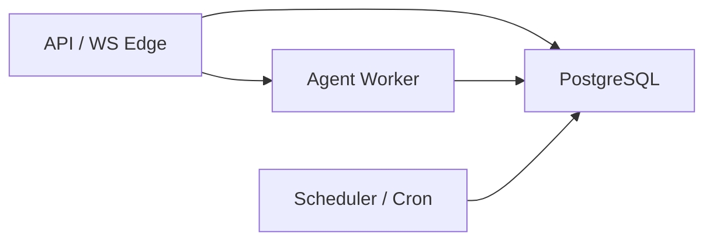

第一阶段允许同一二进制角色化启动；扩缩容依据与本地状态允许范围按角色分离。

### 10.2 状态边界

| 层 | 允许 | 禁止 |
|----|------|------|
| PG | 会话 canonical、事件 seq、审批、租约、检查点、cron | — |
| Pod 本地 | 连接、缓存、加速层 | 作为跨 Pod 真相源 |
| 工作区 FS | 工具工作区（可 PVC） | 替代 PG 会话账本 |

### 10.3 与单机模式关系

- `octos chat` / `octos gateway` 保留 local adapter（JSONL/redb）
- `octos serve` 在集群配置下切换 PG 后端；对外 UI Protocol / REST 契约保持兼容

