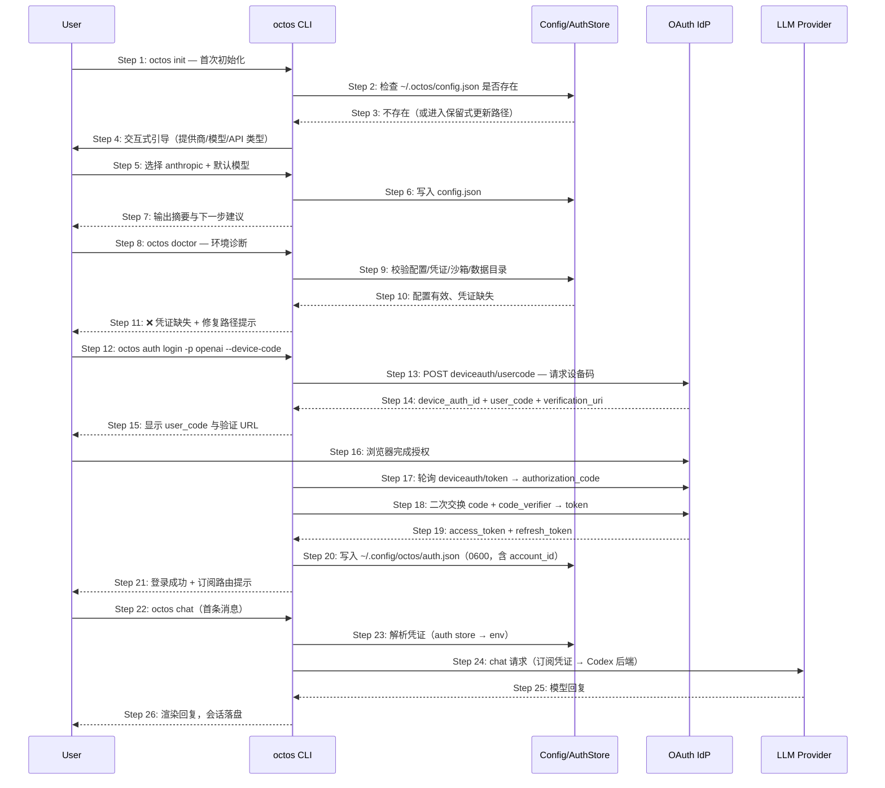

# S02: 开发者首次上手与认证 — 时序图

> 场景来源：core-01-requirements.md §四 S02（P0）；交互设计：core-02-cli-onboarding-design.md §二
> 参与方与架构概要 §一/§四.4 一致：CLI（octos-cli）、Config（config.json + auth store）、IdP（OAuth 提供方）、LLM（提供商 API）

## 时序图

## 步骤说明

1. **用户** 运行 `octos init`，这是与产品的第一次接触。
2. **CLI** 检查 `~/.octos/config.json` 是否已存在。
3. **Config** 返回检查结果；已存在时 init 走保留用户修改的更新路径，不静默覆盖。
4. **CLI** 进入交互式引导（提供商 → 模型 → API 类型，仅适用家族）。
5. **用户** 完成选择（本例 anthropic + 默认模型）。
6. **CLI** 将选择写入 config.json。
7. **CLI** 输出配置摘要与下一步建议（doctor/auth/chat）。

> init 把"选提供商"放在首次接触完成，是因为此时用户意图最明确；后续改配置可用 `octos config` 查看、手工编辑或重跑 init。

8. **用户** 运行 `octos doctor` 验证环境。
9. **CLI** 逐项检查：config 有效性、凭证可用性（auth store → env_vars → 进程 env 链）、沙箱决策、数据目录与磁盘。
10. **Config** 返回：配置有效但尚无凭证。
11. **CLI** 输出 ❌ 凭证缺失及修复路径（auth login 或 env var）。→ 见 EX-11.1（strict 模式）
12. **用户** 运行 `octos auth login -p openai --device-code`（无浏览器环境选设备码；有浏览器默认 PKCE → 见 EX-15.1）。
13. **CLI** 向 IdP 请求设备码（JSON 版 deviceauth API）。
14. **IdP** 返回 `device_auth_id`、`user_code`、验证地址与有效期。
15. **CLI** 显示授权码与 URL。→ 见 EX-17.1（超时/拒绝）
16. **用户** 在任意设备浏览器打开 URL 输入授权码完成授权。
17. **CLI** 轮询 token 端点，授权完成后拿到 `authorization_code`。
18. **CLI** 用 `authorization_code` + `code_verifier` 二次交换。

> 二次交换是新版 deviceauth JSON API 的要求（S01 变更落地的关键适配），旧 form 轮询已不可用。

19. **IdP** 返回 access/refresh token；CLI 从 JWT 提取 `chatgpt_account_id` 与 plan。
20. **CLI** 写入 `~/.config/octos/auth.json`（XDG auth_home，全局共享、不受 `--data-dir` 影响；legacy `~/.octos/auth.json` 启动时自动迁移；权限 0600，宽松权限自动收紧），凭证分类为 ChatGptOAuth。
21. **CLI** 提示订阅凭证将路由 Codex 后端（仅订阅模型可用）。
22. **用户** 启动 `octos chat` 发送首条消息。
23. **CLI** 按优先级链解析凭证（auth store 优先于 env var）。→ 见 EX-23.1（无任何凭证）
24. **CLI** 依据凭证类型路由：ChatGptOAuth + 无自定义 base_url + 订阅模型 → Codex 后端（`chatgpt.com/backend-api/codex`，附加 chatgpt-account-id 等头）。
25. **LLM** 返回回复。
26. **CLI** 渲染回复，消息追加到会话 JSONL，任务摘要按需写 episode。

## 异常用例

### EX-11.1: strict 模式检出缺失
- **触发条件**：Step 11 中用户运行 `octos doctor --strict` 且凭证缺失
- **期望响应**：凭证项输出 ❌ 与修复路径；进程退出码非 0（供 CI 门禁）
- **副作用**：无

### EX-15.1: 浏览器 PKCE 回调失败
- **触发条件**：默认 PKCE 流程中本地回调端口（1455）被占用，或 state 校验不匹配
- **期望响应**：端口占用 → 提示改用 `--device-code`；state 不匹配 → 拒绝交换并提示重新登录（防 CSRF）
- **副作用**：不写入任何凭证

### EX-17.1: 授权超时或拒绝
- **触发条件**：Step 17 轮询超过设备码有效期，或用户在浏览器拒绝授权
- **期望响应**：CLI 提示设备码过期/授权未完成，退出码非 0
- **副作用**：auth.json 不产生写入

### EX-23.1: 无任何可用凭证
- **触发条件**：Step 23 凭证链全部落空（auth store 无、env 未设）
- **期望响应**：chat 首轮即报错并给出修复路径（auth login / env var），退出码非 0，不发起模型请求
- **副作用**：会话不写入任何消息

### EX-24.1: 订阅凭证误配非订阅模型
- **触发条件**：ChatGptOAuth 凭证搭配非订阅模型（不在 gpt-5*/codex* 前缀集）
- **期望响应**：给出"该凭证仅支持订阅模型"的明确错误与可选模型提示
- **副作用**：不发出必败的计费请求（直连 api.openai.com 必 403，这是 S01 变更的根因）
