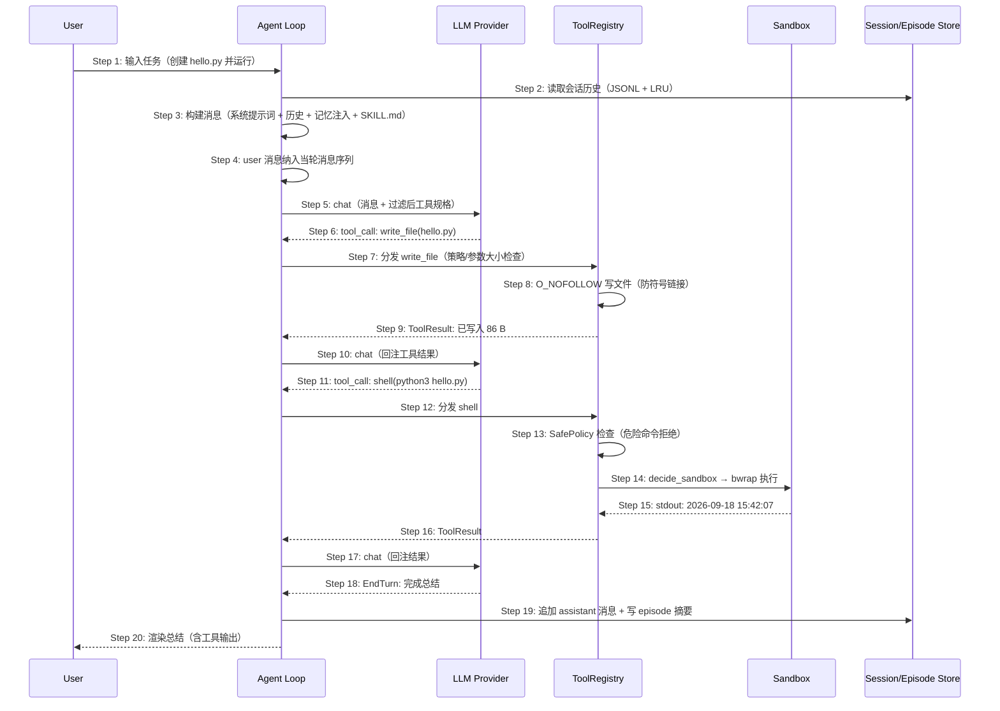

# S03: CLI 交互式多轮任务执行 — 时序图

> 场景来源：core-01-requirements.md §四 S03（P0）；交互设计：core-02-cli-onboarding-design.md §三
> 参与方与架构概要 §四.1/§四.2 一致：CLI、Agent（agent loop）、LLM（提供商栈）、Tools（ToolRegistry）、Sandbox（decide_sandbox + 后端）、Store（会话 JSONL + EpisodeStore）

## 时序图

## 步骤说明

1. **用户** 在 REPL 输入任务描述（或 `-m` 单条模式）。
2. **Agent** 从 SessionManager 读取该会话历史（JSONL 文件 + LRU 缓存，10MB 上限）。
3. **Agent** 构建消息序列：系统提示词（bootstrap 文件 + persona）+ 记忆注入（HybridSearch 相关 episode + 7 天窗口 MEMORY.md）+ 会话历史 + 技能 SKILL.md 片段。

> 记忆注入在每轮构建时发生，保证"越用越懂项目"（S08 的读取路径）。

4. **Agent** 将 user 消息纳入当轮消息序列；chat/OUP 路径在轮次结束后将当轮全部消息（user/assistant/tool）统一原子追加到会话 JSONL（tmp + rename，崩溃不留半行）；gateway 路径 actor 则在处理前即时持久化 user 消息（见 S04 Step 11）。
5. **Agent** 调用 LLM：消息 + 经 ToolPolicy/provider 过滤后的工具规格（全量规格每轮发送，无 LRU 延迟加载）。→ 见 EX-5.1（LLM 错误）、EX-5.2（预算触发压缩）
6. **LLM** 返回 write_file 工具调用。
7. **Agent** 经 ToolRegistry 分发：执行前 hooks（before_tool_call 可 exit 1 拒绝）、provider 策略检查、参数大小 ≤1MB 估算检查。→ 见 EX-7.1（hook 拒绝）
8. **ToolRegistry** 以 O_NOFOLLOW 写入文件（Unix 防符号链接 TOCTOU）。
9. **ToolRegistry** 返回 ToolResult，触发 after_tool_call hook。
10. **Agent** 将工具结果回注消息，再次调用 LLM。
11. **LLM** 返回 shell 工具调用（运行脚本）。
12. **Agent** 分发 shell 工具。
13. **ToolRegistry** 先过 SafePolicy（危险命令模式在空白归一化后匹配即拒）。→ 见 EX-13.1（危险命令）
14. **ToolRegistry** 经 decide_sandbox 纯决策层解析后端（HostOs × Probe），在 bwrap 中执行。→ 见 EX-14.1（显式后端不可用 fail-closed）
15. **Sandbox** 返回命令输出。
16. **ToolRegistry** 返回 ToolResult。
17. **Agent** 回注后第三次调用 LLM。
18. **LLM** 返回 EndTurn 与最终总结。
19. **Agent** 持久化 assistant 消息；save_episodes 开启时写任务摘要到 EpisodeStore。
20. **Agent** 渲染总结给用户，等待下一轮输入。

> 每轮循环都会重新评估 token 预算；EX-5.2 的压缩对长会话是常态路径而非异常。

## 异常用例

### EX-5.1: LLM 调用失败
- **触发条件**：提供商返回 429/5xx
- **期望响应**：经提供商栈 RetryProvider 指数退避 → ProviderChain 转移（S12）；最终失败时输出各跳原因
- **副作用**：已落盘的消息不回滚，用户可直接重试

### EX-5.2: token 预算触发压缩
- **触发条件**：消息估算 token 接近预算上限
- **期望响应**：compaction 介入——剥离历史工具参数、早期内容摘要化、保留最近工具调用/结果对；用户可见压缩提示；循环继续
- **副作用**：被压缩内容仍在会话 JSONL（只是不再进入上下文）

### EX-7.1: before_tool_call hook 拒绝
- **触发条件**：配置的 hook 命令对该工具调用 exit 1
- **期望响应**：工具不执行，agent 收到拒绝反馈并可向用户解释；hook 连续 3 次失败（exit ≥2/超时）被熔断自动禁用
- **副作用**：拒绝事件进入会话记录

### EX-13.1: SafePolicy 命中危险命令
- **触发条件**：shell 命令匹配危险模式（rm -rf /、dd、mkfs、fork 炸弹等，空白归一化后）
- **期望响应**：工具返回拒绝结果与原因，命令不进入沙箱；agent 可向用户说明
- **副作用**：无文件系统影响

### EX-14.1: 显式沙箱后端不可用
- **触发条件**：配置了显式后端（如 docker）但主机无 Docker
- **期望响应**：decide_sandbox 返回 RefusingSandbox——命令被拒绝并给出按 OS 的修复指引；绝不静默 NoSandbox；auto 模式无后端时为响亮降级（fail_closed=true 时同样转拒绝）
- **副作用**：命令未执行；doctor 沙箱项同步报告该状态

### EX-16.1: 工具超时
- **触发条件**：shell 执行超过钳制后的超时（[1, 600]s）
- **期望响应**：进程被杀（Unix 信号 / Windows taskkill），返回超时 ToolResult，agent 继续处理
- **副作用**：沙箱内子进程一并清理
