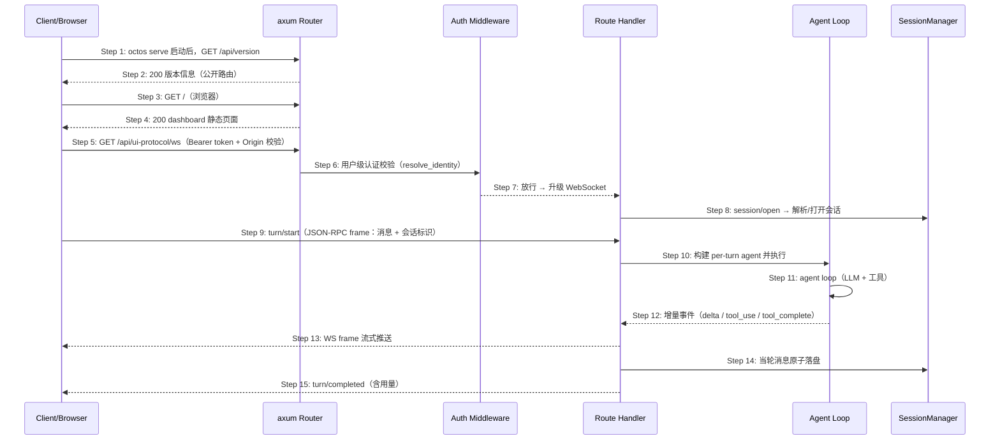

# S05: REST API 服务与流式集成 — 时序图

> 场景来源：core-01-requirements.md §四 S05（P0）；交互设计：core-04-serve-api-design.md §一
> 参与方与架构概要 §三/§五.3 一致：Client（调用方/浏览器）、HTTP（axum router）、AUTH（认证中间件）、HDL（路由 handler）、AG（Agent loop）、SM（SessionManager）

## 时序图

## 步骤说明

1. **Client** 请求公开路由 `/api/version`（serve 默认绑定 127.0.0.1:50080；对外暴露需显式 `--host`）。
2. **Router** 返回版本信息——公开路由不经过用户/admin 认证。
3. **Client**（浏览器）访问根路径。
4. **Router** 返回内嵌的 Web 仪表盘静态资源（rust_embed 嵌入，SPA 回退）。
5. **Client** 携带 Bearer token 请求 `GET /api/ui-protocol/ws` 升级 WebSocket——对话核心链路走 WS 而非 REST POST（REST 侧另有三层路由组：公开 / 用户级 /api/my/* / 管理 /api/admin/*；SSE 由 `/api/events/harness` 承担事件监控流，不承担对话）。
6. **认证中间件** 校验 token（Bearer 优先，兼容 `?token=` 查询参数），解析用户身份。→ 见 EX-6.1（无/错 token）、EX-6.2（越权访问 admin）
7. **中间件** 放行并完成 WS 升级，进入 ui_protocol_connection（维护 active turns 与事件流水）。
8. **Handler** 按会话标识解析/打开会话（SessionRuntimeCache 复用会话运行时；与 CLI/gateway 共享 SessionManager 与 JSONL 存储）。

> 三种运行时共享会话存储，用户在 CLI 聊到一半可经 serve 继续同一会话——这是"同一内核"的直接体现。

9. **Client** 发送 `turn/start` JSON-RPC frame（消息 + 附件）。
10. **Handler** 为该轮构建 per-turn agent（含 profile 的 LLM 栈、工具注册表、沙箱配置）并触发处理。
11. **Agent** 执行与 S03 相同的核心循环。
12. **Agent** 产生增量事件（message delta / tool_use / tool_complete）。
13. **Handler** 以 WS frame 持续推送增量给客户端。→ 见 EX-12.1（客户端断连）
14. **Handler** 将当轮消息原子写入会话。
15. **Handler** 发送 `turn/completed`（含 token 用量统计），该轮结束。

## 异常用例

### EX-6.1: 缺失或无效 token
- **触发条件**：Step 6 请求无 Authorization 头或 token 无效
- **期望响应**：401；响应体为通用错误结构，不提示 token 错在哪一位（防枚举）
- **副作用**：请求不进入 handler，无会话写入

### EX-6.2: 普通用户访问管理面
- **触发条件**：用户级 token 请求 /api/admin/*
- **期望响应**：403；不返回任何管理面数据
- **副作用**：可计入审计日志

### EX-12.1: 流式中断
- **触发条件**：客户端在 Step 13 中途断连（WS 关闭）
- **期望响应**：服务端感知连接关闭后记日志；agent 当轮处理可被取消；已完成部分不回滚
- **副作用**：客户端重连后可通过会话历史获取上下文重新发起

### EX-1.1: 端口被占用
- **触发条件**：serve 启动时 50080 已被占用
- **期望响应**：启动失败并明确提示端口冲突与 `--port` 参数，退出码非 0
- **副作用**：不启动半初始化进程
