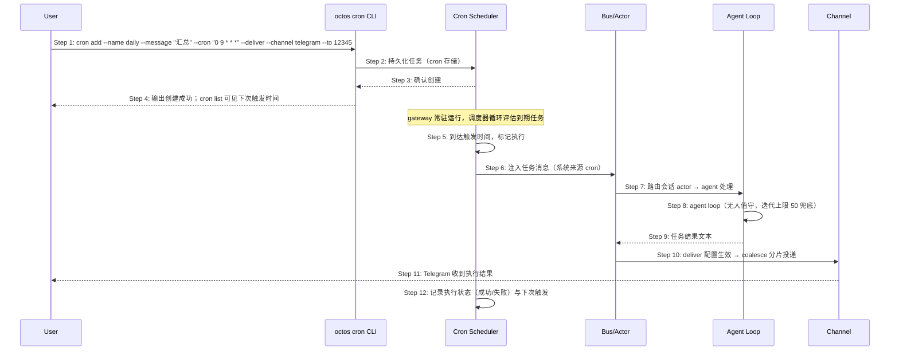

# S06: 定时任务与无人值守自动化 — 时序图

> 场景来源：core-01-requirements.md §四 S06（P1）；交互设计：core-03-gateway-channels-design.md §二
> 参与方与架构概要 §四.3 一致：User、CLI（octos cron）、CRON（cron 调度器/存储）、BUS（总线）、AG（Agent loop）、CH（目标通道）

## 时序图

## 步骤说明

1. **用户** 通过 `octos cron add` 创建任务：名称、注入消息、调度（--every/--cron/--at 三选一）、可选投递目标。
2. **CLI** 将任务写入 cron 存储（损坏文件加载时隔离 quarantine，不静默丢弃）。→ 见 EX-2.1（调度参数缺失）
3. **存储** 确认创建。
4. **CLI** 输出成功；`octos cron list` 展示任务与下次触发时间。
5. **调度器**（gateway 进程内）到点取任务并标记本次执行。

> cron 在 gateway 进程内运行而非独立守护进程——保证投递与通道在同一生命周期内，也避免多实例并发触发同一任务。

6. **调度器** 将任务消息注入总线（sender 标记为系统来源 cron，与真人消息区分）。
7. **总线** 按目标会话路由到 actor。
8. **Agent** 无人值守执行（无人工交互，迭代上限 UNATTENDED_MAX_ITERATIONS_FALLBACK=50 兜底防跑飞）。→ 见 EX-8.1（LLM 全链路失败）、EX-8.2（迭代耗尽）
9. **Agent** 产出结果文本。
10. **总线** 按 deliver 配置经目标通道 coalesce 分片投递。→ 见 EX-10.1（投递失败）
11. **用户** 在 IM 收到执行结果。
12. **调度器** 记录执行状态并计算下次触发时间。

## 异常用例

### EX-2.1: 调度参数缺失
- **触发条件**：add 时未提供 --every/--cron/--at 任一项
- **期望响应**：CLI 报错提示三选一必填，退出码非 0，不创建任务
- **副作用**：无

### EX-8.1: 执行时 LLM 全链路失败
- **触发条件**：触发时提供商链重试与转移均耗尽
- **期望响应**：本次执行标记失败并记录原因；若配置了 deliver，向目标通道投递失败摘要；调度周期不受影响
- **副作用**：失败记录可通过 cron list / 日志查询

### EX-8.2: 迭代耗尽
- **触发条件**：任务在 50 次迭代内未收敛
- **期望响应**：执行中止并标记"迭代耗尽"，已有中间产物保留在会话中；投递摘要说明未完整完成
- **副作用**：不进入死循环消耗配额

### EX-10.1: 投递失败
- **触发条件**：目标通道不可用（token 失效/网络故障）
- **期望响应**：通道层退避重试；最终失败时记录日志，执行结果仍保留在会话中不丢失
- **副作用**：无消息伪造（不会把失败投递标记为成功）

### EX-5.1: gateway 停机错过触发
- **触发条件**：触发时间点 gateway 未运行
- **期望响应**：重启后按存储中的调度状态评估：过期未执行任务按实现策略补跑或跳过（以 cron 存储记录为准），list 中可见状态
- **副作用**：无并发重复触发（单进程调度语义）
