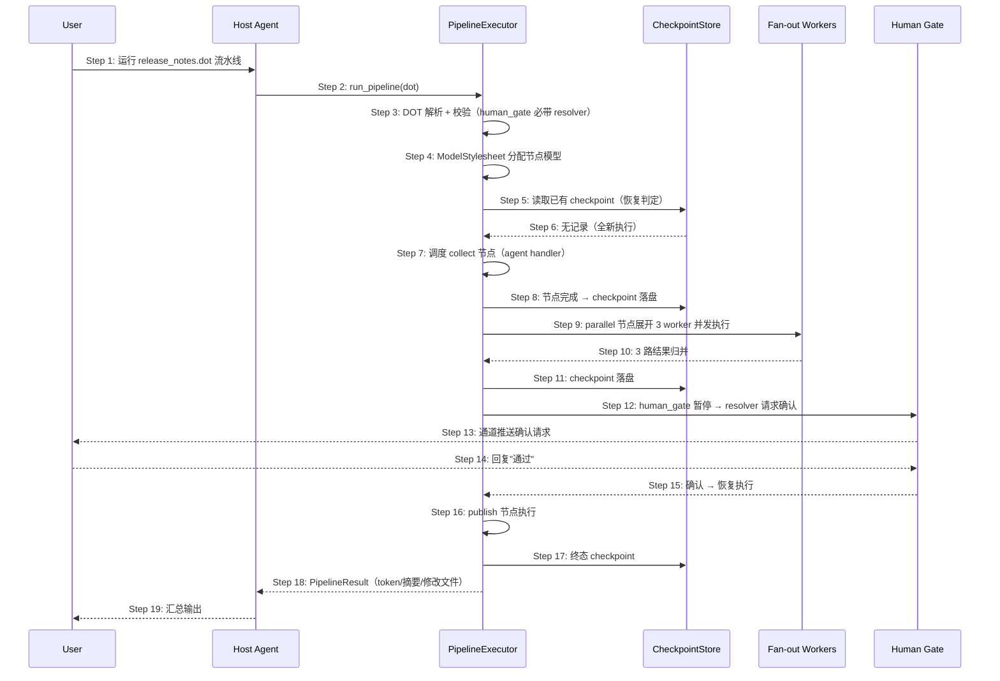

# S07: 流水线编排多步工作流 — 时序图

> 场景来源：core-01-requirements.md §四 S07（P1）；交互设计：core-05-orchestration-design.md §一
> 参与方与架构概要 §五.4 一致：User、AG（宿主 agent）、EXE（PipelineExecutor）、CHK（CheckpointStore）、WK（fan-out worker 子 agent）、GATE（human gate resolver）

## 时序图

## 步骤说明

1. **用户** 在会话中要求运行指定 DOT 流水线（pipeline 无独立 CLI，经 agent 工具 `run_pipeline` 触发）。
2. **宿主 agent** 调用 run_pipeline 工具，传入 DOT 定义（文件或内联）。
3. **执行器** 解析 DOT 并校验：图结构合法性、human_gate 节点必须声明 resolver 等。→ 见 EX-3.1（校验失败）
4. **执行器** 用 ModelStylesheet 为节点分配模型（节点级覆盖图级默认）。
5. **执行器** 读取 checkpoint 存储判断是否恢复执行。→ 见 EX-5.1（崩溃恢复）
6. **CheckpointStore** 返回无记录（全新执行）。
7. **执行器** 按依赖顺序调度 collect 节点（agent handler：子 agent 执行节点 prompt）。
8. **执行器** 在节点完成后将状态原子写入 checkpoint。
9. **执行器** 遇到 parallel 节点，在运行期展开 N 个 worker 并发执行（worker 数由节点属性决定）。
10. **Worker** 全部完成，结果归并。→ 见 EX-10.1（部分 worker 失败）
11. **执行器** 落 checkpoint。
12. **执行器** 到达 human_gate 节点，暂停调度并经 resolver（如消息通道）发出确认请求。
13. **负责人** 在通道收到确认请求。
14. **负责人** 回复"通过"。→ 见 EX-14.1（拒绝）
15. **执行器** 恢复调度。
16. **执行器** 执行 publish 节点。
17. **执行器** 写终态 checkpoint。
18. **执行器** 返回 PipelineResult：总输出、累计 token、逐节点摘要、修改文件清单。→ 见 EX-16.1（token 预算耗尽）
19. **宿主 agent** 将结果汇总呈现给用户。

## 异常用例

### EX-3.1: 校验失败
- **触发条件**：DOT 中 human_gate 未声明 resolver（或图结构非法）
- **期望响应**：run_pipeline 直接返回校验错误（指明节点与缺失属性），不启动任何节点、不消耗模型调用
- **副作用**：无

### EX-5.1: 崩溃后恢复执行
- **触发条件**：上次执行中途崩溃，checkpoint 已有若干节点记录
- **期望响应**：重新触发时已完成节点整体跳过（不重复执行、不重复扣费），从首个未完成节点继续
- **副作用**：PipelineResult 合并展示（跳过节点标记 checkpoint 命中）

### EX-10.1: 部分 worker 失败
- **触发条件**：fan-out 中个别 worker 失败（如提供商错误）
- **期望响应**：按节点失败策略处理——默认该 parallel 节点标记失败并中止后续调度（保留 checkpoint 供修复后续跑）；失败 worker 的错误进入节点摘要
- **副作用**：已成功 worker 的 checkpoint 保留

### EX-14.1: 人工拒绝
- **触发条件**：负责人在 gate 回复"拒绝"
- **期望响应**：流水线以"人工拒绝"状态终止；后续节点不执行；结果记录拒绝人与时间
- **副作用**：checkpoint 保留，修改定义后可重新触发

### EX-16.1: token 预算耗尽
- **触发条件**：累计 token 达到 graph 级 max_total_tokens
- **期望响应**：停止调度新节点，返回预算耗尽状态与已完成节点摘要；checkpoint 完整可续跑
- **副作用**：无半成品节点状态（节点粒度落盘）
