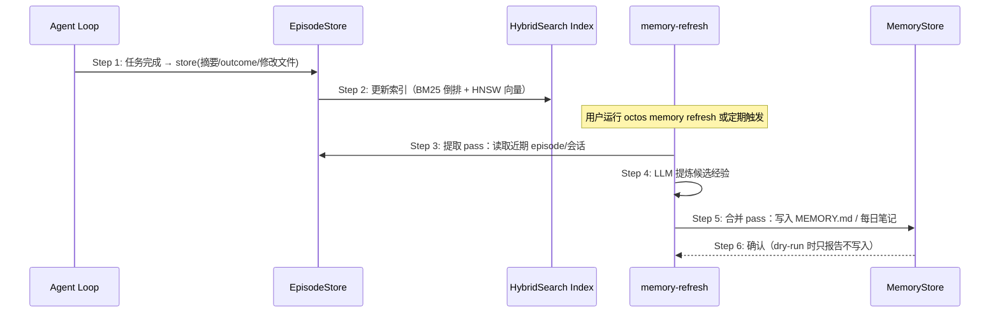
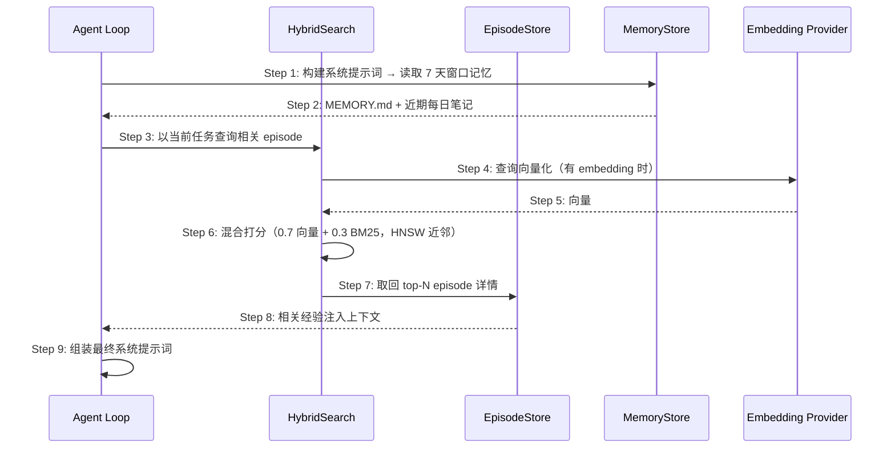

# S08: 记忆沉淀与检索复用 — 时序图

> 场景来源：core-01-requirements.md §四 S08（P1）；交互设计：core-06-capability-design.md §一
> 参与方与架构概要 §四.5 一致：AG（Agent loop）、EPI（EpisodeStore/redb）、MEM（MemoryStore：MEMORY.md + 每日笔记）、HS（HybridSearch：BM25 + HNSW）、EMB（embedding provider）

## 时序图（写入路径）

## 时序图（读取/注入路径）

## 步骤说明（写入）

1. **Agent** 在任务完成（save_episodes 开启）时将摘要写入 EpisodeStore：任务类型、结果、关键决策、修改文件、时间戳。
2. **EpisodeStore** 同步更新混合索引（BM25 倒排 + HNSW 向量，BM25 epsilon 防 NaN）。
3. **memory-refresh**（`octos memory refresh` 或服务化定期触发）读取近期 episode 与会话。
4. **refresh** 用 LLM 做提取 pass，产出候选经验条目。→ 见 EX-写4.1（refresh 中 LLM 失败）
5. **refresh** 做合并 pass，将经验写入 MEMORY.md 与每日笔记（--dry-run 只报告不写）。
6. **MemoryStore** 确认写入。

## 步骤说明（读取）

1. **Agent** 构建系统提示词时先取 MemoryStore 的 7 天窗口内容（长期记忆 + 近期笔记）。
2. **MemoryStore** 返回该窗口文本。
3. **Agent** 以当前任务文本查询相关 episode。
4. **HybridSearch** 在有 embedding provider 时将查询向量化。→ 见 EX-读4.1（无 embedding 降级）
5. **Embedding provider** 返回向量。
6. **HybridSearch** 混合打分：默认 0.7 向量（HNSW 余弦近邻）+ 0.3 BM25，with_weights 可配置。
7. **HybridSearch** 取回 top-N episode 完整内容。
8. **EpisodeStore** 返回条目，注入上下文。
9. **Agent** 组装最终系统提示词进入 LLM 调用。

## 异常用例

### EX-读4.1: 无 embedding provider
- **触发条件**：读取 Step 4 未配置 embedding
- **期望响应**：向量通道跳过，自动降级 BM25-only 排序并正常返回；检索输出中可见降级提示
- **副作用**：无中断；排序质量下降但功能完整

### EX-写4.1: refresh 中 LLM 失败
- **触发条件**：写入 Step 4 提取 pass 的 LLM 调用失败
- **期望响应**：本次 refresh 标记失败并保留现场（已提取未合并的候选不落盘），下次运行重试；既有 MEMORY.md 不被破坏
- **副作用**：无部分写入（合并 pass 原子性按文件维度保证）

### EX-1.1: episodes.redb 损坏
- **触发条件**：写入 Step 1 数据库文件损坏不可读
- **期望响应**：以降级模式打开（只读/空库），记录告警；agent 主流程不因记忆不可用而失败
- **副作用**：新 episode 暂不可写，doctor 报告该状态

### EX-7.1: 敏感内容约束
- **触发条件**：episode/笔记被标记 sensitive（`memory add --sensitive`）
- **期望响应**：注入与检索结果按 sensitive 标记受约束（不进入默认注入路径）
- **副作用**：敏感条目仍可通过显式 search 查询
