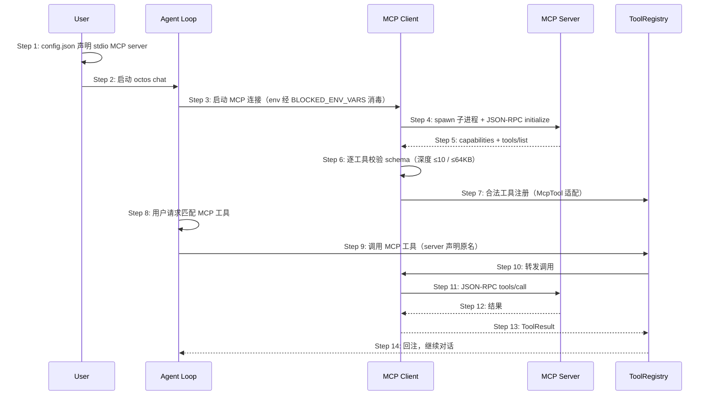

# S10: MCP 服务器接入与工具扩展 — 时序图

> 场景来源：core-01-requirements.md §四 S10（P1）；交互设计：core-06-capability-design.md §三
> 参与方与架构概要 §四.6 一致：User、AG（Agent loop）、MCP（mcp.rs 客户端）、SRV（MCP server 进程）、TR（ToolRegistry）

## 时序图

## 步骤说明

1. **用户** 在 config.json 声明 MCP server（command/args/env；oauth 型可用 `octos mcp login` 完成认证）。
2. **用户** 启动 chat（或 gateway/serve——同一注册路径）。
3. **Agent** 启动 MCP 客户端；server 进程 env 经 BLOCKED_ENV_VARS（18 个）消毒，防 LD_PRELOAD 等注入。

> MCP 与沙箱、hooks、browser 共享同一份环境变量黑名单——这是安全一致性设计。

4. **MCP 客户端** spawn 子进程并完成 JSON-RPC initialize 握手。→ 见 EX-4.1（握手失败）
5. **Server** 返回能力与工具清单。
6. **MCP 客户端** 逐工具校验 input schema：深度 ≤ 10、序列化大小 ≤ 64KB。→ 见 EX-6.1（超限拒绝注册）
7. **合法工具** 经 McpTool 适配注册进 ToolRegistry，LLM 每轮可见其规格。
8. **Agent** 处理用户请求时选中 MCP 工具。
9. **Agent** 发起调用（工具以 server 声明的原名注册；与内置工具同名时该 MCP 工具被跳过，保护内置面不被远程 server 顶替；经注册表统一入口，策略/hooks 同样生效）。
10. **注册表** 转发给 MCP 客户端。
11. **MCP 客户端** 通过 stdio 发送 tools/call。
12. **Server** 返回结果。→ 见 EX-12.1（server 崩溃）
13. **MCP 客户端** 包装为 ToolResult。
14. **Agent** 回注结果继续对话。

## 异常用例

### EX-4.1: 握手失败
- **触发条件**：server 命令不存在、启动即退出或 initialize 超时
- **期望响应**：该 server 标记不可用并记录原因；其余 server 与内置工具不受影响；agent 正常启动
- **副作用**：LLM 看不到该 server 的工具规格

### EX-6.1: schema 超限拒绝注册
- **触发条件**：某工具 schema 深度 > 10 或大小 > 64KB
- **期望响应**：该工具被拒绝注册并记录原因（工具名 + 超限维度）；同 server 其余合法工具正常注册
- **副作用**：无

### EX-12.1: server 进程崩溃
- **触发条件**：调用中途 server 进程死亡或 stdio 断开
- **期望响应**：返回工具级错误（server 不可用），agent 可换工具或告知用户；主进程与会话不崩溃
- **副作用**：后续对该 server 的调用快速失败（避免悬挂等待）

### EX-1.1: OAuth 型 server 未认证
- **触发条件**：需要 OAuth 的 MCP server 未完成 `octos mcp login`
- **期望响应**：连接被拒并提示运行 `octos mcp login <url>`；不影响其他 server
- **副作用**：无
