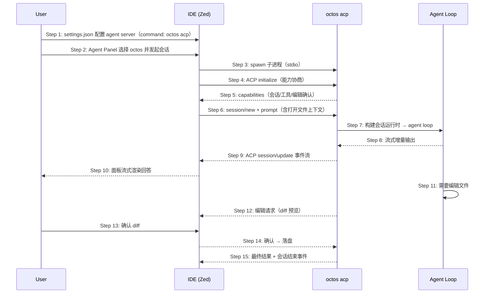

# S13: ACP 协议接入 IDE — 时序图（主路径）

> 场景来源：core-01-requirements.md §四 S13（P2）；交互设计：core-04-serve-api-design.md §二
> 参与方：User、IDE（Zed 等 ACP 客户端）、ACP（octos acp 子进程）、AG（Agent loop）
> P2 场景：本文档覆盖主路径；细化异常在设计评审后按需补充。

## 时序图

## 步骤说明

1. **用户** 在 IDE 配置外部 agent server：`octos acp`（stdio 传输）。
2. **用户** 在 IDE Agent Panel 选择 octos 并发起会话。
3. **IDE** 以子进程拉起 `octos acp`（无独立终端窗口）。
4. **IDE** 发起 ACP initialize 握手，协商协议版本与能力。
5. **ACP** 返回能力集（会话管理、工具执行、编辑确认等）。
6. **IDE** 创建会话并下发用户 prompt（可附带当前打开文件/选区上下文）。
7. **ACP** 构建会话运行时，进入与 S03 相同的 agent loop（同一内核、同一工具/沙箱策略）。→ 见 EX-7.1（无凭证）
8-10. **Agent** 流式产出，经 ACP 事件回显 IDE 面板。
11. **Agent** 需要修改文件。
12. **ACP** 将编辑以 IDE 原生 diff 预览请求呈现。
13. **用户** 在 IDE 中确认（或拒绝）diff。
14. **IDE** 确认后落盘；拒绝时 ACP 收到拒绝反馈，agent 继续对话。
15. **ACP** 发出最终结果与会话结束事件。

## 异常用例（主路径级别）

### EX-3.1: octos 不在 PATH
- **触发条件**：IDE spawn 子进程失败
- **期望响应**：IDE 显示 agent server 启动失败；无后台驻留进程
- **副作用**：无

### EX-7.1: 无可用凭证
- **触发条件**：agent 构建时凭证链落空
- **期望响应**：面板中显示缺少凭证的错误与修复路径（auth login / env var），会话不发起模型请求
- **副作用**：无
