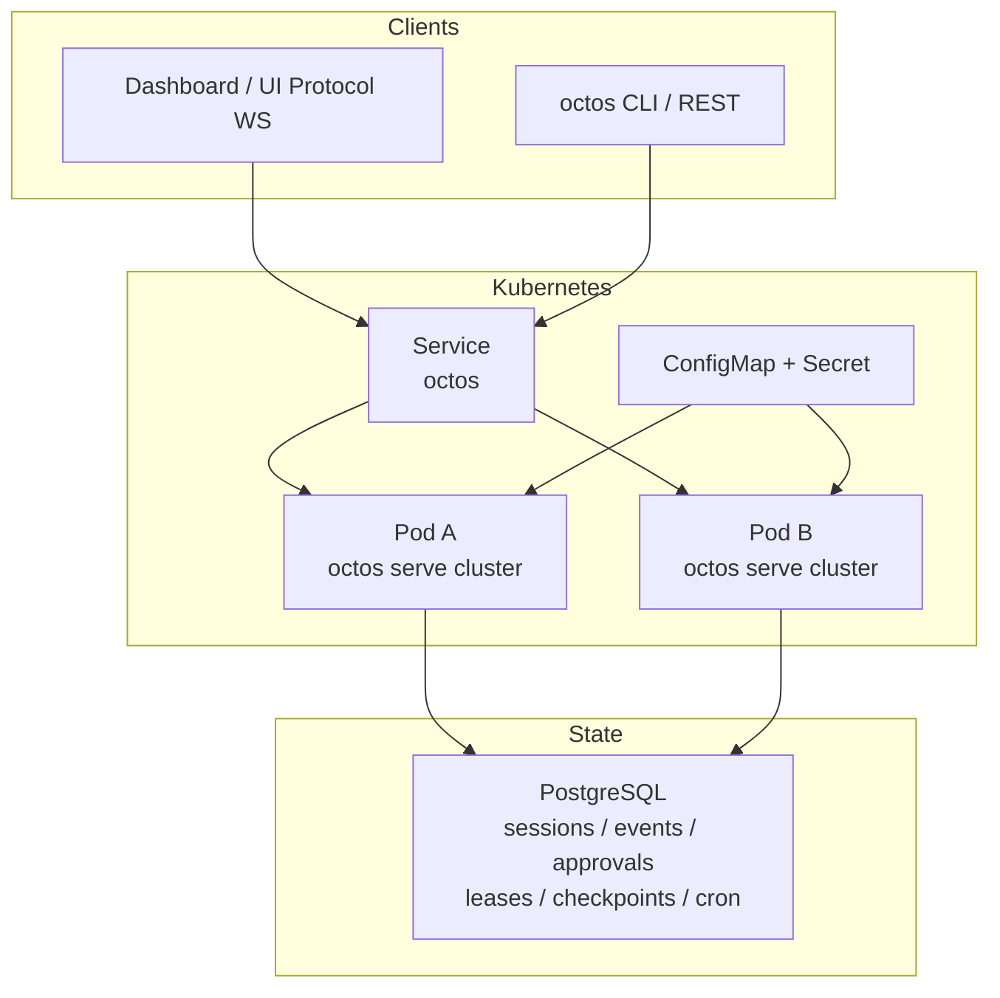
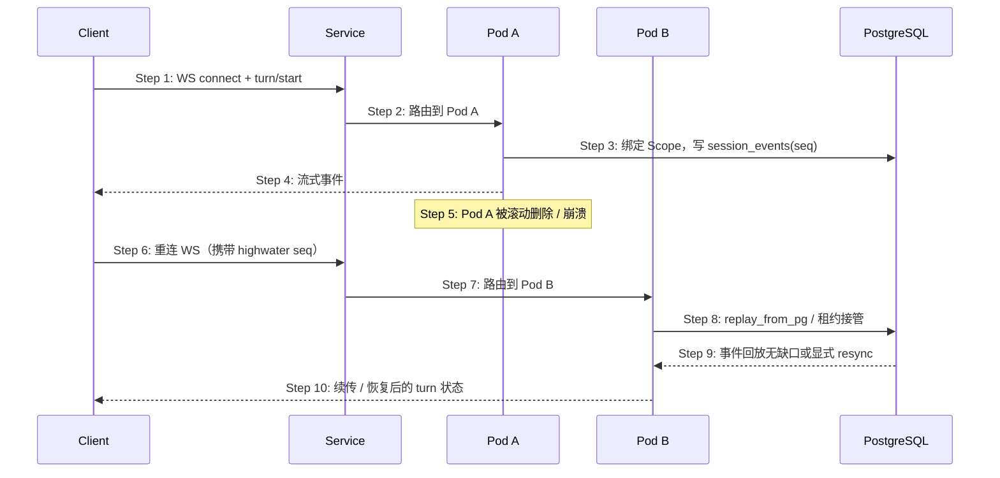

# S16: K8s 多副本无状态化部署与故障恢复 — 时序图

> 场景来源：core-01-requirements.md §四 S16（P0）；交互设计：core-07-k8s-cluster-design.md
> 参与方：Ops（运维）、K8s（API/Controller）、PG（PostgreSQL）、PodA/PodB（serve 副本）、Client（Dashboard/WS）

## 部署拓扑（流程图）

## 时序图：滚动升级后会话续接

## 步骤说明

1. **Client** 经 Service 建立 UI Protocol 连接并发起 turn。
2. **Service** 将连接落到某一副本（无会话粘滞要求）。
3. **Pod A** 将 Scope 绑定与事件写入 PostgreSQL（单调 seq）。
4. **Pod A** 向客户端推送流式帧。
5. **Pod A** 因滚动升级或故障退出——进程内缓存作废。
6. **Client** 重连并携带已确认 highwater。
7. **Service** 将连接落到 **Pod B**。
8. **Pod B** 尝试租约接管并从 PG 回放。→ 见 EX-8.1
9. **PG** 返回连续事件或触发显式 resync。
10. **Pod B** 向客户端续传，业务状态以 PG 为准。

## 异常用例

### EX-8.1: 租约仍被旧 epoch 持有
- **触发条件**：网络分区导致旧 Pod 晚到写
- **期望响应**：旧 epoch 写被拒绝；新持有者继续服务
- **副作用**：晚到结果按受控策略丢弃或进入对账，不覆盖新真相

### EX-3.1: 迁移未应用
- **触发条件**：PG 可达但缺 `0001_c2`–`0005_c5` 表结构
- **期望响应**：启动失败并提示执行迁移；不以 local JSONL 顶替
- **副作用**：不对外提供半初始化服务
