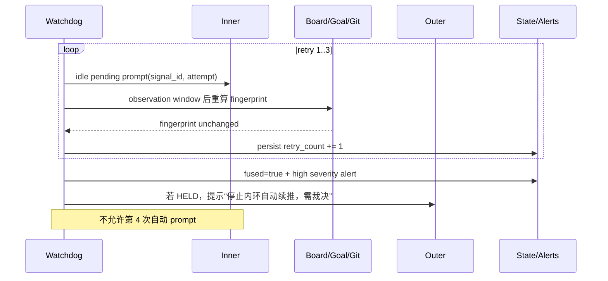

# S17: OctoLoop 夜间监督与有界续推 — 时序图

> 场景来源：core-01-requirements.md §四 S17（P0）
> 交互设计：core-08-octoloop-watchdog-design.md
> 参与方：OP（operator）、WD（Watchdog）、SRC（黑板/events/goal/Git）、HD（herdr）、IN（内环）、OD（outer-duty）、OUT（外环）、ST（监督状态/告警）

## 主时序：ACK/负信号唤醒外环，空闲待办续推内环

```mermaid
sequenceDiagram
    participant OP as Operator
    participant WD as Watchdog
    participant SRC as Board/Events/Goal/Git
    participant HD as herdr
    participant IN as Inner
    participant OD as outer-duty
    participant OUT as Outer
    participant ST as State/Alerts

    OP->>WD: Step 1: watchdog run --project P
    WD->>ST: Step 2: load state or create EOF baseline
    WD->>HD: Step 3: agent list
    HD-->>WD: Step 4: agents with cwd/status/pane
    WD->>SRC: Step 5: read new board/event ranges + progress facts
    SRC-->>WD: Step 6: signals and highwaters
    WD->>WD: Step 7: classify + stable signal_id + dedupe
    alt ACK / blocked / escalation / budget_limited
        WD->>OD: Step 8a: check --project P
        OD-->>WD: Step 9a: HELD + holder metadata
        WD->>HD: Step 10a: prompt exact holder with evidence pointer
        HD-->>WD: Step 11a: accepted or explicit failure
        WD->>ST: Step 12a: persist delivery/pending atomically
        OUT->>SRC: Step 13a: review, verdict or new board item
        OUT->>HD: Step 14a: receipt prompt to inner
        HD->>IN: Step 15a: start next turn from board pointer
    else inner idle + Active item unacked
        WD->>WD: Step 8b: compare task progress fingerprint and retry count
        WD->>HD: Step 9b: prompt exact idle inner
        HD-->>WD: Step 10b: accepted or explicit failure
        WD->>ST: Step 11b: persist attempt and observation deadline
        IN->>SRC: Step 12b: work, commit/ledger progress, ACK
    else no actionable signal
        WD->>ST: Step 8c: advance healthy cursors only
    end
    WD->>SRC: Step 16: next cycle re-read authoritative progress
    WD->>ST: Step 17: progress resets retry; no progress increments or fuses
```

## 步骤说明与接口推导

1. operator 显式启动前台 `run` 或启用 systemd user service；默认安装不自动 enable。由此推导 `octos watchdog run --project`。
2. Watchdog 先恢复 state；首次运行仅建立当前 EOF/highwater 基线，防历史 ACK 误报。由此推导本地原子状态接口。
3–4. 每个处置周期重新调用 `herdr agent list`，以 canonical cwd 精确发现角色与 pane；多候选不猜。
5–7. 只读取游标之后的新范围，同时获取 goal/ledger/Git 当前事实；分类并生成稳定 signal id。由此推导 `run-once --json` 的确定性输出。
8a–9a. 每次外环门铃前实时执行 `outer-duty check`；只有 `HELD` 可继续。→ 见 EX-9a.1。
10a–12a. 使用 `herdr agent prompt <pane> <text>`；accepted 后才落 delivered，失败保留 pending。状态先写 pending、后投递、再写 delivered。
13a–15a. 外环负责复验、裁决和回执内环；Watchdog 不代理这些专业判断，只监督是否出现新进展。
8b–11b. 内环 idle 且存在未 ACK 条目时，比较 fingerprint 并执行最多 3 次有界续推。→ 见 EX-17.1。
12b. 内环仍遵循读 Active 最小未 ACK 条目、只 commit 不 push、写 v1 ACK 的协议。
16–17. 下一周期从权威源重算进展；任何真实进展清零计数，纯状态抖动不算。

`status --project --json` 来自 Step 2、7、12、17 的只读投影；它不得执行 Step 8–15。

## 异常时序：三次无进展熔断



## 异常用例

### EX-9a.1: outer-duty 非 HELD
- **触发条件**：check 返回 VACANT、ERROR、unsupported、超时，或 holder 无法与 cwd 匹配外环唯一对应
- **期望响应**：信号保持 pending，写 operator 告警；不调用 prompt 任意外环
- **副作用**：不 acquire/hold，不依据 TTL、标题或最近活动自动接管

### EX-10a.1: herdr prompt 未接受
- **触发条件**：herdr 不可用、agent_blocked、agent_prompt_stalled、timeout 或目标消失
- **期望响应**：记录 attempt 与原因，不写 delivered；按有界 backoff 重试基础设施投递
- **副作用**：基础设施重试不增加“内环无进展”业务计数；持续失败升级 operator 告警

### EX-17.1: 连续三次无进展
- **触发条件**：同一 Active 条目连续 3 个 observation window 的指纹完全相同
- **期望响应**：写 fused，停止内环 prompt；若外环 HELD 则唤醒外环，否则仅 operator 告警
- **副作用**：重启后 fuse 保持；检测到真实进展才自动清零

### EX-5.1: 事件文件轮转或截断
- **触发条件**：events.jsonl 的 file identity 改变或长度小于已持久化 offset
- **期望响应**：建立新 generation，从新文件起点解析；通过 signal id 去重；无法证明边界时 fault 并停止推进该 cursor
- **副作用**：不跳过未读事件，不把旧历史重新当成新信号

### EX-2.1: 状态文件损坏
- **触发条件**：state.json 无法解析、版本不支持或 project 不匹配
- **期望响应**：`run`/`run-once` fail closed，保留损坏文件用于诊断并告警；不得静默归零 retry/fuse
- **副作用**：黑板、goal、checkpoint、Git 不受修改

### EX-3.1: 多个同角色 agent 匹配项目
- **触发条件**：herdr 返回两个 cwd 均为项目且角色同为 outer 或 inner 的候选
- **期望响应**：标记 ambiguous，不注入；输出候选 pane id 供 operator 处理
- **副作用**：不按 focused、title 或最近活动猜测

### EX-13a.1: 到达 OpenLogos 人类确认点
- **触发条件**：外/内环进度到达 merge、verify、部署、smoke、archive、push 或 loop-exhausted
- **期望响应**：Watchdog 只报告状态与指针，不执行确认点；通用 agent auto mode 不构成授权
- **副作用**：仅既有 `openlogos next --auto` standing 授权可放行规定动作；loop-exhausted 永不自动放行
