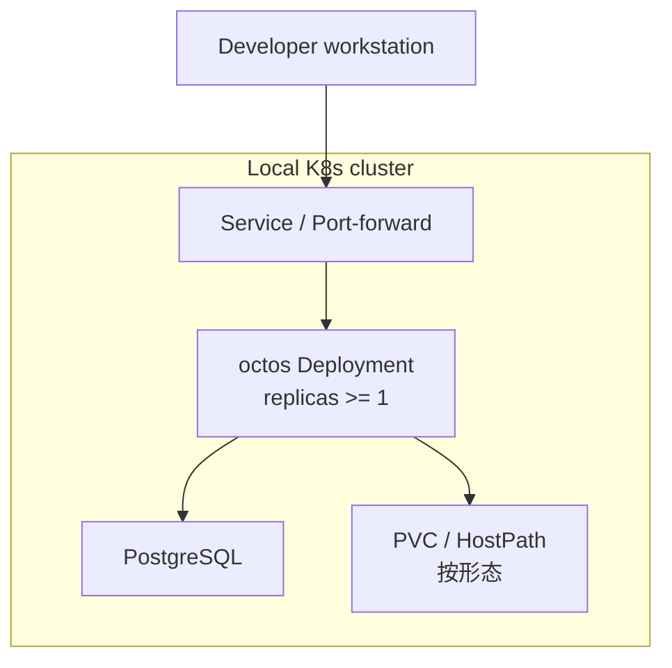

# core-01-deployment-plan

> 最后更新：2026-09-22
> 覆盖：本地 docker / 本地 k8s（baseline · hostpath · cluster）/ 后续 staging
> 关联场景：S05（serve）、S14（管理面）、**S16（k8s 无状态化）**
> 清单权威路径：`deploy/`（见 `deploy/README.md`、`deploy/docs/K8S_INSTALL.md`）

## 一、部署目标

| 环境 | 目标 | 形态 |
|------|------|------|
| 本地 docker | 单机冒烟 | `deploy/docker/docker-compose.yml` |
| 本地 k8s | 开发与多副本验证 | baseline / hostpath / cluster |
| staging | 预发（后续） | cluster + 托管 PG |

核心目标：在 **cluster** 形态下验证「PG 真相源 + 多副本 + 滚动可恢复」。

## 二、部署拓扑



三种清单：

| 文件 | 用途 |
|------|------|
| `deploy/k8s/01-baseline.yaml` | 最小镜像验证 |
| `deploy/k8s/02-hostpath-dev.yaml` | 单节点 HostPath 开发 |
| `deploy/k8s/03-cluster-with-config.yaml` | ConfigMap/Secret + PG + PVC 的目标形态 |

## 三、环境变量与密钥

| 名称 | 来源 | 说明 |
|------|------|------|
| `DATABASE_URL` | Secret | 集群模式必填 |
| LLM / 通道密钥 | Secret / 既有 auth store 挂载 | 禁止打进镜像层 |
| serve auth token | Secret / 环境 | 避免进入进程 argv（见既有 serve 安全修复） |
| `config.json` | ConfigMap | 非密钥配置 |

## 四、构建与发布命令

```bash
# 构建（示例）
cargo build --release -p octos-cli --features "api,..."

# 本地 k8s
./deploy/scripts/deploy-k8s.sh baseline
./deploy/scripts/deploy-k8s.sh hostpath
./deploy/scripts/deploy-k8s.sh cluster
```

镜像标签与拉取策略以清单注释为准；开发可用 `imagePullPolicy: IfNotPresent`。

## 五、数据迁移策略

1. cluster 形态启动前/InitContainer 应用 `crates/octos-store/migrations/0001_c2`–`0005_c5`
2. 本地 JSONL/redb **不**在集群模式双写为真相；如需迁移，走显式导入任务（后续切片）
3. 回滚迁移仅在空库/可重建环境允许；生产需备份后正向兼容迁移

## 六、回滚策略

| 级别 | 动作 |
|------|------|
| 应用 | `kubectl rollout undo` 回到上一 ReplicaSet |
| 配置 | 还原 ConfigMap/Secret 版本后滚动 |
| 数据 | 从 PG 备份恢复；禁止用 baseline 清单覆盖生产 PVC |
| 模式 | 临时降级单副本 + 只读流量（需运维确认） |

## 七、部署后检查清单

- [ ] Pod Ready 且无 CrashLoop
- [ ] `GET /api/version` 200
- [ ] Dashboard 可打开
- [ ] PG 迁移表存在（sessions/events/leases/cron 等）
- [ ] 杀一副本后 WS 可重连回放（S16）

## 八、冒烟测试方案

| ID | 检查项 | 期望 |
|----|--------|------|
| SMOKE-S16-01 | cluster 部署脚本 | 退出 0，Service 可达 |
| SMOKE-S16-02 | version 探活 | HTTP 200 |
| SMOKE-S16-03 | PG 迁移 | 关键表可查询 |
| SMOKE-S16-04 | 删 Pod 续聊 | 重连后历史可回放 |

## 九、门禁结论

- `deployment_required: true`（core 模块）
- `smoke_required: true`
- 本方案满足 Phase 3-3；部署执行与 `openlogos smoke` 需人类确认后进行

## 十、S17 Watchdog 本地常驻部署

### 10.1 支持范围与默认状态

- 第一阶段部署目标：Linux systemd user service；本地开发机与隔离测试环境。
- 默认只安装 unit/template，不执行 `enable`；operator 明确启用后才具备常驻监督语义。
- macOS/Windows 可运行 `octos watchdog run` / `run-once`，但本变更不提供 launchd/Windows Service，也不宣称崩溃自动拉起。
- 无业务数据库迁移；本地监督状态可删除重建，但删除会重新建立 baseline。

### 10.2 unit 契约

模板单元建议为 `octos-watchdog@.service`，实例配置通过 `%i` 映射到已安装的项目配置文件：

```ini
[Unit]
Description=Octos OctoLoop watchdog (%i)
After=default.target

[Service]
Type=simple
ExecStart=%h/.local/bin/octos watchdog run --config %h/.config/octos/watchdog/%i.toml
Restart=always
RestartSec=5s
NoNewPrivileges=yes
PrivateTmp=yes

[Install]
WantedBy=default.target
```

最终 unit 路径与二进制安装路径由安装脚本探测并渲染，禁止假设 `%h/.local/bin` 必然存在。unit 不携带 LLM/API 凭据；Watchdog 只调用本机 herdr 与只读 outer-duty check。

### 10.3 安装与启用

```bash
# 安装模板与指定项目配置，但不启用
./deploy/scripts/install-watchdog-user-service.sh --project /absolute/project

# operator 明确启用
systemctl --user daemon-reload
systemctl --user enable --now octos-watchdog@<project-id>.service

# 状态与日志
systemctl --user status octos-watchdog@<project-id>.service
journalctl --user -u octos-watchdog@<project-id>.service
octos watchdog status --project /absolute/project --json
```

若用户 session 在登出后仍需运行，`loginctl enable-linger <user>` 属 operator 决策，安装脚本只检测并提示，不自动修改系统登录策略。

### 10.4 状态、日志与权限

| 资源 | 建议位置 | 权限/生命周期 |
|------|----------|---------------|
| 配置 | `$XDG_CONFIG_HOME/octos/watchdog/<project-id>.toml` | 0600；不含模型凭据 |
| 状态 | `$XDG_STATE_HOME/octos/watchdog/<project-id>/state.json` | 0600；原子替换；升级前备份 |
| 告警 | 同状态目录 `alerts.jsonl` | 0600；append-only，可轮转 |
| 服务日志 | systemd journal | 不输出完整 prompt/凭据 |

Watchdog 与被监督项目使用同一非 root 用户运行，确保可读黑板与 Git，但不额外授予 root、Docker socket 或免沙箱权限。

### 10.5 升级与回滚

升级：先 `stop` 服务，备份 state，替换二进制/unit，`daemon-reload` 后启动并执行 status/run-once 检查。state schema 不兼容必须显式迁移或 fail closed，禁止静默归零 fuse。

回滚：

```bash
systemctl --user disable --now octos-watchdog@<project-id>.service
./deploy/scripts/uninstall-watchdog-user-service.sh --project /absolute/project --keep-state
```

回滚只停用/移除 Watchdog unit 与配置；默认保留 state/alerts，且绝不删除 `.octos/OUTER_LOOP_REVIEW.md`、goal ledger、checkpoint、Git commit、herdr pane 或 outer-duty 元数据。

### 10.6 S17 部署后检查与冒烟

| ID | 检查项 | 期望 |
|----|--------|------|
| SMOKE-S17-01 | unit 崩溃恢复 | 主进程退出后 systemd 自动拉起，state cursor 保持 |
| SMOKE-S17-02 | ACK→外环 | 新 ACK 只向 HELD holder 投递一次 |
| SMOKE-S17-03 | budget_limited→外环 | checkpoint 保留，外环收到证据指针 |
| SMOKE-S17-04 | idle+未 ACK→内环 | 唯一 cwd 匹配的 idle 内环收到一次指针 |
| SMOKE-S17-05 | 三次无进展熔断 | 第三观察窗后 fused，停止第 4 次 prompt 并告警 |
| SMOKE-S17-06 | 重启去重 | 服务重启不重放已 delivered signal |

冒烟 runner 必须使用隔离 fixture 项目、假 herdr/duty adapter 或专用测试 panes，禁止向真实生产 agent 注入。结果追加至 `logos/resources/verify/smoke-results.jsonl`。

## 十一、octos-web 反代路径白名单契约

前后端分离形态（`deploy/k8s/04-octos-web-standalone.yaml`）下，octos-web 的 nginx 是浏览器到后端的唯一入口。其 `default.conf` 的路由契约为**白名单制**——只有以下路径族反代到 `octos.octos.svc.cluster.local:8080`，其余一律 SPA fallback（`try_files ... /index.html`，前端 client routing 依赖此行为）：

| location | 匹配 | 后端路由 | 备注 |
|----------|------|----------|------|
| `/api/` | 前缀 | 全部主路由组（REST + `/api/ui-protocol/ws`） | WS upgrade + 3600s 读超时 |
| `= /health` | 精确 | `handlers::health`（router.rs:899） | 前端源码唯一直接调用的非 `/api` 路径 |
| `/v1/` | 前缀 | `/v1/session_ingress/ws/{session_id}`（router.rs:952） | session-ingress WS 族 |

约束：

1. 三个反代 block 共用同一组 proxy 参数（Host/X-Forwarded 头、WS upgrade 头、3600s 读写超时、`proxy_buffering off`）；
2. nginx location 优先级（精确 > 前缀）保证 `= /health` 不被 `location /` 捕获；
3. 后端路由表中**不存在**的路径（如 `/openapi.json`、`/docs`、`/v1/chat/completions`）不属于白名单——它们命中后端时的正确行为是 `404 application/json`（见 serve API 规格），nginx 不为不存在的路由开口。

### 验收条件（部署级）

##### 正常：健康检查穿透
- **GIVEN** octos-web pod 以新配置运行
- **WHEN** 经 web 端口请求 `GET /health`
- **THEN** 返回 `200 application/json` `{"status":"healthy",...}`，而非 index.html

##### 正常：/v1/ 不落 SPA
- **GIVEN** 同上
- **WHEN** 请求 `/v1/session_ingress/ws/x`（无 WS upgrade）
- **THEN** 返回后端真实响应（4xx），而非 index.html

##### 正常：SPA 与 /api 不回退
- **GIVEN** 同上
- **WHEN** 请求 `/chat`（前端路由）与 `/api/auth/me`
- **THEN** `/chat` 仍返回 index.html；`/api/auth/me` 仍返回后端 JSON（401/200），两者行为与变更前一致
