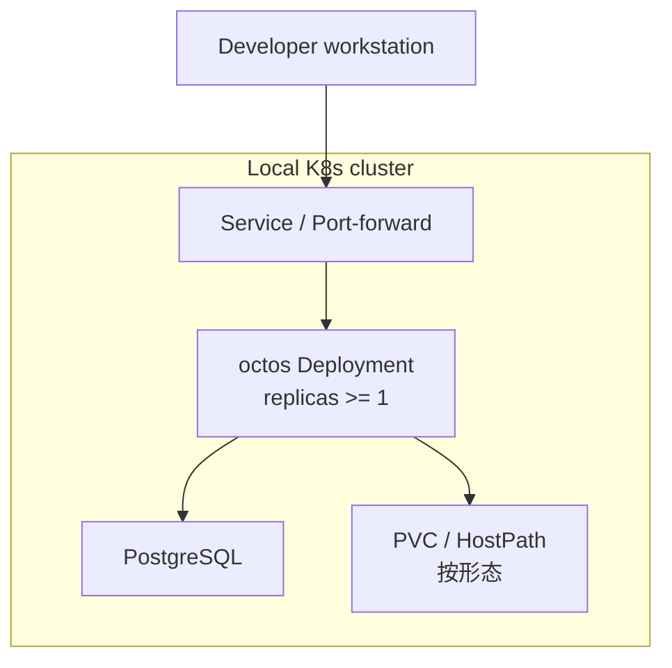

# core-01-deployment-plan

> 最后更新：2026-09-20
> 覆盖：本地 docker / 本地 k8s（baseline · hostpath · cluster）/ 后续 staging
> 关联场景：S05（serve）、S14（管理面）、**S16（k8s 无状态化）**
> 清单权威路径：`deploy/`（见 `deploy/README.md`、`deploy/docs/K8S_INSTALL.md`）

## 一、部署目标

| 环境 | 目标 | 形态 |
|------|------|------|
| 本地 docker | 单机冒烟 | `deploy/docker/docker-compose.yml` |
| 本地 k8s | 开发与多副本验证 | baseline / hostpath / cluster |
| staging | 预发（后续） | cluster + 托管 PG |

核心目标：在 **cluster** 形态下验证「PG 真相源 + 多副本 + 滚动可恢复」。

## 二、部署拓扑



三种清单：

| 文件 | 用途 |
|------|------|
| `deploy/k8s/01-baseline.yaml` | 最小镜像验证 |
| `deploy/k8s/02-hostpath-dev.yaml` | 单节点 HostPath 开发 |
| `deploy/k8s/03-cluster-with-config.yaml` | ConfigMap/Secret + PG + PVC 的目标形态 |

## 三、环境变量与密钥

| 名称 | 来源 | 说明 |
|------|------|------|
| `DATABASE_URL` | Secret | 集群模式必填 |
| LLM / 通道密钥 | Secret / 既有 auth store 挂载 | 禁止打进镜像层 |
| serve auth token | Secret / 环境 | 避免进入进程 argv（见既有 serve 安全修复） |
| `config.json` | ConfigMap | 非密钥配置 |

## 四、构建与发布命令

```bash
# 构建（示例）
cargo build --release -p octos-cli --features "api,..."

# 本地 k8s
./deploy/scripts/deploy-k8s.sh baseline
./deploy/scripts/deploy-k8s.sh hostpath
./deploy/scripts/deploy-k8s.sh cluster
```

镜像标签与拉取策略以清单注释为准；开发可用 `imagePullPolicy: IfNotPresent`。

## 五、数据迁移策略

1. cluster 形态启动前/InitContainer 应用 `crates/octos-store/migrations/0001_c2`–`0005_c5`
2. 本地 JSONL/redb **不**在集群模式双写为真相；如需迁移，走显式导入任务（后续切片）
3. 回滚迁移仅在空库/可重建环境允许；生产需备份后正向兼容迁移

## 六、回滚策略

| 级别 | 动作 |
|------|------|
| 应用 | `kubectl rollout undo` 回到上一 ReplicaSet |
| 配置 | 还原 ConfigMap/Secret 版本后滚动 |
| 数据 | 从 PG 备份恢复；禁止用 baseline 清单覆盖生产 PVC |
| 模式 | 临时降级单副本 + 只读流量（需运维确认） |

## 七、部署后检查清单

- [ ] Pod Ready 且无 CrashLoop
- [ ] `GET /api/version` 200
- [ ] Dashboard 可打开
- [ ] PG 迁移表存在（sessions/events/leases/cron 等）
- [ ] 杀一副本后 WS 可重连回放（S16）

## 八、冒烟测试方案

| ID | 检查项 | 期望 |
|----|--------|------|
| SMOKE-S16-01 | cluster 部署脚本 | 退出 0，Service 可达 |
| SMOKE-S16-02 | version 探活 | HTTP 200 |
| SMOKE-S16-03 | PG 迁移 | 关键表可查询 |
| SMOKE-S16-04 | 删 Pod 续聊 | 重连后历史可回放 |

## 九、门禁结论

- `deployment_required: true`（core 模块）
- `smoke_required: true`
- 本方案满足 Phase 3-3；部署执行与 `openlogos smoke` 需人类确认后进行
